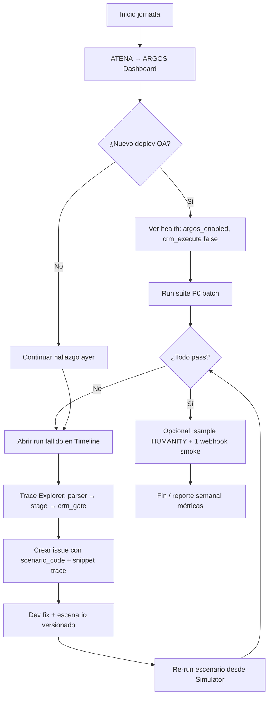

# ARGOS-2 — UX/UI Concept v1 (kickoff, sin implementación)

**Estado:** Conceptual aprobado para diseño — **no autoriza código ni migraciones**  
**Prerrequisitos:** ARGOS-1 en QA, P0 escenarios versionados, Training Strategy v1 activa  
**Repositorio UI:** `luxetty-atena` (shell ARGOS-0) + proxy Supabase Edge  
**Motor:** `luxetty-perseo` `/internal/argos/*` (sin cambios de contrato core)

---

## 1. Visión

ARGOS-2 convierte el laboratorio PERSEO en una **consola de entrenamiento conversacional** para QA y producto: ver la plática, entender por qué PERSEO decidió, correr lotes de escenarios y comparar runs — sin Postman ni JSON crudo como interfaz principal.

```text
         ┌─────────────────────────────────────────┐
         │  ATENA — ARGOS Console                  │
         │  ┌─────────┐ ┌──────────┐ ┌───────────┐ │
         │  │Simulator│ │ Scenarios│ │ Batch/    │ │
         │  │ (chat)  │ │ Manager  │ │ Timeline  │ │
         │  └────┬────┘ └────┬─────┘ └─────┬─────┘ │
         │       │           │             │       │
         │       └───────────┴─────────────┘       │
         │                     │                     │
         │              Trace Explorer             │
         └─────────────────────┬───────────────────┘
                               │ JWT admin
                               ▼
                    Edge: argos-perseo-runner
                               │
                               ▼
                    PERSEO /internal/argos/*
```

---

## 2. Personas y jobs-to-be-done

| Persona | Job diario |
|---------|------------|
| **QA tester** | Correr P0 tras deploy; ver por qué falló; archivar evidencia |
| **Dev PERSEO** | Reproducir bug; validar fix con mismo escenario |
| **Producto** | Ver % pass y métricas HUMANITY; priorizar familia |
| **Ops** | Confirmar flags Railway; no exponer secret en browser |

---

## 3. Flujo diario del QA tester (vista operativa)



### 3.1 Rutina express (15 min post-deploy)

1. Dashboard → badge **P0 8/8** (último batch).
2. Si falla → click fila → **Timeline** del turno rojo.
3. Panel derecho: `crm_gate_blockers` en lenguaje humano.
4. Copiar link interno al issue (run_id, scenario_version, build_sha).

### 3.2 Rutina profunda (bug nuevo)

1. **Simulator** → pegar mensajes del ticket WhatsApp real (anonimizados).
2. Turno a turno: ver reply + snapshot.
3. Guardar como borrador escenario → **Scenario Manager** → export JSON a PR.
4. Marcar `must_not` que apliquen.

---

## 4. Módulos UX (pantallas conceptuales)

### 4.1 ARGOS Dashboard (home)

| Widget | Contenido |
|--------|-----------|
| Health strip | PERSEO QA URL, `build_sha`, argos_enabled, v3, crm_execute |
| P0 status | Último batch: pass/fail count, timestamp |
| Métricas conversacionales | Cards: robotic %, CRM_READY %, loops (manual v1) |
| Acciones rápidas | Run P0 · Open Simulator · View last batch |

### 4.2 Conversational Simulator (core)

Layout **tres columnas**:

```text
┌────────────────┬─────────────────────────────┬─────────────────────┐
│ Transcript     │ Chat (user / assistant)    │ Technical panel     │
│ (turn list)    │                             │ intent, stage,      │
│                │ [ input bar ]               │ slots, gates        │
│                │ [ Send ] [ Reset CRM ]      │                     │
├────────────────┴─────────────────────────────┴─────────────────────┤
│ Trace Explorer (collapsible): parser_winner | state_transition |  │
│ crm_gate_blockers | assignment_decision | must_not                  │
└────────────────────────────────────────────────────────────────────┘
```

**Interacciones clave:**

- Click turno → scroll trace filtrado a ese turno.
- Toggle **deterministic_mode** / **crm_dry_run** en toolbar.
- Botón **Export scenario JSON** desde transcript actual.
- Indicador visual stage: chip `IDENTITY_PENDING`, `HANDOFF_PENDING`, `CRM_READY`.

### 4.3 Scenario Manager

| Función | UX |
|---------|-----|
| Lista | Tabla: code, priority, family, version, last_result |
| Filtros | P0 / P1 / HUMANITY / demand / offer |
| Editor | Form + JSON avanzado; validación schema |
| Diff | Comparar v1 vs v2 del mismo code |
| Run one | Lanza `run-scenario` y abre Timeline |

Fuente v1: lee `manifest.json` del repo (sync manual); v2: DB `argos_scenarios`.

### 4.4 Batch Runner

| Paso | UI |
|------|-----|
| Selección | Checkbox suite P0 / P1 / custom |
| Ejecución | Progress bar N/M; cancel |
| Resultado | Tabla pass/fail; export CSV |
| Drill-down | Click fila → Timeline de ese escenario |

Endpoint futuro: `POST /internal/argos/run-batch` o loop Edge con rate limit.

### 4.5 Timeline View

Vista horizontal **por turno**:

```text
Turn1      Turn2         Turn3           Turn4
[Hola] → [Cumbres] → [5M budget] → [Jorge]
  │          │            │              │
  ▼          ▼            ▼              ▼
UNDERST.  IDENTITY    IDENTITY       HANDOFF
          _PENDING    _PENDING       _PENDING
```

Color:

- Verde: expected cumplido.
- Rojo: violation / blocker.
- Amarillo: HUMANITY flag manual.

### 4.6 Trace Explorer

| Feature | Descripción |
|---------|-------------|
| Tree por `phase` | gate · parser · v3 · crm_preview · safety |
| Search | Filtrar `crm_gate`, `parser_winner` |
| Compare runs | Diff traces run A vs B (mismo escenario) |
| Copy | JSON del evento para issue |

### 4.7 Replay conversacional

- Re-ejecutar batch con mismo `phone_sim` + `reset-session full` entre runs.
- **Replay from turn N:** truncar transcript y re-enviar desde mensaje N (requiere API extendida — ARGOS-2.1).

### 4.8 Findings / Hallazgos (opcional P2 UI)

Agregación:

- Top `crm_gate_blockers` de la semana.
- Escenarios más flake.
- Tags HUMANITY.

---

## 5. Arquitectura técnica (conceptual)

| Capa | Responsabilidad |
|------|-----------------|
| **ATENA React** | UI; nunca almacena `ARGOS_SERVICE_SECRET` |
| **Edge `argos-perseo-runner`** | JWT Supabase → headers PERSEO → proxy |
| **PERSEO** | Lógica; sesión in-memory ARGOS-1 |
| **Supabase (ARGOS-2c)** | Persistencia runs/scenarios — **gate migración** |

### 5.1 Acciones Edge → PERSEO

| action UI | PERSEO endpoint |
|-----------|-----------------|
| `simulate_turn` | POST `/internal/argos/simulate-turn` |
| `run_scenario` | POST `/internal/argos/run-scenario` |
| `crm_dry_run` | POST `/internal/argos/crm-dry-run` |
| `reset_session` | POST `/internal/argos/reset-session` |
| `run_batch` | Nuevo o loop (diseño abierto) |
| `health` | GET `/internal/argos/health` |

---

## 6. Métricas en UI (conversacionales + técnicas)

Dashboard ARGOS-2 muestra las métricas de Training Strategy v1:

| Grupo | Visualización |
|-------|---------------|
| Técnico | Pass rate, CRM_READY, ownership, must_not |
| Conversacional | Robotic %, repeated openings, natural flow (HUMANITY suite) |
| Tendencia | Sparkline por deploy (build_sha en X) |

Datos v1: ingreso manual post-batch; v2: `argos_runs.summary` JSONB.

---

## 7. Fases de implementación sugeridas (solo planificación)

| Fase | Entregable | Duración orient. |
|------|------------|------------------|
| **2a** | Simulator + Technical panel + proxy Edge | 1–1.5 sem |
| **2b** | Scenario Manager (JSON repo) + Run one | 1 sem |
| **2c** | Batch runner + Timeline + export CSV | 1 sem |
| **2d** | Trace Explorer compare + métricas dashboard | 1 sem |
| **2e** | Persistencia `argos_*` + historial | 1 sem (+ gate migración) |

**No iniciar** hasta P0 100% en QA Railway.

---

## 8. Principios de diseño UX

1. **Diagnóstico primero** — siempre visible *por qué no* (blockers), no solo *qué*.
2. **Un clic a la evidencia** — trace ligado a turno, no JSON monolítico.
3. **Mismo contrato que CI** — UI ejecuta mismos JSON que `docs/argos/scenarios/`.
4. **Seguridad** — secret solo en Edge; RLS en runs.
5. **Humano en el loop** — HUMANITY requiere checkbox QA hasta automatizar.

---

## 9. Wireframe ASCII — Simulator (referencia)

```text
┌─ ARGOS Simulator ──────────────────────────────────────────────── [QA ▼] [⚙] ─┐
│ Build: a1b2c3d · argos_enabled · crm_execute: false                          │
├──────────────────────────────────────────────────────────────────────────────┤
│ USER: Busco casa en Cumbres                                                  │
│ BOT:  Con gusto. ¿Me compartes tu nombre?                                    │
│                                                                               │
│ USER: [ Tengo presupuesto de 5 millones________________ ] [Enviar]           │
├───────────────────────────────┬──────────────────────────────────────────────┤
│ Stage: IDENTITY_PENDING       │ Gates: crm_execution_eligible: false         │
│ Intent: buy · Zone: Cumbres   │ Blockers: missing full_name                  │
│ Budget: 5,000,000             │                                              │
├───────────────────────────────┴──────────────────────────────────────────────┤
│ ▼ Trace (turn 2)  parser_winner · BUYER_BUDGET · state_transition            │
└──────────────────────────────────────────────────────────────────────────────┘
```

---

## 10. Relación con ARGOS-0

ARGOS-0 (ATENA) aportó:

- Rutas `/argos` o equivalente QA
- Selector audit run (contexto CRM legacy)

ARGOS-2 **reemplaza/extiende** con foco simulador PERSEO, no auditoría SQL legacy.

---

## 11. Decisiones abiertas (para kickoff reunión)

| # | Pregunta |
|---|----------|
| 1 | ¿Persistencia `argos_*` en S2 o post-P0 100%? |
| 2 | ¿Batch en PERSEO vs solo en Edge? |
| 3 | ¿HUMANITY automation en PERSEO vs checklist UI? |
| 4 | ¿Un ambiente QA dedicado siempre con ARGOS on? |

---

## 12. Referencias

- `ARGOS-CONVERSATIONAL-TRAINING-STRATEGY-v1.md`
- `ARGOS-SCENARIO-VERSIONING-v1.md`
- `docs/sprints/argos-qa-plan-argos-0-1.md` (Parte D, E, Apéndice H)
- `docs/argos/postman/ARGOS-1-Internal-API.postman_collection.json`

---

*ARGOS-2 UX Concept v1 — documento de kickoff. Implementación prohibida hasta gate explícito producto + ingeniería.*
