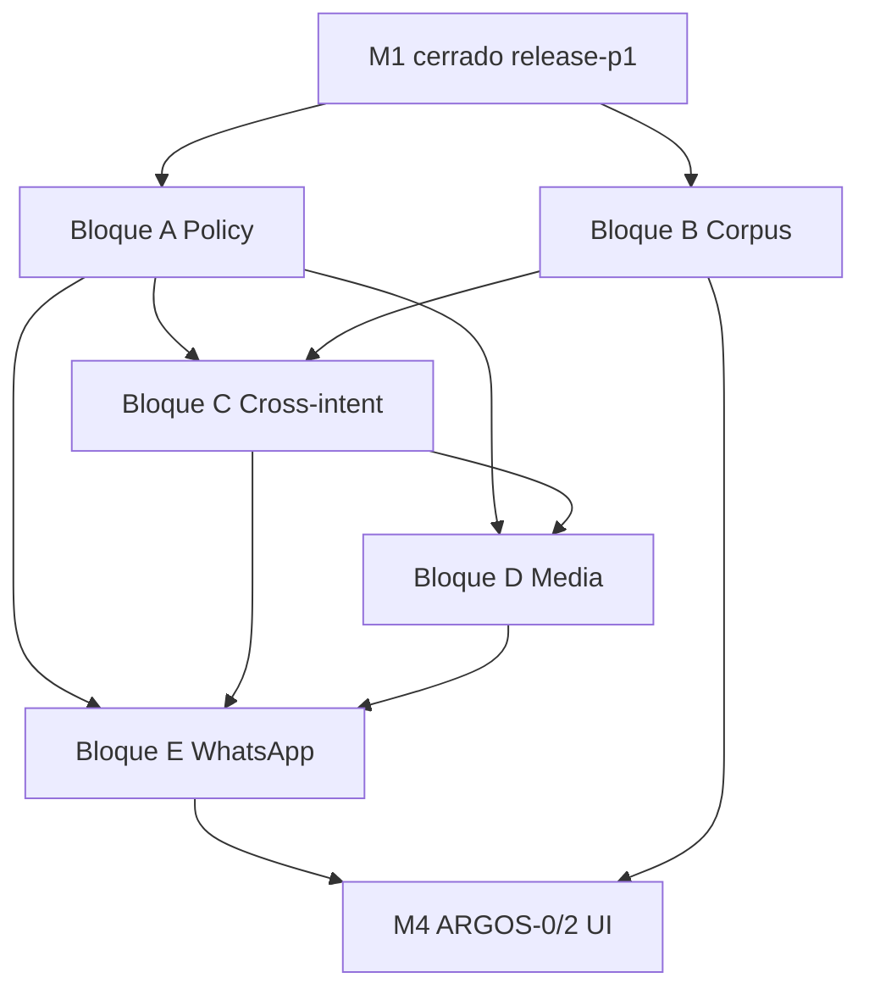

# PERSEO / ARGOS — Integrated Roadmap v2

**Versión:** 2.1  
**Estado:** Rector aprobado — **ejecución operativa:** `PERSEO-ARGOS-M2-M3-EXECUTION-PLAN-v1.md`  
**Fecha:** 2026-05-19  
**Audiencia:** Producto, QA, ingeniería PERSEO, coordinación ATENA  
**Repositorio motor:** `luxetty-perseo`  
**Repositorio UI (fase posterior):** `luxetty-atena`

---

## Resumen ejecutivo

Este documento **integra** (no sustituye) el plan original de madurez conversacional y ARGOS con los bloques evolutivos de **Policy**, **Corpus/Learning**, **Message Understanding**, **Media** y **WhatsApp real**.

| Pregunta | Respuesta |
|----------|-----------|
| ¿Sigue vigente el plan original? | **Sí.** `plan-oficial-perseo-madurez-conversacional-p0-p6.md` (R0–R7), Coverage Strategy, M1, ARGOS-1, Training Strategy. |
| ¿Qué cambió? | **Ritmo y forma de entrega:** bloques ambiciosos con motor + escenarios + suite + regresión + contrato + Railway. |
| ¿Qué reemplaza? | PRs de “un solo escenario” (salvo hotfix crítico) y la secuencia aislada “LP0 JSON → otro día escenarios”. |
| ¿Qué NO incluye aún? | ARGOS-2 UI, migraciones Supabase, tablas `policy_*`, dashboards, refactor total Decision Core, CRM execute, DOCX/PDF completo si retrasa. |

**Hito actual (baseline):**

```text
M1 ✅  — madurez conversacional base (sticky, humanity, handoff disciplinado)
M1-D ✅ — release-p1 = 11/11 (D1+O1+PROP+EDGE+HUMANITY)
ARGOS-1 ✅ — laboratorio API + runner + traces (sin tablas argos_*)
```

---

## 0. Principios de integración

1. **ARGOS sigue siendo el laboratorio** — todo comportamiento promovido lleva `expected` + `must_not` + trace auditable.
2. **M1 no se reabre** — regresión obligatoria en cada bloque nuevo contra suites M1 existentes.
3. **Corpus masivo ≠ escenarios congelados** — L0 indexado; promoción selectiva a Capa B (Coverage Strategy).
4. **Policy, understanding y media son capas**, no ramas `if` sueltas ni sustitutos de Stage Engine / RuleGuard.
5. **ATENA / ARGOS-2** permanecen en **M4**; M2–M3 son PERSEO + ARGOS JSON + validación WhatsApp.
6. **Cada PR de producto** (salvo hotfix): **6–12 escenarios** (PR-M2-01 integrado: **14–16**) + suite(s) dedicada(s) + regresión acumulativa. Ver **Execution Plan v1**.
7. **Objetivo de producto:** PERSEO sobrevive conversaciones reales complejas sin parecer bot roto (no solo pasar suites).

---

## 1. Mapa macro: M1 → M4 integrado con el plan original

```text
┌────────────────────────────────────────────────────────────────────────────┐
│ PLAN ORIGINAL (sigue vigente como arquitectura y taxonomía)                 │
│ • plan-oficial R0–R7          • V3 roadmap F0–F9                            │
│ • PERSEO-ARGOS-COVERAGE-STRATEGY-v1   • ARGOS-CONVERSATIONAL-TRAINING       │
│ • PERSEO-M1 (cerrado)         • argos-qa-plan ARGOS-0/1/2…                  │
└────────────────────────────────────────────────────────────────────────────┘
                                      │
        ┌─────────────────────────────┼─────────────────────────────┐
        ▼                             ▼                             ▼
   M1 ✅ (hecho)                  M2 (foundation)              M3 (operativo real)
   R0+R1+R3 parcial              Policy+Corpus+Cross          Media+WA+policy harden
   ARGOS release-p0/p1           Blocks A+B+C                 Blocks D+E
        │                             │                             │
        └─────────────────────────────┴─────────────────────────────┘
                                      ▼
                              M4 (plataforma + escala)
                              ARGOS-0/2 UI, corpus upload UI,
                              exploratory runs (LP4), tablas opcionales (LP3)
```

### 1.1 Tabla de correspondencia M ↔ plan original ↔ LP

| Macro | Contenido integrado | Plan original | Roadmap LP v1 (referencia) |
|-------|---------------------|---------------|----------------------------|
| **M1** ✅ | Humanity, sticky, D1/O1/PROP/EDGE, `release-p1` | R0, R1 parcial, R3 parcial, **R7** ARGOS-TDD | — |
| **M2** | Bloques **A + B + C** | R2 RuleGuard ampliado, **R7** corpus index | LP0, LP1, LP7 |
| **M3** | Bloques **D + E** + endurecimiento policy | R6 multimedia honesto, **R7** métricas reales | LP5 (audio), LP6 (imagen), validación campo |
| **M4** | ARGOS-0, ARGOS-2, ingest UI, exploratory | R7 plataforma, ATENA insight | LP2, LP3, LP4, LP8 |

### 1.2 Qué queda explícitamente del plan original

| Documento / artefacto | Estado | Rol en v2 |
|----------------------|--------|-----------|
| `plan-oficial-perseo-madurez-conversacional-p0-p6.md` | Vigente | Tesis R0–R7, fallback asesor, ~200 familias |
| `perseo-conversational-core-v3-roadmap.md` | Vigente | Catálogo F1–F8, etapas, handoff |
| `PERSEO-ARGOS-COVERAGE-STRATEGY-v1.md` | Vigente | Capas A/B/C, P0/P1/P2, olas por familia |
| `PERSEO-M1-HUMANITY-STICKY-CONTEXT-v1.md` | **Cerrado** | Baseline regresión; no re-scope |
| `argos-qa-plan-argos-0-1.md` | Vigente | ARGOS-1 hecho; ARGOS-0/2 → **M4** |
| `PERSEO-ARGOS-LEARNING-POLICY-MULTIMODAL-ROADMAP-v1.md` | Vigente como **arquitectura** | Detalle LP0–LP8; **ejecución** según este v2 |
| `ARGOS-2-UX-CONCEPT-v1.md` | Vigente | Diseño UI → **M4** |
| Suites `release-p0`, `release-p1`, reg/humanity | **Gates permanentes** | Toda PR M2+ debe pasarlas |

### 1.3 Qué se integra como nuevo (sin sustituir M1/ARGOS)

| Bloque v2 | Integra en macro | Escenarios nuevos | Suite dedicada |
|-----------|------------------|-------------------|----------------|
| **A — Policy Layer operativo** | M2 | `POLICY_001`–`008` (8) | `policy-p0` |
| **B — Corpus & Learning Foundation** | M2 | 0–2 smoke (opcional) | `corpus-validate` (script/suite) |
| **C — Message Understanding v1** | M2 | `CROSS_001`–`004` (4) | `cross-intent-p0` |
| **D — Media Intake v1** | M3 | `MEDIA_*` (4) | `media-p0` |
| **E — WhatsApp Real Validation** | M3 | `REG-*` según hallazgos (4–8 acum.) | `whatsapp-smoke` (checklist + registro) |

**Acumulado escenarios ejecutables tras M3 (objetivo):** ~18 existentes + 8 policy + 4 cross + 4 media + 4–8 REG ≈ **38–42** en repo (sin contar borradores corpus).

---

## 2. Nueva regla de alcance (obligatoria desde M2)

### 2.1 Definición de “bloque” o PR de producto

Cada entrega debe incluir **los 8 ítems**:

| # | Entregable | Criterio |
|---|------------|----------|
| 1 | **Motor** | Código PERSEO con contrato claro y feature flag si aplica |
| 2 | **Escenarios ARGOS** | **4–8** JSON versionados (salvo hotfix: 1 escenario + suite existente) |
| 3 | **Suite dedicada** | Archivo en `docs/argos/suites/{nombre}.json` |
| 4 | **Regresión** | PASS 100% en suites listadas §2.3 |
| 5 | **Documentación mínima** | Contrato en `docs/argos/contracts/` o sección en este doc / README del bloque |
| 6 | **Criterios de aceptación** | Tabla AC en PR body (copiar plantilla §8) |
| 7 | **Pruebas locales** | `npm run test:argos`, `npm run test:perseo`, suite nueva local |
| 8 | **Plan Railway** | Comandos remote + checklist post-deploy |

### 2.2 Excepciones

| Caso | Escenarios | Regresión |
|------|------------|-----------|
| Hotfix producción crítico | 1 + extensión `must_not` si aplica | Todas las suites §2.3 |
| Bloque B (corpus) | 0–2 smoke ingest | `corpus-validate` + regresión §2.3 |
| Bloque E (WhatsApp) | Promoción manual a `REG-*` (4–8 por ola) | `whatsapp-smoke` + §2.3 |

### 2.3 Suites de regresión obligatorias (cada PR M2+)

```bash
# Gate acumulativo — local y Railway QA post-deploy
node scripts/argos-run-suite.js --suite release-p0      # 7 escenarios — 100%
node scripts/argos-run-suite.js --suite release-p1      # 11 escenarios — 100%
node scripts/argos-run-suite.js --suite humanity-p0     # 100%
node scripts/argos-run-suite.js --suite reg-sticky-p0   # 100%
node scripts/argos-run-suite.js --suite reg-short-msg-p0
node scripts/argos-run-suite.js --suite humanity-handoff-p0
# + suite nueva del bloque — 100%
```

| Suite | Escenarios | Umbral | Origen |
|-------|------------|--------|--------|
| `release-p0` | 7 | 100% | Coverage Strategy P0 |
| `release-p1` | 11 | 100% | M1-D cierre |
| `humanity-p0` | 2 | 100% | M1-A |
| `reg-sticky-p0` | 2 | 100% | M1-B |
| `reg-short-msg-p0` | 1 | 100% | M1-B |
| `humanity-handoff-p0` | según manifest | 100% | M1 handoff |

---

## 3. Bloque A — Policy Layer operativo (M2, PR-1)

### 3.1 Objetivo

Externalizar reglas comerciales en config versionada y motor consultable, con decisión auditable en trace — **sin** migraciones Supabase ni tablas `policy_*` en v1.

### 3.2 Alcance motor

| Componente | Descripción |
|------------|-------------|
| `config/policy/commercial-policy.v1.json` | Perfil default tenant Luxetty |
| `config/policy/active-zones.v1.json` | Zonas + colonias activas |
| `config/policy/decline-templates.v1.json` | Copy aprobado por `DECLINE_SOFT` |
| `PolicyEngine` | `evaluate(context) → PolicyDecision` |
| Acciones | `ATTEND`, `QUALIFY`, `DECLINE_SOFT`, `HANDOFF`, `DEFER` |
| Monedas | MXN, USD con umbrales por `operation_type` |
| Integración | Después de interpreter / antes de RuleGuard; **no** escribe CRM |
| Observabilidad | `debug_trace.policy_decision` en cada turno evaluado |
| Flag | `PERSEO_POLICY_ENGINE_ENABLED` (default false en prod hasta QA) |

### 3.3 Reglas comerciales v1 (contrato)

| Regla | Condición | Decisión |
|-------|-----------|----------|
| Venta bajo mínimo | `operation=sale`, `amount < 3_000_000 MXN` | `DECLINE_SOFT` |
| Venta bajo mínimo USD | `operation=sale`, `amount < 150_000 USD` | `DECLINE_SOFT` |
| Renta bajo mínimo | `operation=rent`, `amount < 10_000 MXN/mes` | `DECLINE_SOFT` |
| Renta bajo mínimo USD | `operation=rent`, `amount < 500 USD/mes` | `DECLINE_SOFT` |
| Zona fuera cobertura | zona/colonia no en listas activas | `DECLINE_SOFT` o `HANDOFF` (configurable) |
| Zona válida | en lista activa + datos coherentes | `ATTEND` |
| Datos insuficientes | intención clara pero sin monto/zona para política | `DEFER` o `QUALIFY` |
| Caso ambiguo | conflicto moneda, zona ambigua, excepción explícita | `HANDOFF` o `QUALIFY` según tabla |

**Zonas activas v1 (ejemplo):** Cumbres, Carretera Nacional, San Pedro (+ colonias hijas en JSON).

### 3.4 Escenarios ARGOS — `policy-p0` (8)

| Código | Hipótesis | Decisión esperada |
|--------|-----------|-------------------|
| `POLICY_001` | Venta 2.5M MXN explícito | `DECLINE_SOFT` + copy venta |
| `POLICY_002` | Venta 120k USD explícito | `DECLINE_SOFT` |
| `POLICY_003` | Renta demanda 8k MXN/mes | `DECLINE_SOFT` |
| `POLICY_004` | Renta 400 USD/mes | `DECLINE_SOFT` |
| `POLICY_005` | Zona “Monterrey centro” fuera de lista | `DECLINE_SOFT` o `HANDOFF` |
| `POLICY_006` | Venta Cumbres 4.5M MXN | `ATTEND` (continúa calificación) |
| `POLICY_007` | “Quiero vender” sin monto ni zona | `DEFER` o `QUALIFY` |
| `POLICY_008` | Monto en USD con zona MX ambigua / excepción | `HANDOFF` o `QUALIFY` |

**must_not comunes:** inventar política distinta a config; prometer captación bajo mínimo; omitir `policy_decision` en trace cuando flag activo.

### 3.5 Criterios de aceptación (AC)

- [ ] `policy-p0` **8/8** local y Railway QA con flag ON
- [ ] Regresión §2.3 **100%** sin flag (motor no rompe path legacy)
- [ ] Regresión §2.3 **100%** con flag ON en QA
- [ ] Cambio de umbral en JSON → PASS/FAIL esperado sin cambio de código
- [ ] `debug_trace.policy_decision` presente en los 8 escenarios

### 3.6 Estimación

| Métrica | Valor |
|---------|-------|
| Duración orientativa | **2–2.5 semanas** |
| PRs | **1 PR** (bloque completo) |
| Líneas motor estimadas | 800–1.400 + tests unit PolicyEngine |

---

## 4. Bloque B — Corpus & Learning Foundation (M2, PR-2)

### 4.1 Objetivo

Base real para escalar de ~210 pláticas indexadas a inventario vivo **sin** ARGOS-2 ni tablas DB — preparar ingest y gobernanza para promoción futura.

### 4.2 Alcance

| Componente | Descripción |
|------------|-------------|
| `ConversationRecordV1` | Schema JSON estable (ver LP roadmap §3.1) |
| Parsers v1 | MD, TXT, CSV, JSON — adaptador por formato |
| Arquitectura extensible | Interface `CorpusParser` + registro; **stub** DOCX/PDF documentado, no implementado |
| `corpus-index.yaml` | Campos: `corpus_id`, `source_document`, `promotion_status`, `import_batch_id`, `turn_count`, `outcome_hash`, `tags` |
| Dedupe básico | Hash por outcome + rail; alerta duplicado |
| CLI | `node scripts/corpus-validate.js [--batch path]` |
| Suite | `corpus-validate` — valida schema, PII básico, índice coherente |
| Smoke ARGOS (opcional) | `CORPUS_001` import MD → record válido (0–2 escenarios) |

**promotion_status:** `indexed | candidate | promoted | rejected | wont_automate`

### 4.3 Criterios de aceptación

- [ ] Import piloto ≥20 registros desde corpus existente sin romper índice
- [ ] `corpus-validate` PASS en CI (`npm run test:argos` o script dedicado)
- [ ] Regresión §2.3 **100%**
- [ ] Documento contrato `docs/argos/contracts/ConversationRecordV1.md`
- [ ] Ningún registro auto-promovido a `scenarios/*.json`

### 4.4 Estimación

| Métrica | Valor |
|---------|-------|
| Duración | **1.5–2 semanas** |
| PRs | **1 PR** |
| Escenarios ARGOS | **0–2** (smoke opcional) |

---

## 5. Bloque C — Message Understanding Layer v1 (M2, PR-3)

### 5.1 Objetivo

Preparar PERSEO para mensajes largos y multintención: segmentar, detectar intenciones múltiples, slots por segmento, plan de respuesta ordenado — **sin** refactor total del Decision Core.

### 5.2 Alcance motor

| Componente | Descripción |
|------------|-------------|
| `messageSegmenter` | Split por párrafos / bullets / “y también” |
| `multiIntentDetector` | Lista de intenciones con confianza heurística |
| `segmentSlots` | Extracción por segmento (zona, monto, listing) |
| `responsePlanner` | `response_plan[]` ordenado: acknowledge → prioridad → siguiente pregunta |
| Trace | `debug_trace.response_plan`, `debug_trace.segments` |
| Integración | Capa antes del composer; **una** respuesta por turno (plan serializado) |

### 5.3 Escenarios — `cross-intent-p0` (4)

| Código | Entrada resumida | Comportamiento esperado |
|--------|------------------|-------------------------|
| `CROSS_001` | “quiero vender mi casa y comprar otra” | Reconoce dual intent; prioriza según stage; no menú IVR |
| `CROSS_002` | Cumbres 4M habitada + busco en San Pedro | Extrae oferta + demanda; no mezcla slots |
| `CROSS_003` | 4 preguntas en un mensaje | Plan con ≥2 acknowledgments; 1 pregunta foco |
| `CROSS_004` | Multilínea desordenada (precio, zona, nombre) | Slots correctos; sin reinicio de flujo |

### 5.4 Criterios de aceptación

- [ ] `cross-intent-p0` **4/4** local + Railway
- [ ] Regresión §2.3 **100%**
- [ ] `response_plan` en trace en los 4 escenarios
- [ ] No regresión sticky (`reg-sticky-p0`)

### 5.5 Estimación

| Métrica | Valor |
|---------|-------|
| Duración | **2–2.5 semanas** |
| PRs | **1 PR** |
| Dependencia | Recomendado **después** de Bloque A (policy puede priorizar segmento oferta vs demanda) |

---

## 6. Bloque D — Media Intake v1 (M3, PR-4)

### 6.1 Objetivo

Contrato honesto para audio (transcript como turno lógico) e imagen (hints, no verdad) — sin visión avanzada ni inventar datos.

### 6.2 Alcance motor

| Tipo | Contrato |
|------|----------|
| Audio | `logical_turn.text` desde transcript; mock ARGOS inyecta transcript |
| Sin transcript | Fallback: pedir texto o HANDOFF; **no** fingir contenido |
| Imagen | `image_hints[]` (labels confianza); nunca precio/disponibilidad desde imagen sola |
| Sin imagen útil | Mensaje honesto + siguiente paso |
| Trace | `debug_trace.media_intake` |

### 6.3 Escenarios — `media-p0` (4)

| Código | Caso |
|--------|------|
| `MEDIA_AUDIO_001` | Audio con transcript mock → flujo normal |
| `MEDIA_AUDIO_002` | Audio sin transcript → fallback honesto |
| `MEDIA_IMG_001` | Imagen con hints “fachada / recámara” → no inventar precio |
| `MEDIA_IMG_002` | Imagen ilegible → pedir descripción textual |

### 6.4 Criterios de aceptación

- [ ] `media-p0` **4/4**
- [ ] Regresión §2.3 + `policy-p0` + `cross-intent-p0` si ya en main
- [ ] `must_not`: `invented_from_media`, `fake_transcript`

### 6.5 Estimación

| Métrica | Valor |
|---------|-------|
| Duración | **1.5–2 semanas** |
| PRs | **1 PR** |
| Relación plan original | **R6** parcial (honesto, no completo) |

---

## 7. Bloque E — WhatsApp Real Validation (M3, PR-5 + operación continua)

### 7.1 Objetivo

Salir del laboratorio: validar percepción y bugs reales con allowlist controlada; cerrar criterio **PERSEO V1 operativo**.

### 7.2 Entregables (no solo código)

| Artefacto | Descripción |
|-----------|-------------|
| `docs/argos/whatsapp-smoke/allowlist-20.yaml` | 20 pláticas reales (IDs, carril, objetivo) |
| Checklist HUMANITY | 5 ítems × 20 pláticas (escala 1–5) |
| Registro de errores | `docs/argos/whatsapp-smoke/runs/{date}.md` |
| Promoción | Bug → `REG-{ticket}.v1.json` + suite `reg-*` |
| Suite `whatsapp-smoke` | Gate documental + opcional 2 escenarios sintéticos de smoke |

### 7.3 Criterio de salida PERSEO V1 operativo

| Métrica | Umbral |
|---------|--------|
| Allowlist 20 pláticas | ≥ **16/20** “suena humano” (≥4/5 en checklist) |
| Bugs críticos abiertos | **0** (inventario, flip intent, handoff prematuro) |
| Suites automatizadas | `release-p0` + `release-p1` + `policy-p0` + regresión §2.3 = **100%** Railway |
| REG promovidos desde WA | ≥ **4** escenarios `REG-*` en repo |

### 7.4 Estimación

| Métrica | Valor |
|---------|-------|
| Duración | **2 semanas** (paralelo a hardening policy) |
| PRs | **1 PR** docs + **1 PR** motor si hallazgos (4–8 `REG-*`) |

---

## 8. Macro M4 — Plataforma (sin implementar en M2–M3)

| Entrega | Repo | Notas |
|---------|------|-------|
| ARGOS-0 | ATENA | Rename, dashboard `ai_audit_*`, sin migraciones |
| ARGOS-2 UI | ATENA + PERSEO | Simulador, batch, promote — tras V1 operativo |
| Corpus upload UI | ATENA | Consume `ConversationRecordV1` |
| Exploratory runs | PERSEO | LP4 — no bloqueante release |
| Tablas `policy_*` / corpus DB | Supabase | Solo cuando negocio exija edición sin deploy |

---

## 9. Suites por etapa (vista consolidada)

| Etapa | Suites nuevas | Suites regresión | Escenarios nuevos (objetivo) |
|-------|---------------|------------------|------------------------------|
| **M1** ✅ | `release-p1`, `humanity-p0`, reg-* | `release-p0` | +11 en p1 (hecho) |
| **M2-A** | `policy-p0` | §2.3 | +8 |
| **M2-B** | `corpus-validate` | §2.3 | +0–2 |
| **M2-C** | `cross-intent-p0` | §2.3 | +4 |
| **M3-D** | `media-p0` | §2.3 + policy + cross | +4 |
| **M3-E** | `whatsapp-smoke` | §2.3 + todas M2 | +4–8 REG |
| **M4** | `exploratory-p1`, batch UI | Acumulativo | +15–25 P2 olas |

**Inventario escenarios tras M3 (objetivo):**

```text
Baseline M1:     18 archivos ejecutables (P0+P1+REG+HUMANITY parcial)
M2 nuevos:       +12 (8 policy + 4 cross) [+0–2 corpus smoke]
M3 nuevos:       +8 (4 media + 4–8 REG)
Total objetivo:  ~38–42 escenarios congelados (vs ~70 meta Coverage Strategy 2026)
```

---

## 10. Dependencias entre bloques



| Dependencia | Razón |
|-------------|-------|
| A antes de C | Policy puede priorizar segmento venta vs compra |
| B ∥ A | Corpus no bloquea policy; puede ir en paralelo si 2 devs |
| C antes de D | Media intake asume turno lógico; planner ayuda fallback |
| A+C antes de E | WhatsApp valida stack completo |
| M4 después de E | UI sin V1 operativo genera deuda de percepción |

---

## 11. Riesgos y mitigaciones

| Riesgo | Impacto | Mitigación |
|--------|---------|------------|
| Policy duplica lógica en interpreter | Divergencia | PolicyEngine único; tests unit; trace obligatorio |
| Bloque grande rompe sticky M1 | Regresión release-p1 | §2.3 en CI local pre-push; flag OFF por defecto prod |
| Cross-intent reabre menú IVR | Percepción bot | `must_not` + `humanity-p0` en cada PR |
| Corpus ingest sin gobernanza | 10k JSON | `corpus-validate` + no auto-promote |
| WhatsApp ≠ ARGOS determinista | Falsos confianza | Allowlist + REG-*; no bajar umbral P0 |
| Ritmo ambicioso sin QA | PRs atascados | Máx. 1 bloque motor activo; Railway checklist fijo |
| Confundir M2 con Decision Core R2 | Scope creep | Planner heurístico v1; R2 spec aparte, M4+ |

---

## 12. Qué se implementa primero

**Prioridad absoluta (orden fijo):**

```text
1. Policy Layer + Message Understanding foundation  → PR-M2-01 (único bloque fuerte)
2. Corpus Foundation v1                             → PR-M2-02
3. Media Intake + WhatsApp wave 1                 → PR-M3-01
4. M4 — ARGOS-0 / ARGOS-2                         → tras M3-01
```

**Detalle operativo (escenarios, AC, rollout, riesgos):** `PERSEO-ARGOS-M2-M3-EXECUTION-PLAN-v1.md`

---

## 13. Plan de PRs (v2.1 — velocidad alta)

### 13.1 Calendario M2–M3 (~6 semanas a WA wave 1)

| Semana | PR | Cierre | Escenarios | Suites nuevas |
|--------|-----|--------|------------|---------------|
| 1–2 | **PR-M2-01** | Policy + Cross foundation | **14–16** | `policy-p0`, `cross-intent-p0`, `humanity-policy-p0` |
| 3–4 | **PR-M2-02** | Corpus Foundation v1 | **6–8** | `corpus-p0`, `corpus-validate` |
| 5–6 | **PR-M3-01** | Media + WhatsApp Hardening v1 | **10–12** | `media-p0`, `whatsapp-field-p0`, `whatsapp-smoke` |
| 7+ | **M4** | ARGOS-0 UI | — | — |

**Hotfix:** 1–2 escenarios, solo producción crítica.

### 13.2 Plantilla PR body (obligatoria)

```markdown
## Bloque
[A|B|C|D|E] — título

## Motor
- [ ] archivos / flags

## Escenarios (N = __)
- [ ] POLICY_00x / CROSS_00x / ...

## Suite dedicada
- [ ] docs/argos/suites/___-p0.json — __/__ PASS local

## Regresión
- [ ] release-p0 7/7
- [ ] release-p1 11/11
- [ ] humanity-p0
- [ ] reg-sticky-p0
- [ ] reg-short-msg-p0
- [ ] humanity-handoff-p0

## Contrato
- [ ] docs/argos/contracts/...

## Railway QA
- [ ] remote suite nueva 100%
- [ ] regresión §2.3 100%
- [ ] flag policy: ON/OFF documentado

## AC
(copiar tabla del bloque correspondiente)
```

### 13.3 Anti-patrones explícitos

- PR solo con JSON sin motor.
- PR motor sin suite dedicada.
- PR >8 escenarios sin dividir en 2 olas del mismo bloque.
- Cambiar umbrales en código en lugar de `config/policy/*`.
- Implementar ARGOS-2 antes de Bloque E.

---

## 14. Backlog integrado del plan original (post M3)

Estos ítems **siguen en el plan** y se programan después de V1 operativo o en olas P2:

| Ítem original | Cuándo | Notas |
|---------------|--------|-------|
| Coverage Strategy Fase 3 (P2 amplitud) | M3–M4 | Objeciones F5, CRM F7, más CHAOS |
| `HUMANITY_002/003` | M2 opcional o M3 | Ya en manifest; no en `release-p1` |
| Decision Core R2 completo | M4+ | Spec `perseo-ai-decision-core-rearchitecture.md` |
| R4 CRM hardening | M4+ | Fuera de ARGOS execute |
| R5 Campaign intelligence | M4+ | Tras policy estable |
| ARGOS-3 batch 20/100 | M4 | Con UI |
| DOCX/PDF ingest | M4 | Tras parsers v1 |
| Tablas Supabase policy/corpus | M4+ | LP3 |

---

## 15. Comandos operativos (objetivo post M2)

```bash
# Regresión completa pre-merge M2+
npm run test:argos
npm run test:perseo
node scripts/argos-run-suite.js --suite release-p0 --local
node scripts/argos-run-suite.js --suite release-p1 --local
node scripts/argos-run-suite.js --suite policy-p0 --local        # tras PR-M2-01
node scripts/corpus-validate.js                                   # tras PR-M2-02

# Railway QA (post-deploy)
PERSEO_BASE_URL=... ARGOS_SERVICE_SECRET=... \
  node scripts/argos-run-suite.js --suite release-p0 --remote
PERSEO_BASE_URL=... ARGOS_SERVICE_SECRET=... \
  node scripts/argos-run-suite.js --suite release-p1 --remote
PERSEO_BASE_URL=... ARGOS_SERVICE_SECRET=... \
  node scripts/argos-run-suite.js --suite policy-p0 --remote
```

---

## 16. Referencias cruzadas

| Documento | Relación con v2 |
|-----------|-----------------|
| `PERSEO-ARGOS-LEARNING-POLICY-MULTIMODAL-ROADMAP-v1.md` | Detalle LP0–LP8; **ejecución** = bloques A–E aquí |
| `PERSEO-ARGOS-COVERAGE-STRATEGY-v1.md` | Taxonomía P0/P1/P2; v2 acelera olas con bloques |
| `PERSEO-M1-HUMANITY-STICKY-CONTEXT-v1.md` | Cerrado; baseline regresión |
| `plan-oficial-perseo-madurez-conversacional-p0-p6.md` | R0–R7 vigente |
| `argos-qa-plan-argos-0-1.md` | ARGOS-0/2 → M4 |
| `docs/argos/scenarios/manifest.json` | Actualizar suites al merge de cada PR |

---

## 17. Changelog

| Versión | Fecha | Cambios |
|---------|-------|---------|
| **2.0** | **2026-05-19** | Roadmap integrado M1–M4; bloques A–E |
| **2.1** | **2026-05-19** | Ejecución acelerada; Execution Plan v1; PR-M2-01 Policy+Cross 14–16 escenarios |

---

**Siguiente paso acordado:** implementar **Bloque A (PR-M2-01)** según §3, sin migraciones ni UI.
