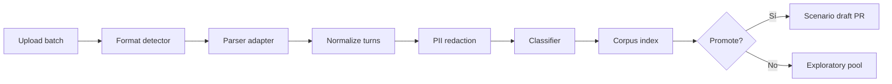

# PERSEO / ARGOS — Learning, Policy & Multimodal Roadmap

**Versión:** 1.0  
**Estado:** Arquitectura de referencia (LP0–LP8) — **ejecución integrada en** `PERSEO-ARGOS-INTEGRATED-ROADMAP-v2.md`  
**Fecha:** 2026-05-19  
**Audiencia:** Producto, QA, ingeniería PERSEO, ATENA  
**Relacionado:** `PERSEO-ARGOS-COVERAGE-STRATEGY-v1.md`, `ARGOS-2-UX-CONCEPT-v1.md`, `perseo-ai-decision-core-rearchitecture.md`, `plan-oficial-perseo-madurez-conversacional-p0-p6.md`

---

## Resumen ejecutivo

Este documento define el bloque estratégico **Learning & Policy Layer** para PERSEO y ARGOS: cómo escalar de ~70 escenarios congelados a **miles de conversaciones reales** sin mantener 10 000 JSON rígidos; cómo externalizar **reglas comerciales** (montos mínimos, zonas activas, descarte amable); y cómo incorporar **audio, imagen y mensajes multintención** de forma honesta y auditable.

| Pregunta | Respuesta |
|----------|-----------|
| ¿Implementar ahora? | **No.** Solo arquitectura y fases. |
| ¿Bloquea M1-PR-09? | **No.** Complementa cierre M1-D. |
| ¿Reemplaza escenarios ARGOS? | **No.** Corpus vivo + promoción selectiva a regresión. |
| ¿Dónde vive la política comercial? | Tablas/config + `PolicyEngine`, no prompts ni `if` dispersos. |

---

## 0. Principios rector

1. **Corpus masivo ≠ escenarios congelados** — el inventario vivo alimenta descubrimiento; solo hipótesis estables pasan a `release-p*`.
2. **Política comercial configurable** — montos, zonas y descarte vienen de datos versionados, consultados antes de calificar o prometer.
3. **Multimodal con fallback honesto** — transcribir/interpretar cuando hay señal; nunca inventar; pedir texto o asesor si falla.
4. **Mensajes complejos = plan de respuesta** — segmentar, priorizar intenciones, responder en orden (no un párrafo genérico).
5. **ARGOS-TDD se mantiene** — todo comportamiento promovido a regresión lleva `expected` + `must_not` + trace.

---

## 1. Modelo de cuatro capas (ampliación de Coverage Strategy)

Extiende la Capa A/B/C de `PERSEO-ARGOS-COVERAGE-STRATEGY-v1.md`:

```text
┌─────────────────────────────────────────────────────────────────────────┐
│ CAPA L0 — Corpus masivo (inventario vivo)                                │
│ Fuentes: JSON, MD, TXT, CSV, DOCX, PDF, exports WhatsApp, ATENA         │
│ Rol: clasificar, muestrear, proponer gaps, variantes lingüísticas        │
│ NO corre como gate de release; sí alimenta L1 y exploración              │
└───────────────────────────────┬─────────────────────────────────────────┘
                                │ ingest + classify + dedupe
                                ▼
┌─────────────────────────────────────────────────────────────────────────┐
│ CAPA L1 — Conversational records normalizados (canonical turn model)     │
│ Rol: turnos tipados, metadata, tags, PII redacted, multimodal refs       │
└───────────────────────────────┬─────────────────────────────────────────┘
                                │ promote (humano + reglas)
                                ▼
┌─────────────────────────────────────────────────────────────────────────┐
│ CAPA B — Escenarios ARGOS (~50–120 congelados, crecimiento lento)        │
│ Rol: regresión CI, release gate, ARGOS-TDD                               │
└───────────────────────────────┬─────────────────────────────────────────┘
                                │ nightly / batch
                                ▼
┌─────────────────────────────────────────────────────────────────────────┐
│ CAPA C — Exploratory runs (no bloqueantes)                              │
│ Rol: fuzz de wording, corpus sampling, métricas HUMANITY, drift          │
└─────────────────────────────────────────────────────────────────────────┘

         ┌──────────────────────────────────────────┐
         │ CAPA P — Policy & attention config       │
         │ (transversal: consultada en cada turno)   │
         └──────────────────────────────────────────┘
```

| Capa | Volumen objetivo | Gate release |
|------|------------------|--------------|
| **L0 Corpus** | 200 → 2 000 → 10 000+ conversaciones indexadas | No |
| **L1 Records** | Mismo orden; schema estable | No |
| **B Scenarios** | ~70 (2026) → ~120 (2027) | **Sí** (`release-p0`, `release-p1`, …) |
| **C Exploratory** | Miles de runs/mes | No (alertas) |
| **P Policy** | Config por tenant/campaña | Validación de schema + tests de política |

**Anti-patrón explícito:** generar un `.v1.json` por cada plática importada. Eso destruye mantenibilidad y duplica la misma hipótesis de comportamiento cientos de veces.

---

## 2. Ingesta masiva de conversaciones

### 2.1 Objetivo

Al cerrar **ARGOS-1** (motor + runner) y estabilizar **M1** (comportamiento núcleo), habilitar un pipeline que:

1. Acepte lotes de documentos con pláticas usuario ↔ PERSEO (o usuario ↔ asesor para gold futuro).
2. Normalice a un **modelo canónico de turno**.
3. Clasifique por familia tipológica (F1–F8), carril, outcomes, tags de riesgo.
4. **Proponga** escenarios candidatos (borrador JSON + `expected` sugerido).
5. Deje trazabilidad `corpus_id → promoted_scenario | gap | rejected`.

### 2.2 Formatos de entrada

| Formato | Uso | Parser / notas |
|---------|-----|----------------|
| **JSON** | Exports estructurados, ARGOS runs, APIs | Schema `ConversationImportV1`; validación CI del schema |
| **MD** | Pláticas documentadas en repo | Frontmatter YAML + bloques `USER:` / `BOT:` |
| **TXT** | Dumps simples, WhatsApp export crudo | Heurística `^Usuario:` / timestamps WA |
| **CSV** | Hojas de QA, matrices legacy | Columnas: `turn`, `role`, `text`, `conversation_id` |
| **DOCX** | Corpus humano actual (~210) | Extracción párrafo + clasificación batch (offline) |
| **PDF** | Manuales, capturas | OCR opcional (fase tardía); prioridad baja |

**Salida única del ingest:** `ConversationRecord` (ver §3), almacenada en:

- **Fase temprana:** filesystem `docs/argos/corpus/imports/{batch_id}/` + índice YAML.
- **Fase media:** tabla `conversation_corpus_entries` (Supabase).
- **Fase ARGOS-2:** UI upload + cola de procesamiento en ATENA.

### 2.3 Pipeline de ingest (conceptual)



| Etapa | Responsable | Automatizable |
|-------|-------------|---------------|
| Upload + virus scan | Ops / ATENA | Parcial |
| Parse + normalize | PERSEO worker | Sí |
| Classify (familia, rail) | Reglas + LLM asistido | Híbrido |
| Dedupe por outcome hash | Script | Sí |
| Promote a escenario | QA + producto | **Humano obligatorio** |

### 2.4 Volumen y rendimiento

| Escala | Conversaciones | Turnos est. | Estrategia |
|--------|----------------|-------------|------------|
| Piloto | 200–500 | 2k–15k | Reutilizar corpus actual + imports MD |
| Operación | 2 000 | 20k–150k | Batch nocturno; índice en DB |
| Escala | 10 000+ | 100k+ | Cola + sampling; **no** ejecutar todas en CI |

**Exploratory runs:** ejecutar motor sobre muestra (p. ej. 5% estratificado por familia) con `flags.exploratory: true` — resultados en métricas, no fallan deploy.

---

## 3. Conversión de documentos a corpus

### 3.1 Modelo canónico `ConversationRecordV1`

```json
{
  "record_schema_version": "1.0",
  "corpus_id": "CAP-A-012-import-2026-05",
  "source": { "format": "md", "file": "captacion/A-012.md", "imported_at": "ISO-8601" },
  "metadata": {
    "rail_hint": "offer",
    "typology_block": "A",
    "language": "es-MX",
    "channel": "whatsapp"
  },
  "turns": [
    {
      "index": 0,
      "role": "user",
      "text": "Hola quiero vender mi casa",
      "attachments": []
    },
    {
      "index": 1,
      "role": "assistant",
      "text": "...",
      "trace_ref": null
    }
  ],
  "labels": {
    "families": ["F1"],
    "outcomes": ["qualification_partial"],
    "risk_tags": ["no_invent_price"]
  },
  "promotion": {
    "status": "indexed | candidate | promoted | rejected",
    "promoted_scenario": null,
    "reject_reason": null
  }
}
```

### 3.2 Índice corpus (evolución de `corpus-index.yaml`)

Extender filas existentes con:

| Campo | Descripción |
|-------|-------------|
| `import_batch_id` | Trazabilidad del lote |
| `turn_count` | Tamaño |
| `outcome_hash` | Dedupe comportamental |
| `scenario_candidate_id` | Borrador si existe |
| `last_exploratory_run_id` | Último batch no bloqueante |
| `policy_tags` | `below_min_sale`, `out_of_zone`, etc. |

### 3.3 Clasificación automática (asistida)

**Entrada:** `ConversationRecord`  
**Salida:** tags + borrador de hipótesis `expected` (no vinculante)

| Señal | Método |
|-------|--------|
| Carril offer/demand/property | Reglas + keywords + estado final si existe |
| Familia F* | Matriz tipología (Training Strategy) |
| Must-not candidatos | Detección post-facto: precios inventados, URLs, menú repetido |
| Duplicado de escenario existente | Similitud de outcome_hash vs manifest |

**Regla:** la clasificación automática **nunca** promueve sola a `scenarios/*.v1.json` sin revisión humana en M1–M2.

---

## 4. Promoción de corpus a escenarios ARGOS

### 4.1 Criterios de promoción

Un registro pasa de L0 → escenario congelado cuando:

1. Representa una **hipótesis nueva** no cubierta por `manifest.json`.
2. Ha fallado en producción o exploratory run (bug real).
3. Tiene **outcome verificable** en `expected` + `must_not` acordado.
4. QA firma el transcript mínimo (3–8 turnos típico).
5. No duplica `outcome_hash` de escenario existente (ampliar `corpus_ref` en su lugar).

### 4.2 Flujo de promoción

```text
corpus_id ──▶ scenario_candidate.json (draft, branch tooling)
           ──▶ PR: scenarios/{RAIL}_{NNN}.v1.json + manifest + suite
           ──▶ CI: run-scenario PASS
           ──▶ corpus-index: status=promoted, promoted_scenario=...
```

### 4.3 Variantes sin escenario nuevo

| Necesidad | Mecanismo |
|-----------|-----------|
| Mismo outcome, otro wording | `datasets/variants/{SCENARIO}.yaml` |
| Misma familia, otra plática | `corpus_ref` en escenario canónico |
| Exploración masiva | Exploratory run + métrica, sin JSON |

---

## 5. Parámetros comerciales configurables (Policy Layer)

### 5.1 Problema

Hoy parte de la lógica comercial vive en:

- Composers y plantillas (`slotTemplates`, `openingVariantPicker`).
- Heurísticas del intérprete.
- Conocimiento implícito en prompts.

Eso impide cambiar montos mínimos, zonas activas o mensajes de descarte **sin deploy de código**.

### 5.2 Objetivo

**PolicyEngine** consultado en cada turno (antes o después del intérprete, según fase) con decisión explícita:

| Decisión | Significado |
|----------|-------------|
| `ATTEND` | Continuar flujo normal |
| `QUALIFY` | Pedir datos faltantes dentro de política |
| `DECLINE_SOFT` | Descartar amablemente con copy aprobado |
| `HANDOFF` | Canalizar asesor (fuera de zona / caso especial) |
| `DEFER` | No decidir aún (faltan datos para política) |

### 5.3 Reglas iniciales (ejemplo de negocio)

#### Montos mínimos

| Operación | Moneda | Mínimo | Acción si no cumple |
|-----------|--------|--------|---------------------|
| Venta | MXN | $3 000 000 | `DECLINE_SOFT` + mensaje venta |
| Venta | USD | $150 000 | `DECLINE_SOFT` |
| Renta (demanda) | MXN | $10 000 / mes | `DECLINE_SOFT` |
| Renta (demanda) | USD | $500 / mes | `DECLINE_SOFT` |

#### Zonas activas (v1)

- Cumbres  
- Carretera Nacional  
- San Pedro  

*(Colonias y micro-zonas: tabla hija, fase P2.)*

#### Dimensiones adicionales

| Dimensión | Fuente config |
|-----------|---------------|
| Campaña / pauta | `campaign_policy_overrides` |
| Colonia dentro de zona | `active_neighborhoods` |
| Tipo de propiedad excluida | `property_type_rules` |
| Horario / SLA | futuro |

### 5.4 Integración con PERSEO

```text
Usuario → Interpreter → PolicyEngine.evaluate(context) → RuleGuard → Composer
                              │
                              ├─ ATTEND / QUALIFY → pipeline actual
                              ├─ DECLINE_SOFT → composer de política (copy fijo)
                              └─ HANDOFF → handoffPlanner
```

**Invariante:** PolicyEngine **no** escribe CRM ni inventario; solo **recomienda** acción validada por `RuleGuard`.

---

## 6. Tablas y config propuestas (Supabase / JSON)

### 6.1 Esquema relacional propuesto

```text
policy_profiles
  id, tenant_id, name, effective_from, effective_to, is_active

policy_min_amounts
  id, profile_id, operation_type, currency, min_amount, decline_template_key

policy_active_zones
  id, profile_id, zone_slug, display_name, is_active

policy_active_neighborhoods
  id, zone_id, neighborhood_slug, display_name, is_active

policy_decline_templates
  key, locale, tone, body_markdown, variables[]

campaign_policy_overrides
  campaign_id, profile_id, min_amount_multiplier, extra_zones[], disabled_rules[]
```

### 6.2 Alternativa fase 0 (pre-tablas)

Archivo versionado en repo:

```text
config/policy/
  default.profile.json
  zones.active.json
  min_amounts.json
  decline_templates.es-MX.json
```

Cargado al boot; hot-reload en QA vía env `PERSEO_POLICY_PROFILE=qa`.

**Ventaja:** sin migración; desventaja: no editable por ops sin deploy.

### 6.3 Ejemplo `min_amounts.json`

```json
{
  "profile": "luxetty_default",
  "rules": [
    { "operation": "sale", "currency": "MXN", "min": 3000000, "template": "decline_sale_below_min_mxn" },
    { "operation": "sale", "currency": "USD", "min": 150000, "template": "decline_sale_below_min_usd" },
    { "operation": "rent", "currency": "MXN", "min": 10000, "period": "monthly", "template": "decline_rent_below_min_mxn" },
    { "operation": "rent", "currency": "USD", "min": 500, "period": "monthly", "template": "decline_rent_below_min_usd" }
  ]
}
```

### 6.4 Mensajes de descarte amable

| Requisito | Implementación |
|-----------|----------------|
| Tono profesional, no robot | Templates aprobados por producto |
| Sin culpar al usuario | Variables: `{operation}`, `{threshold}`, `{zone}` |
| Ofrecer alternativa cuando aplique | “Si cambia el rango o zona, con gusto revisamos” |
| No prometer asesor si política dice no | `DECLINE_SOFT` ≠ `HANDOFF` |
| Auditable | Log `policy_decision` en `debug_trace` |

---

## 7. Audio (transcripción e interpretación)

### 7.1 Flujo objetivo

```text
WhatsApp audio → storage (existente) → transcribe → normalized text
       → mismo pipeline que mensaje texto → transcript persistido en mensaje
```

| Paso | Detalle |
|------|---------|
| Transcribir | Whisper / proveedor ya usado en PERSEO (ver `transcribeAudio`) |
| Interpretar | `minimalInterpreter` sobre texto transcrito |
| Persistir | Campo `transcript` en mensaje + evento |
| Fallback 1er audio sin TX | Pedir que escriba o confirme (R22 en qa-regression) |
| Fallback 2do | Escalar asesor (R22b) |

### 7.2 Contrato

- El **turno lógico** para V3 es el **texto transcrito**, no el binario audio.
- Si confianza baja → no extraer slots; pedir aclaración.
- ARGOS: escenarios `MEDIA_AUDIO_00x` con fixture de transcript.

### 7.3 Dependencias

| Componente | Estado actual | Gap |
|------------|---------------|-----|
| `transcribeAudio` | Existe | Integración V3 primary |
| Persistencia transcript | Parcial legacy | Unificar en `conversation_messages` |
| ARGOS simulate audio | No | Mock transcript en escenario |

---

## 8. Imagen (interpretación visual)

### 8.1 Casos de uso

| Tipo imagen | Señales útiles | Prohibido |
|-------------|----------------|-----------|
| Fachada / interior | Tipo propiedad, estado general | Inventar m² o precio |
| Documento / plano | Metraje si legible | Inventar si ilegible |
| Captura mapa / ubicación | Zona aproximada | Dirección exacta inventada |
| Ficha competencia | Solo si OCR claro | Datos de otro listing como propios |

### 8.2 Flujo

```text
image → vision/analyze (acotado) → structured hints (JSON)
     → merge como "signals" al interpreter, no como verdad absoluta
     → composer pide confirmación si baja confianza
```

### 8.3 Fallback

- “No alcancé a leer bien la foto. ¿Me escribes la zona o el dato que quieres revisar?”
- Nunca describir detalles no visibles.

### 8.4 Dependencias

| Requiere | Fase |
|----------|------|
| `analyzeImage` / pipeline existente | Endurecer contrato V3 |
| Storage + PII | Ya parcial |
| ARGOS fixtures imagen | P3+ |
| Tablas nuevas | No obligatorio v1 |

---

## 9. Parser de mensajes largos y multintención

### 9.1 Problema

Un solo mensaje puede mezclar:

- Varias preguntas  
- Historia larga  
- Venta + compra  
- Datos desordenados  
- Objeciones + slots  
- Cambio de intención intra-mensaje  

El intérprete actual asume **una intención dominante por turno**.

### 9.2 Arquitectura objetivo: Message Understanding Layer

```text
raw message
    → segmenter (oraciones / cláusulas / bullets)
    → per-segment: { intent, slots, confidence, priority }
    → merger: conflict resolution + sticky rules
    → response plan: [ { action, segment_ref }, ... ]
    → composer: ejecuta plan (1–2 bloques por turno, no 10 párrafos)
```

### 9.3 Ejemplo (usuario dual)

**Entrada:**  
“Hola, tengo una casa en Cumbres, creo que vale como 4 millones, pero también quiero saber si ustedes me pueden ayudar a comprar otra en San Pedro. La mía todavía está habitada.”

**Salida estructurada (conceptual):**

| Seg | Intent | Slots | Prioridad |
|-----|--------|-------|-----------|
| S1 | `SELL_PROPERTY` | zone=Cumbres, expected_price=4M | 1 |
| S2 | `BUY_PROPERTY` | zone=San Pedro | 2 |
| S3 | `OCCUPANCY` | occupied | 1 (ligado a S1) |

**Plan de respuesta:**

1. Reconocer dualidad sin confundir sticky.  
2. Confirmar venta en Cumbres + ocupación.  
3. Indicar que después afinan compra en San Pedro (o pedir permiso para cambiar hilo).

### 9.4 Relación con Decision Core

El schema `PerseoTurnDecisionV1` evolucionaría a soportar `segments[]` y `response_plan[]` (fase R3+ en rearchitecture doc).

**M1 / ARGOS actual:** escenarios multintención **documentados** como gaps; implementación post M2.

---

## 10. Roadmap por fases

| Fase | Nombre | Entregables | Gate |
|------|--------|-------------|------|
| **LP0** | Policy config en JSON | `config/policy/*`, `PolicyEngine` read-only, 4–6 escenarios `POLICY_*` | Tras M1 cerrado |
| **LP1** | Corpus ingest piloto | Parsers MD/TXT/CSV, `ConversationRecordV1`, extensión `corpus-index` | 500 conversaciones indexadas |
| **LP2** | Promoción asistida | CLI `argos-promote-candidate`, drafts, UI mínima ATENA | Proceso QA documentado |
| **LP3** | Policy en Supabase | Migraciones tablas §6.1, admin seed, cache | Ops puede editar zonas |
| **LP4** | Exploratory runs | Suite `exploratory-*`, nightly, dashboard métricas | No bloquea deploy |
| **LP5** | Audio V3 primary | Transcript como turno; ARGOS audio fixtures | R22/R22b verdes |
| **LP6** | Image signals | Hints JSON + confirmación; no inventar | Escenarios MEDIA_IMG |
| **LP7** | Multi-intent parser | Segmenter + response plan; HUMANITY dual | Escenarios `CROSS_*` |
| **LP8** | ARGOS-2 learning UI | Upload, classify, promote desde ATENA | Producto QA self-serve |

```text
2026 Q2          2026 Q3          2026 Q4          2027+
  M1-D ✅          LP0-LP2          LP3-LP5          LP6-LP8
  ARGOS-1 ✅       Policy JSON      DB policy        Multimodal pleno
                   Corpus pilot     Exploratory      ARGOS-2 UI
```

---

## 11. Qué se puede hacer antes de ARGOS-2

| Iniciativa | Esfuerzo | Valor |
|------------|----------|-------|
| `config/policy/*.json` + evaluator | Medio | Desacopla reglas comerciales |
| Extender `corpus-index.yaml` con imports | Bajo | Trazabilidad |
| Parsers MD/TXT → `ConversationRecord` | Medio | Base ingest |
| CLI promote-candidate (borrador escenario) | Medio | Escala QA |
| Suite `exploratory-p1` (no gate) | Bajo | Métricas |
| Documentar gaps multintención en manifest | Bajo | Alineación |
| Audio: unificar transcript en V3 path | Medio | Producción |
| Variantes YAML por escenario existente | Bajo | Más wording sin JSON nuevo |

**No requiere UI ATENA** — todo vía repo, scripts y Postman/CLI.

---

## 12. Qué requiere ARGOS-2 o tablas nuevas

| Capacidad | ARGOS-2 UI | Tablas / infra |
|-----------|------------|----------------|
| Upload masivo drag-drop | **Sí** | Storage bucket + `import_batches` |
| Revisar clasificación corpus | **Sí** | `conversation_corpus_entries` |
| Promote click → PR scenario | **Sí** | Integración git opcional |
| Editar zonas/montos sin deploy | **Sí** | `policy_*` tables |
| Timeline exploratory runs | **Sí** | `argos_exploratory_runs` |
| Batch 10k conversaciones | Parcial | Cola worker (Railway/Edge) |
| Multi-intent visual debugger | **Sí** | `debug_trace.segments` |

---

## 13. Riesgos

| Riesgo | Impacto | Mitigación |
|--------|---------|------------|
| 10 000 JSON congelados | Mantenimiento imposible | Política de promoción estricta §4 |
| Policy en prompt solamente | Incumplimiento comercial silencioso | PolicyEngine + tests |
| LLM clasifica corpus sin revisión | Escenarios incorrectos en CI | Humano en promoción |
| PII en corpus imports | Legal / confianza | Redacción en ingest |
| Multimodal inventa datos | Daño comercial | Hints + confirmación + must_not |
| Exploratory runs ruidosos | Alert fatigue | Umbrales + muestreo |
| Dual intent mal manejado | Sticky incorrecto | `explicitFlowSwitch` + escenarios CROSS |
| Divergencia JSON policy vs DB | Comportamiento distinto QA/prod | Una fuente de verdad por entorno |

---

## 14. Prioridad recomendada

Orden sugerido **después de merge M1-PR-09** (no paralelo crítico al cierre M1-D):

| Prioridad | Bloque | Por qué |
|-----------|--------|---------|
| **P0** | Policy config JSON (LP0) | Negocio pide cambiar zonas/montos sin deploy |
| **P1** | Corpus ingest piloto (LP1) | Desbloquea escala sin más escenarios manuales |
| **P2** | Exploratory runs (LP4) | Visibilidad drift post-deploy |
| **P3** | Audio V3 unificado (LP5) | Volumen real WhatsApp |
| **P4** | Promoción asistida + ARGOS-2 UI (LP2/LP8) | Eficiencia QA |
| **P5** | Policy DB (LP3) | Ops self-service |
| **P6** | Multi-intent (LP7) | Complejidad alta; depende de V3 estable |
| **P7** | Image (LP6) | Valor incremental; más riesgo alucinación |

---

## 15. Dependencias con trabajo actual

| Trabajo actual | Relación con este roadmap |
|----------------|---------------------------|
| **M1-PR-09** (PROP, EDGE, HUMANITY) | No bloqueado; establece base sticky/reset/property |
| **ARGOS-1** | Prerrequisito de exploratory + ingest |
| **Coverage Strategy v1** | Capa L0 formalizada aquí |
| **ARGOS-2 UX** | UI para LP2, LP4, LP8 |
| **Decision Core rearchitecture** | `segments[]` alinea con §9 |
| **ATENA** | Panel policy admin; corpus browser |
| **manifest.json** | `planned_not_yet_committed` → referenciar este doc |

### 15.1 Escenarios ARGOS futuros (backlog naming)

| Prefijo | Ejemplo | Tema |
|---------|---------|------|
| `POLICY_` | `POLICY_001` | Debajo mínimo venta MXN |
| `POLICY_` | `POLICY_002` | Fuera de zona activa |
| `MEDIA_` | `MEDIA_AUDIO_001` | Transcript → intent |
| `MEDIA_` | `MEDIA_IMG_001` | Foto ilegible → aclaración |
| `CROSS_` | `CROSS_001` | Venta + compra mismo mensaje |
| `INGEST_` | n/a (tooling) | Validación parsers |

---

## 16. Criterios de “listo” por bloque (definición de hecho futura)

| Bloque | DoD |
|--------|-----|
| Policy LP0 | 4 reglas en JSON; 4 escenarios PASS; trace `policy_decision` |
| Corpus LP1 | 500 records importados; 100% indexados en YAML/DB |
| Promote LP2 | 10 candidatos → 3 escenarios mergeados con CI verde |
| Exploratory LP4 | Nightly report; 0 falsos positivos en release gate |
| Audio LP5 | 95% audios con transcript en QA allowlist |
| Multi-intent LP7 | 3 escenarios CROSS PASS; sin sticky trap |

---

## 17. Referencias

| Documento | Uso |
|-----------|-----|
| `docs/argos/PERSEO-ARGOS-COVERAGE-STRATEGY-v1.md` | Capas A/B/C base |
| `docs/argos/ARGOS-CONVERSATIONAL-TRAINING-STRATEGY-v1.md` | ARGOS-TDD |
| `docs/argos/ARGOS-2-UX-CONCEPT-v1.md` | UI batch / promote |
| `docs/sprints/perseo-ai-decision-core-rearchitecture.md` | Decision schema |
| `docs/sprints/plan-oficial-perseo-madurez-conversacional-p0-p6.md` | Fases R0–R7 |
| `docs/qa-regression.md` | R22 audio fallback |

---

## Changelog

| Versión | Fecha | Cambio |
|---------|-------|--------|
| 1.0 | 2026-05-19 | Documento inicial — arquitectura futura post M1-D |
