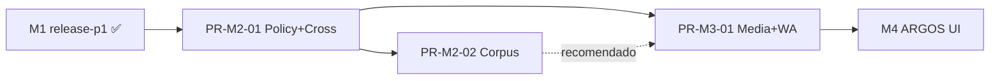

# PERSEO / ARGOS — Plan de ejecución M2–M3 (velocidad alta)

**Versión:** 1.0  
**Estado:** **Operativo** — complementa y acelera `PERSEO-ARGOS-INTEGRATED-ROADMAP-v2.md`  
**Fecha:** 2026-05-19  
**Objetivo de producto:**

```txt
PERSEO debe sobrevivir conversaciones reales complejas
sin parecer un bot roto.
```

**Regla:** los suites son medios; el fin es **capacidad conversacional real** en WhatsApp.

---

## 0. Cambio de operación (vigente)

| Antes (v2.0 inicial) | Ahora (ejecución) |
|----------------------|-------------------|
| Bloques 4–8 escenarios | Bloques **6–12** escenarios (PR-M2-01 excepción integrada: **14–16**) |
| PR-M2-01 solo Policy (8) | **PR-M2-01 = Policy + Cross foundation** (1 bloque fuerte) |
| Corpus antes o paralelo a Cross | **Corpus después de Policy+Cross** |
| 2–2.5 semanas por bloque pequeño | **1–2 semanas máximo** por PR de bloque |
| “Pasar POLICY_001” | **“Cerrar Policy Layer v1 + Message Understanding foundation”** |

### 0.1 Prioridad absoluta (orden fijo)

```text
1. Policy Layer
2. Multi-intent / mensajes largos
3. Corpus foundation
4. Media intake
5. WhatsApp real
6. UI ARGOS (M4)
```

### 0.2 Checklist obligatorio por bloque

1. Problema de producto **completo** resuelto.  
2. Valor **visible** (comportamiento demostrable en 1–2 frases de demo).  
3. **6–12** escenarios reales (14–16 solo PR-M2-01 integrado).  
4. Motor endurecido + flags + trace.  
5. Capacidad real nueva (no solo JSON).  
6. Pruebas **agresivas** (unit + ARGOS + regresión acumulativa).  
7. Validación **Railway** documentada.  
8. **Smoke WhatsApp** cuando el bloque toque percepción o política en campo.

---

## 1. Vista de PRs M2–M3 (reestructurada)

```text
Semana 1–2   PR-M2-01  Policy + Cross foundation     14–16 escenarios │ 2 suites
Semana 3–4   PR-M2-02  Corpus Foundation v1           6–8 escenarios   │ corpus-validate
Semana 5–6   PR-M3-01  Media + WhatsApp Hardening v1  10–12 escenarios │ media-p0 + whatsapp-smoke
Semana 7+    M4        ARGOS-0 UI (fuera de este plan)
```

**Total nuevos escenarios M2–M3:** ~30–36 (acumulado repo ~48–54 con M1).

**Hotfix (excepción):** 1–2 escenarios, producción crítica, sin abrir bloque nuevo.

---

## 2. PR-M2-01 — Policy + Cross foundation

### 2.1 Nombre de cierre

```txt
Cerrar: Policy Layer v1 + Message Understanding foundation
```

Un solo PR. Un solo hito de demo. Dos flags independientes pero desplegables juntos en QA.

### 2.2 Problema de producto que resuelve

| Dolor real | Sin este bloque | Con este bloque |
|------------|-----------------|-----------------|
| Usuario bajo mínimo o fuera de zona | Bot califica igual o inventa | `DECLINE_SOFT` / `HANDOFF` con copy y trace |
| “Vendo y compro” en un mensaje | Menú IVR o flip de carril | Segmentos + `response_plan` + policy por segmento |
| Mensaje largo con 4 datos | Pierde slots o reinicia | Slots por segmento + una pregunta foco |
| Confundido tras política | Tono robot o handoff prematuro | Humanity integrada en regresión |

**Por qué Policy + Cross juntos:** policy sobre texto plano sin segmentación **falla** en mensajes reales (montos en un párrafo, dual intent). Cross sin policy **promete** captación imposible.

### 2.3 Alcance motor exacto

#### A) Policy Engine v1 (completo)

| Pieza | Entregable |
|-------|------------|
| Config | `config/policy/commercial-policy.v1.json` |
| Zonas | `config/policy/active-zones.v1.json` (zonas + **colonias** hijas) |
| Copy | `config/policy/decline-templates.v1.json` |
| Motor | `conversation/v3/policy/PolicyEngine.js` |
| Decisiones | `ATTEND`, `QUALIFY`, `DECLINE_SOFT`, `HANDOFF`, `DEFER` |
| Monedas | MXN / USD con umbrales venta y renta |
| Trace | `debug_trace.policy_decision` (siempre que flag ON) |
| Integración | Post-interpreter, pre-RuleGuard; no CRM |
| Flag | `PERSEO_POLICY_ENGINE_ENABLED` (default `false` prod) |

#### B) Message Understanding foundation (MVP integrado)

| Pieza | Entregable |
|-------|------------|
| Segmentación | `conversation/v3/understanding/messageSegmenter.js` |
| Multi-intent | `conversation/v3/understanding/multiIntentDetector.js` |
| Slots segmento | `conversation/v3/understanding/segmentSlotExtractor.js` |
| Planner | `conversation/v3/understanding/responsePlanner.js` → `response_plan[]` |
| Prioridad | Reglas: policy block > acknowledge dual > slot gap > pregunta única |
| Trace | `debug_trace.segments`, `debug_trace.response_plan` |
| Flag | `PERSEO_MESSAGE_PLANNER_ENABLED` (default `false` prod) |
| **Fuera de scope** | LLM libre, refactor Decision Core, más de 1 respuesta WhatsApp por turno |

#### C) Contrato documental

| Archivo | Contenido |
|---------|-----------|
| `docs/argos/contracts/PolicyEngine-v1.md` | Inputs, outputs, decisiones, umbrales |
| `docs/argos/contracts/MessageUnderstanding-v1.md` | Segmentos, planner, invariantes con sticky M1 |

### 2.4 Escenarios — 16 totales (objetivo)

#### Suite `policy-p0` — 8 escenarios

| Código | Caso | Decisión / outcome |
|--------|------|-------------------|
| `POLICY_001` | Venta 2.5M MXN | `DECLINE_SOFT` |
| `POLICY_002` | Venta 120k USD | `DECLINE_SOFT` |
| `POLICY_003` | Renta 8k MXN/mes | `DECLINE_SOFT` |
| `POLICY_004` | Renta 400 USD/mes | `DECLINE_SOFT` |
| `POLICY_005` | Zona fuera cobertura (ej. MTY centro) | `DECLINE_SOFT` o `HANDOFF` |
| `POLICY_006` | Venta Cumbres 4.5M MXN | `ATTEND` |
| `POLICY_007` | “Quiero vender” sin monto/zona | `DEFER` / `QUALIFY` |
| `POLICY_008` | USD + zona ambigua / excepción | `HANDOFF` / `QUALIFY` |

#### Suite `cross-intent-p0` — 6 escenarios

| Código | Caso | Comportamiento clave |
|--------|------|----------------------|
| `CROSS_001` | Vender casa y comprar otra | Dual intent; sin menú IVR; plan serializado |
| `CROSS_002` | Cumbres 4M habitada + busco San Pedro | Slots por segmento; no mezclar oferta/demanda |
| `CROSS_003` | 4 preguntas en un mensaje | ≥2 ack en plan; 1 pregunta foco |
| `CROSS_004` | Multilínea desordenada (precio, zona, nombre) | Slots correctos; sticky |
| `CROSS_005` | Dual intent + **policy** (venta 2M + compra Cumbres 5M) | Decline segmento venta; attend compra |
| `CROSS_006` | Mensaje largo post-handoff / continuidad | No reopen global; `response_plan` coherente |

#### Suite `humanity-policy-p0` — 2 escenarios (nueva)

| Código | Origen | Rol en PR-M2-01 |
|--------|--------|-----------------|
| `HUMANITY_002` | **Ya existe** — endurecer PASS con planner+policy OFF/ON | Confundido sin handoff prematuro |
| `HUMANITY_003` | **Ya existe** — endurecer PASS | Cortante / brevedad |

> **Nota:** no crear duplicados `HUMANITY_002b`. Si fallan, **arreglar motor** en el mismo PR.

#### Opcional +2 (solo si 16 PASS antes de merge — no retrasar PR)

| Código | Caso |
|--------|------|
| `REG_LONG_MSG_001` | Mensaje >400 chars con zona+monto; sticky intacto |
| `REG_POLICY_TONE_001` | Tras `DECLINE_SOFT`, tono humano sin menú |

Si el PR va largo en semana 2, estos 2 van a **PR-M2-02** (corpus o reg pack), no bloquean M2-01.

### 2.5 Suites y regresión

**Suites nuevas (gate 100%):**

- `policy-p0` (8)
- `cross-intent-p0` (6)
- `humanity-policy-p0` (2) — o ampliar `humanity-handoff-p0` si se prefiere un solo archivo

**Regresión obligatoria (gate 100%):**

```text
release-p0          (7)
release-p1          (11)
humanity-p0         (2)
reg-sticky-p0
reg-short-msg-p0
humanity-handoff-p0 (si no fusionada en humanity-policy-p0)
```

### 2.6 Criterios de aceptación (AC)

**Producto**

- [ ] Demo 3 min: mensaje dual intent + mensaje bajo mínimo → respuesta coherente, no IVR.
- [ ] Ningún escenario nuevo inventa precio, link o disponibilidad.
- [ ] Tras `DECLINE_SOFT`, usuario puede seguir en compra si el mensaje era dual (CROSS_005).

**Técnico**

- [ ] `policy-p0` 8/8 local + Railway (flags ON en QA).
- [ ] `cross-intent-p0` 6/6 local + Railway.
- [ ] `humanity-policy-p0` 2/2 (o handoff suite equivalente).
- [ ] Regresión §2.5 100% con flags **OFF** y **ON** en QA.
- [ ] `npm run test:argos` + `npm run test:perseo` PASS.
- [ ] `npm test` — fallos baseline documentados sin nuevos (2 conocidos en main).

**Observabilidad**

- [ ] 100% escenarios POLICY/CROSS con `policy_decision` y `response_plan` en trace (flag ON).

**WhatsApp (smoke acotado — 3 pláticas, no bloquea merge)**

- [ ] Allowlist piloto: 1 dual intent, 1 bajo mínimo, 1 mensaje largo — anotado en `docs/argos/whatsapp-smoke/pilot-m2-01.md`.

### 2.7 Dependencias

| Depende de | Bloquea |
|------------|---------|
| M1 ✅ `release-p1` | PR-M2-02, PR-M3-01 |
| RuleGuard / interpreter actuales | — |
| Supabase / ATENA | Nada |

### 2.8 Riesgos y mitigaciones

| Riesgo | Mitigación |
|--------|------------|
| PR “monstruo” (>3k LOC) | Dos flags; revisión por subcarpetas `policy/` y `understanding/`; checklist PR en §2.10 |
| Policy duplica interpreter | PolicyEngine único; tests unit 20+ casos |
| Planner rompe sticky | CROSS_004/006 + `reg-sticky-p0` en CI pre-push |
| 16 escenarios retrasan 2 semanas | Congelar scope en 14 (sin REG opcionales); humanity solo PASS |
| Prod accidental ON | Flags default false; Railway QA checklist |

### 2.9 Estrategia de rollout

```text
Fase 0 — Dev local
  PERSEO_POLICY_ENGINE_ENABLED=true
  PERSEO_MESSAGE_PLANNER_ENABLED=true
  → todas las suites §2.5 + nuevas

Fase 1 — Railway QA (obligatorio pre-merge)
  Ambos flags true
  → remote: release-p0, release-p1, policy-p0, cross-intent-p0,
             humanity-*, reg-*

Fase 2 — Producción (post-merge, no en mismo PR)
  Día 0: ambos false (sin cambio comportamiento)
  Día 1–3: planner ON, policy OFF — monitoreo sticky
  Día 4–7: policy ON — monitoreo DECLINE_SOFT / quejas
  Rollback: cualquier flag false en <5 min
```

### 2.10 División interna del PR (evitar caos en review)

| Orden merge interno | Contenido | Reviewer focus |
|--------------------|-----------|----------------|
| Commit 1 | Config policy + PolicyEngine + unit tests | Reglas negocio |
| Commit 2 | Understanding + integración pipeline | Sticky / planner |
| Commit 3 | 14 escenarios JSON + 3 suites | QA / expected |
| Commit 4 | Docs contrato + smoke WA pilot | Producto |

**Tamaño orientativo:** 2.000–3.500 LOC (aceptable para 2 semanas, 1–2 devs).

### 2.11 Duración

| Métrica | Objetivo |
|---------|----------|
| Calendario | **10 días hábiles máximo** (2 semanas) |
| Escenarios | **14–16** (mínimo 14 para merge) |

---

## 3. PR-M2-02 — Corpus Foundation v1

### 3.1 Nombre de cierre

```txt
Cerrar: Corpus & Learning Foundation v1
```

**Prioridad #3** — después de Policy+Cross, porque el corpus alimenta gaps **reales** ya clasificables.

### 3.2 Problema de producto

Escala de ~210 pláticas sin congelar 210 JSON; pipeline de import, validación, dedupe y promoción **manual** a escenarios.

### 3.3 Alcance motor

| Pieza | Entregable |
|-------|------------|
| Schema | `ConversationRecordV1` + `docs/argos/contracts/ConversationRecordV1.md` |
| Parsers | MD, TXT, CSV, JSON (`corpus/parsers/*`) |
| Extensión | Stub `DocxParser`, `PdfParser` (throw `NOT_IMPLEMENTED` + doc) |
| Índice | Extender `corpus-index.yaml`: `promotion_status`, `import_batch_id`, `outcome_hash`, `tags` |
| Dedupe | `corpus/dedupe.js` por outcome_hash + rail |
| CLI | `scripts/corpus-validate.js` |
| Suite | `corpus-validate` (CI) |
| Ingest piloto | Batch ≥30 registros desde corpus existente |

**Fuera de scope:** ARGOS-2 UI, tablas Supabase, auto-promote a scenarios.

### 3.4 Escenarios — 6–8 (familia CORPUS + REG ligados a corpus)

| Código | Tipo | Propósito |
|--------|------|-----------|
| `CORPUS_001` | Ingest MD válido → record | Parser MD |
| `CORPUS_002` | CSV batch 3 filas | Parser CSV |
| `CORPUS_003` | Dedupe detecta duplicado | No doble índice |
| `CORPUS_004` | JSON import ARGOS run | Round-trip |
| `CORPUS_005` | TXT WhatsApp-like | Heurística roles |
| `CORPUS_006` | Registro rechazado PII | Validación falla bien |
| `REG_CORPUS_GAP_001` | Plática corpus CAP-A-014 → comportamiento gap | Puente corpus→motor (opcional) |
| `REG_CORPUS_GAP_002` | Plática demanda ambigua indexada | Idem (opcional) |

Suite: `corpus-p0.json` (6–8) + script `corpus-validate`.

### 3.5 Regresión

Todas las de M2-01 + `policy-p0` + `cross-intent-p0` + `humanity-policy-p0`.

### 3.6 AC

- [ ] `corpus-validate` PASS en CI.
- [ ] `corpus-p0` 6/8 PASS (mínimo 6).
- [ ] ≥30 registros importados sin romper índice.
- [ ] Cero auto-promoción a `scenarios/*.json`.
- [ ] Regresión M2-01 100% Railway.

### 3.7 Dependencias

| Depende de | Bloquea |
|------------|---------|
| PR-M2-01 merge | PR-M3-01 (recomendado) |
| — | M4 ingest UI |

### 3.8 Riesgos

| Riesgo | Mitigación |
|--------|------------|
| Scope creep DOCX | Solo stub |
| CORPUS escenarios frágiles | Validar schema, no conversación completa en CI |

### 3.9 Rollout

CLI y suite en CI; **sin flag en producción** (offline/batch). No afecta WhatsApp en runtime.

### 3.10 Duración

**8–10 días hábiles** (1.5–2 semanas).

---

## 4. PR-M3-01 — Media + WhatsApp Hardening v1

### 4.1 Nombre de cierre

```txt
Cerrar: Media Intake v1 + WhatsApp Real Validation wave 1
```

Un bloque operativo: salir del laboratorio con media honesto y **primera ola** de campo.

### 4.2 Problema de producto

Audio/imagen sin inventar; validar en WhatsApp real que Policy+Cross+Corpus **sobreviven** fuera de ARGOS.

### 4.3 Alcance motor

#### Media Intake v1

| Pieza | Entregable |
|-------|------------|
| Contrato audio | Transcript → `logical_turn.text` |
| Sin transcript | Fallback honesto / HANDOFF |
| Contrato imagen | `image_hints[]`; no precio desde imagen |
| Mock ARGOS | Fixtures transcript / hints |
| Trace | `debug_trace.media_intake` |
| Flag | `PERSEO_MEDIA_INTAKE_V1_ENABLED` |

#### WhatsApp wave 1 (operación + motor)

| Pieza | Entregable |
|-------|------------|
| Allowlist | `docs/argos/whatsapp-smoke/allowlist-20.yaml` |
| Checklist | HUMANITY 5 ítems × 20 |
| Registro | `docs/argos/whatsapp-smoke/runs/` |
| Promoción | Bugs → `REG-WA-*` escenarios |
| Smoke script | `scripts/whatsapp-smoke-report.js` (opcional) |

### 4.4 Escenarios — 10–12

#### Suite `media-p0` — 6 escenarios

| Código | Caso |
|--------|------|
| `MEDIA_AUDIO_001` | Transcript mock → flujo normal |
| `MEDIA_AUDIO_002` | Sin transcript → fallback |
| `MEDIA_AUDIO_003` | Transcript vacío / ruido |
| `MEDIA_IMG_001` | Hints fachada → no inventar precio |
| `MEDIA_IMG_002` | Imagen ilegible → pedir texto |
| `MEDIA_IMG_003` | Imagen + texto; hints no override slots |

#### Suite `whatsapp-field-p0` — 4–6 escenarios (sintéticos + promovidos)

| Código | Origen |
|--------|--------|
| `REG_WA_001` | Dual intent real (sintético basado en piloto) |
| `REG_WA_002` | Bajo mínimo real |
| `REG_WA_003` | Mensaje largo 4 datos |
| `REG_WA_004` | Audio sin transcript real |
| `REG_WA_005` | Confundido post-policy (opcional) |
| `REG_WA_006` | Cortante + property code (opcional) |

Suite operativa: `whatsapp-smoke` = checklist + ≥4 `REG_WA_*` PASS.

### 4.5 Regresión

**Todas** las de M2-01 + M2-02 + `media-p0` + `whatsapp-field-p0` (mínimo 4).

### 4.6 AC

**Automatizado**

- [ ] `media-p0` 6/6 local + Railway.
- [ ] `whatsapp-field-p0` ≥4/6 PASS.
- [ ] Regresión completa 100% Railway.

**Campo (criterio V1 parcial — wave 1)**

- [ ] 10/20 pláticas allowlist ejecutadas con checklist.
- [ ] ≥8/10 con ≥4/5 HUMANITY.
- [ ] Todo bug crítico → `REG-WA-*` en repo o ticket enlazado.

**Producto**

- [ ] PERSEO no inventa contenido de audio/imagen en los 6 escenarios media.

### 4.7 Dependencias

| Depende de |
|------------|
| PR-M2-01 (obligatorio) |
| PR-M2-02 (recomendado, no bloqueante si corpus se retrasa 3 días) |

### 4.8 Riesgos

| Riesgo | Mitigación |
|--------|------------|
| WA ≠ ARGOS | REG-WA sintéticos + allowlist; no bajar umbral P0 |
| PR mezcla ops + código | Separar commits media vs REG-WA; checklist en docs |

### 4.9 Rollout

```text
QA: MEDIA flag ON
Prod: MEDIA flag OFF hasta 3 pláticas WA PASS manual
WA allowlist: números internos solo
```

### 4.10 Duración

**10 días hábiles** (2 semanas). Si WA field se atrasa: merge **media-p0** primero, REG-WA en patch 48h (única excepción de split).

### 4.11 ¿Por qué no separar Media y WhatsApp en 2 PRs?

| Opción | Pros | Contras |
|--------|------|---------|
| **Un PR M3-01** (recomendado) | Un hito “listo para campo”; 10–12 escenarios coherente | Review más largo |
| Dos PRs | Review más chica | Rompe regla “bloque completo”; WA sin media es incompleto |

**Decisión:** un PR con **merge interno en 2 commits** (media → WA REG).

---

## 5. Matriz consolidada M2–M3

| PR | Cierre | Escenarios | Suites nuevas | Semanas | Flags prod default |
|----|--------|------------|---------------|---------|-------------------|
| **M2-01** | Policy + Cross foundation | **14–16** | `policy-p0`, `cross-intent-p0`, `humanity-policy-p0` | 2 | policy OFF, planner OFF |
| **M2-02** | Corpus Foundation v1 | **6–8** | `corpus-p0`, `corpus-validate` | 1.5–2 | N/A (batch) |
| **M3-01** | Media + WA Hardening v1 | **10–12** | `media-p0`, `whatsapp-field-p0`, `whatsapp-smoke` | 2 | media OFF |

**Acumulado escenarios nuevos:** 30–36.  
**Acumulado repo:** ~48–54 ejecutables.

---

## 6. Dependencias globales (diagrama)



---

## 7. Validación Railway (plantilla fija por PR)

```bash
export PERSEO_BASE_URL="https://..."
export ARGOS_SERVICE_SECRET="..."

for SUITE in release-p0 release-p1 policy-p0 cross-intent-p0 \
  humanity-p0 humanity-policy-p0 reg-sticky-p0 reg-short-msg-p0 \
  humanity-handoff-p0 corpus-p0 media-p0 whatsapp-field-p0; do
  node scripts/argos-run-suite.js --suite "$SUITE" --remote || exit 1
done
```

Ejecutar solo las suites que existan tras cada PR (M2-01 no corre `corpus-p0` aún).

---

## 8. Qué NO hacer

- PR solo `POLICY_003`.
- Corpus antes de Cross (invertir prioridad).
- ARGOS-0 antes de M3-01 wave 1 WA.
- Bajar umbral `release-p1` para “ir más rápido”.
- 20 escenarios en un PR sin split interno documentado.

---

## 9. Siguiente acción

1. Aprobar este plan de ejecución.  
2. Abrir rama `feat/m2-01-policy-cross-foundation`.  
3. Implementar PR-M2-01 según §2 (sin empezar M2-02 en la misma rama).

---

## 10. Referencias

- Rector: `PERSEO-ARGOS-INTEGRATED-ROADMAP-v2.md`
- Arquitectura LP: `PERSEO-ARGOS-LEARNING-POLICY-MULTIMODAL-ROADMAP-v1.md`
- Baseline M1: `PERSEO-M1-HUMANITY-STICKY-CONTEXT-v1.md`
