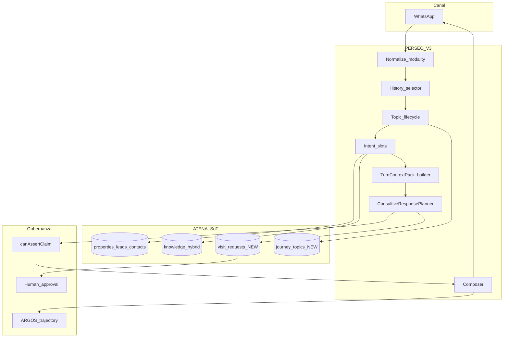
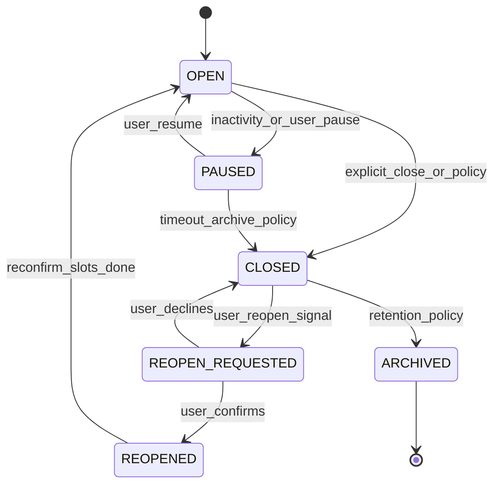
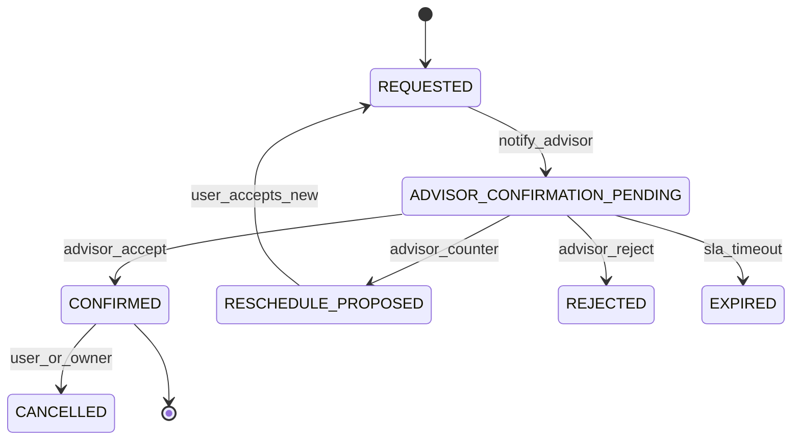
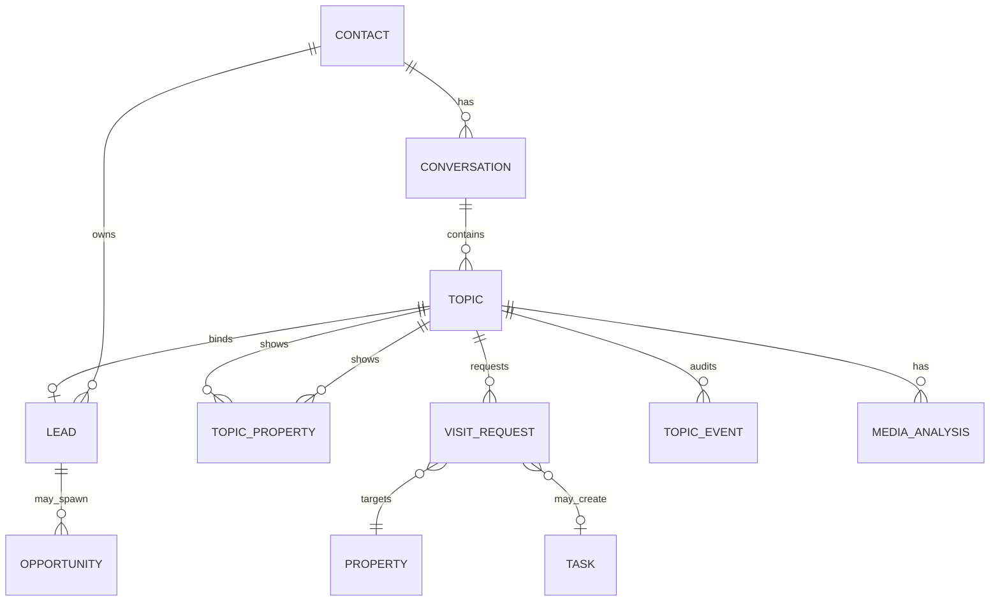
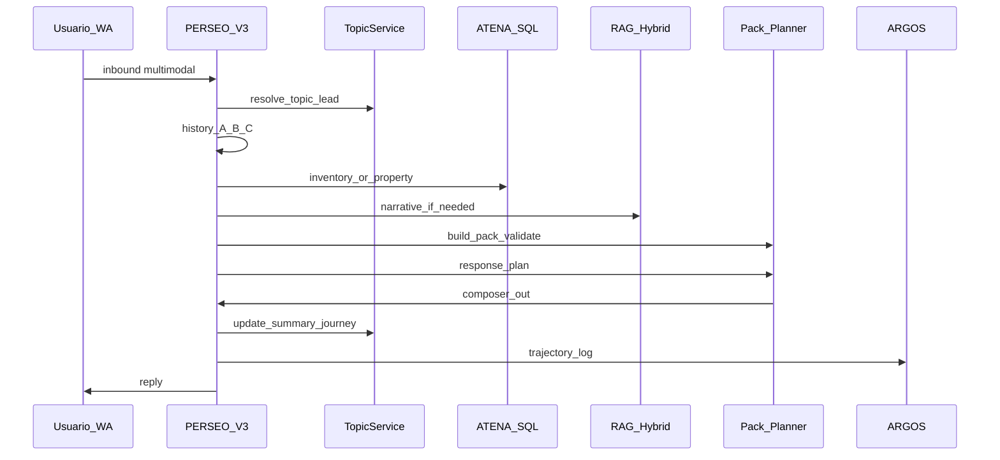
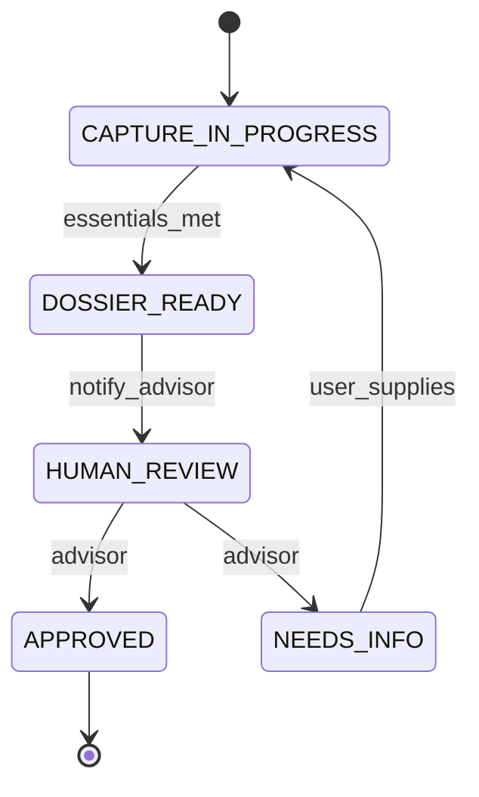
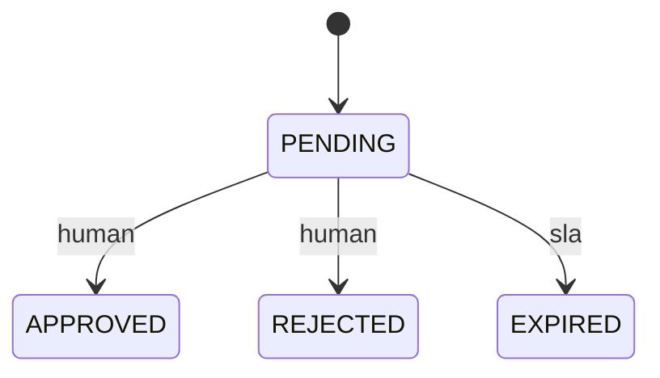

# PERSEO RAG Premium Conversational Evolution — Master Plan V2.1

| Campo | Valor |
|-------|-------|
| **Versión** | **2.1** |
| **Fecha** | 2026-07-22 |
| **Estado** | **ESPECIFICACIÓN CORRECTIVA PARA AUTORIZACIÓN** |
| **Base** | V2 (conservada; correcciones incrementales) |
| **Repos** | luxetty-perseo, luxetty-atena, ARGOS |
| **Plan Cursor** | `.cursor/plans/perseo_rag_evolution_master_e6870d56.plan.md` |
| **Clasificación** | Interno — decisión F0A–F9 |

> **Restricción:** este documento no autoriza por sí solo F2–F9. Autoriza el diseño. La implementación requiere GO explícito por fase.
> **V2.1:** cierra blockers contractuales/operativos; **no** inicia implementación.

---

## Changelog V2 → V2.1

| Cambio V2.1 | Sección afectada | Motivo | Bloquea fase |
| ----------- | ---------------- | ------ | ------------ |
| Reemplazar “merge inmediato” por reconciliación controlada (rama+PR+CI+ARGOS) | §2, §3, §34 F0B, §36, §40 D12, Anexo N | Evitar pérdida de commits main/prod y regresiones | F0B; bloquea F2 si drift no cerrado |
| Separar F1A (telemetría existente) vs F1B (trajectory schema condicional) | §2, §31, §33, §34, §35, Anexo F | No mezclar restore con migración nueva | F1B impl hasta schema/PII OK |
| Eliminar regla oficial “7 días → reutilizar lead”; contrato de idempotencia | §29 Q13, Anexo J, Anexo F | Regla arbitraria; CRM gate + evidencia | F2 (lead link) |
| Ownership/asignación como invariantes P0 + actores multi-asesor | §29, §24, §36, Anexo O | Guardian architecture; visitas 2 asesores | F2/F9 |
| Handoff ≠ cierre: control_mode + handoff_state separados | §10, §11, §13, Anexo K | Handoff no debe CLOSED automático | F2 |
| Propiedades normalizadas `conversation_topic_properties` | §9, §29 ERD/tablas, UI §19 | Eliminar arrays/JSON duplicados | F2 |
| Event log `conversation_topic_events` | §10, §29, Anexo C | Auditoría pause/close/reopen/switch | F2 |
| Journey memory estructurada (no bolsa key/value crítica) | §29, Anexo E | Gobernanza de slots críticos | F2 |
| Parámetros técnicos → `CONFIG_CANDIDATE_PENDING_BASELINE` | §9, §12, §31, Anexo L | Sin baseline F1 no fijar umbrales | F1A+canary |
| Corpus ARGOS ≥100 casos + certificación por niveles | §32, Anexo I | Suites no solo lista | Pre-canary F2+ |
| Canary por journey (smoke ≠ certificación) | §31, §37 | 100 turnos insuficientes para P0 | Canary F2–F9 |
| Visitas multi-asesor (owner ≠ property responsible ≠ coordinator) | §24, §29 visit_requests, UI | Un solo advisor_user_id incorrecto | F9 |
| KPIs comerciales además de seguridad | §31.3, Anexo M | Sistema seguro sin conversión | F1A+ |
| Prohibir PII/transcripts/pack completo en trajectory | §31 F1B, Anexo F | Privacidad | F1B |
| Secuencia autorización F0A/F0B/F1A/F1B… | §2, §34, §35, §42 | Claridad GO/NO-GO | Todas |

### Blockers V2 resueltos en especificación V2.1
B1 reconciliación · B2 F1A/F1B · B3 lead idempotency · B4 ownership · B5 handoff≠close · B6 topic properties · B7 topic events · B8 structured memory · B9 params candidatos · B10 corpus 100 · B11 canary levels · B12 multi-advisor visit · B13 commercial KPIs.

### Blockers pendientes (requieren acción humana / runtime, no más texto)
| ID | Pendiente | Owner |
|----|-----------|-------|
| P-F0A | Ejecutar unificación docs FAIL/CANARY | Docs+ARGOS |
| P-F0B | Abrir PR reconciliación + CI + cert | Eng+Dirección |
| P-F1A | Diagnosticar por qué `rag_query_logs` quieto en path V3 | Eng PERSEO |
| P-F1B | Firmar schema trajectory + retención/PII | Dir+Legal+Eng |
| P-D* | Firmar decisiones §40 (D1–D13) | Dirección |
| P-BASE | Medir baselines latencia/volumen | ARGOS F1A |

---

## Síntesis ejecutiva (1 página) — V2.1

### Qué cambió vs V2
Correcciones contractuales: **no merge directo**; **F1A≠F1B**; **sin ventana 7d como dedup oficial**; **ownership P0**; **handoff no cierra topic automáticamente**; **propiedades y eventos normalizados**; **memoria estructurada**; **parámetros candidatos**; **matriz ≥100 casos**; **canary por journey**; **visitas multi-asesor**; **KPIs comerciales**.

### Autorizar ahora
- **F0A GO** — documentación SoT (sin merge).
- **F0B GO proceso** — reconciliación vía rama/PR/CI/ARGOS (no merge automático).
- **F1A GO** — restaurar observabilidad existente (sin tabla nueva).
- **F1B GO diseño** — schema trajectory; **impl condicional** tras PII/retención.
- **Diseño conjunto F2+F3 GO** — sin migrate.

### Mantener bloqueado
- **F2–F9 implementación** hasta F0B evidencia + F1A baseline + firma §40 + diseño F2∧F3.
- Multimodal, visitas HITL, Agentic N2: **prohibidos** hasta fases y umbrales.

### Decisiones Dirección (críticas)
D12 reconciliación controlada (no merge auto) · D1 temas OPEN · contrato lead (§Anexo J) · ownership (§Anexo O) · handoff control (§Anexo K) · retención media · SLA visitas · owner ARGOS GLOBAL.

---
# 1. Resumen ejecutivo

Luxetty ya opera un **RAG Premium Consultivo certificado** (`PRODUCTION_RAG_GO = YES`, cert funcional PASS 2026-07-22) con inventario SQL SoT, hybrid retrieval, CDC, guardrails y V3 primary. El cuello de botella no es pgvector: es **coordinación conversacional** (tema, memoria por solicitud, pack obligatorio, planner consultivo, HITL de visitas) y **observabilidad post-GLOBAL**.

El programa evoluciona PERSEO de “responder + mostrar opciones” a **asesor guiado** sin reemplazar Supabase, V3 ni ARGOS; sin multiagente; sin CRM write desde RAG; sin confirmar visitas autónomamente.

**Madurez estimada:** operar Luxetty ~75–85%; consultivo premium ~65–70%; agentic controlado ~15% ON / ~45% código; paridad Homes-like ~55–65%.

---

# 2. Veredicto GO/NO-GO para iniciar implementación

| Fase | Veredicto | Condición |
|------|-----------|-----------|
| **F0A** Documentación | **GO** | Unificar SoT PASS/YES; archivar FAIL/CANARY drift; sin merge |
| **F0B** Reconciliación main↔prod | **GO proceso (PR)** | Inventario commits → rama reconciliación → CI → P0 → ARGOS → revisión humana → merge → deploy desde main. **Prohibido merge directo/automático** |
| **F1A** Telemetría existente | **GO** | Diagnosticar `rag_query_logs` / `persistRagQueryLog`; baseline; **sin tablas nuevas** |
| **F1B** Trajectory logging | **GO diseño; NO-GO impl** | Schema+PII+retención+sampling firmados; alternativa sin tabla evaluada |
| **Diseño contratos F2+F3** | **GO diseño** | Sin migrar hasta firma Dirección §40 |
| **F2** Topic lifecycle | **NO-GO impl** | F0B evidencia + F1A baseline + D1–D3 + ownership + lead contract |
| **F3** TurnContextPack | **NO-GO impl** | Requiere F2 con `active_topic_id` real |
| **F4** Response Planner | **NO-GO impl** | Pack válido canary |
| **F5–F6** Journeys/captación | **NO-GO** | Tras F4 |
| **F7** Multimodal | **NO-GO** | Consent+retención+pack |
| **F8** Tools GLOBAL | **NO-GO** | F3 + canary tools |
| **F9** Visitas HITL / Agentic N2 | **NO-GO** | Multi-advisor + umbrales |
| **F10** Optimización | Continuo | Post estabilización |

**Programa completo:** GO CONDICIONAL — F0A + F1A + proceso F0B; no implementar F2–F9 sin autorización por fase.


---

# 3. Estado real encontrado

## 3.1 Runtime y deploys (verificado 2026-07-22)

| Ambiente | Repo | Rama | Commit | Evidencia |
|----------|------|------|--------|-----------|
| Prod Railway luxetty-perseo | PERSEO | `fix/rag-rq47-quality-hardening` | `ca4cccb` | Railway get-status deployment `d8655e81` SUCCESS |
| `origin/main` PERSEO | PERSEO | main | `a915b29` | `git log origin/main -1`; **ca4cccb NOT ancestor of main** |
| Working ATENA | ATENA | `feat/rag-premium-hybrid` | `5e924a7` (histórico V2; tip local puede diferir) | CDC cron + cover metadata |
| `origin/main` ATENA | ATENA | main | `00069c6` (verificado 2026-07-22 tarde) | dashboard KPIs; **≠** tip RAG branch |

**Drift crítico PERSEO (verificado):** merge-base `dd3ec4e`; **15 commits** exclusivos de `fix/rag-rq47-quality-hardening` (incl. `ca4cccb`); **4 commits** exclusivos de `main` (incl. `a915b29` premium consultivo). Diffstat ~74 files / +9.4k. **V2.1:** reconciliación controlada — **Anexo N**. **Prohibido** merge directo prod→main.

## 3.2 Capacidades runtime (código)

- V3: `conversation/v3/core/v3Runtime.js`, `v3InboundBridge.js`, stages en `conversation/v3/types/constants.js` (`NEW`…`CRM_READY`…`CLOSED`)
- Inventario: `services/inventoryOptionsService.js`, `inventoryOptionsTurn.js`
- RAG: `services/ragService.js` (`persistRagQueryLog`, `createContextPack`), `conversation/v3/rag/ragTurnOrchestrator.js`
- Guardrails: `ragPolicy.canAssertClaim`, RC11/RC12, `r0ContextContinuity`, `conversationPriorityResolver` (fix renta `ca4cccb`)
- Tools OFF: `consultiveToolsPlanner.js` + flags `PERSEO_CONSULTIVE_TOOLS_*`
- Media: `whatsappMediaService.downloadWhatsAppMedia`, `imageVisionService`, `audioTranscriptionService` (flags media)
- Hydration ad-hoc: `legacyHydration` en `index.js` / `argos/processInboundForArgos.js` — **no** módulo TurnContextPack
- Planner M2: `conversation/v3/understanding/responsePlanner.js` — stub textos fijos, flags `PERSEO_MESSAGE_PLANNER_ENABLED` OFF

## 3.3 ATENA / Supabase Luxetty `pjoxytwsvbeoivppczdx`

- KS: `knowledge_*`, `rag_query_logs` (500 filas, last_at **2026-07-07**), `knowledge_reindex_jobs`, hybrid RPC, CDC cron `*/5` active
- LI: zones/colonies/aliases
- Valuations + `property_valuation_comparables`
- `tasks` + `task_types` incl. `visit`; **sin** `visit_requests` / `conversation_topics` / journey memory
- `contact_communication_preferences` existe, **0 rows**
- `leads` SoT; `requests` legacy (2 rows)

## 3.4 Cert ARGOS

- SoT máquina: `docs/argos/evidence/perseo-functional-certification/PERSEO_FUNCTIONAL_CERTIFICATION.json` → `final_verdict: PASS` @ `2026-07-22T08:03:02Z`
- Contrato: `docs/architecture/BACKEND_KNOWLEDGE_UTILIZATION_100.md` → `PRODUCTION_RAG_GO = YES`

---

# 4. Diferencias contra el reporte del 22-jul-2026

| Afirmación reporte/audit | Estado V2 |
|--------------------------|-----------|
| PRODUCTION_RAG_GO = YES | Vigente (contrato) |
| Cert PASS | Vigente (JSON) |
| TurnContextPack parcialmente hidratado | Correcto; **sigue sin módulo obligatorio** |
| Tools/fotos OFF | Correcto (código default OFF; prod flags NO VERIFICADOS EN PLAINTEXT Railway) |
| rag_query_logs quieto post-GLOBAL | Vigente (SQL last_at 2026-07-07) |
| Fix sticky/greeting | **Nuevo post-reporte:** `ca4cccb` en prod; **ausente en main** |
| “Main = prod” | **FALSO** — drift de rama/commit crítico |

---

# 5. Inventario de componentes existentes

| Dominio | Rutas verificadas | Estado |
|---------|-------------------|--------|
| V3 runtime | `conversation/v3/core/v3Runtime.js`, `v3InboundBridge.js`, `sessionStore.js` | Wired |
| Intent/slots | `minimalInterpreter.js`, `qualificationPlanner.js`, `slotFillState.js`, `campaignIntake.js` | Wired |
| Priority/sticky | `conversationPriorityResolver.js`, `r0ContextContinuity.js`, `v3/ownership/stickyContext.js` | Wired |
| RAG | `ragService.js`, `ragTurnOrchestrator.js`, `buildContextPack.js`, `domainRetrievalOrchestrator.js` | Wired (flags) |
| Inventory | `inventoryOptionsService.js`, `inventoryOptionsTurn.js` | Wired (flags) |
| Comparables/zone | `comparablesService.js`, `zoneContextService.js` | Wired parcial |
| Tools | `consultiveToolsPlanner.js` | Código; flag OFF |
| Policy claim | `ragPolicy.js` | Wired |
| Handoff/CRM | `handoffPlanner.js`, `crm/executionGate.js`, `crmExecutor.js` | Wired; execute dry-run default |
| Media | `whatsappMediaService.js`, `inboundMediaStorageIngest.js`, `imageVisionService.js`, `audioTranscriptionService.js` | Existe; media runtime flags |
| M2 planner | `responsePlanner.js`, `runUnderstandingLayer.js` | Stub; OFF |
| ARGOS | `argos/processInboundForArgos.js`, `argos/replay/replayEngine.js`, `argos/ragKpiReport.js` | Existe |
| ATENA KS | migrations `20260706140000_*`, `20260722120000_*`, `20260722140000_*`; edges `index-knowledge`, `process-knowledge-cdc` | Prod |
| ATENA UI conv | `src/pages/panel/ConversationsPage.tsx` | Existe |
| Agenda | `tasks`, RPC `ensure_handoff_followup_task` | Existe; no visit_request |

**Ausentes:** `TurnContextPack` module, topic lifecycle tables, durable journey, visit_requests, media_analysis_results, approval_requests, trajectory logs, consultive Response Planner.

---

# 6. Problemas y riesgos priorizados

| ID | Severidad | Problema |
|----|-----------|----------|
| R-P0-01 | P0 | Mezcla sticky offer / greeting vs demanda (parcialmente mitigado `ca4cccb`; falta suite permanente + topic isolation) |
| R-P0-02 | P0 | Sin aislamiento formal tema/lead → herencia de slots entre journeys |
| R-P0-03 | P0 | Drift main≠prod → riesgo de rollback a código sin fix |
| R-P0-04 | P0 | Visita/confirmación sin HITL formal → riesgo de promesa falsa |
| R-P1-01 | P1 | Telemetría `rag_query_logs` quieta |
| R-P1-02 | P1 | Pack no obligatorio → composer ignora inventario |
| R-P1-03 | P1 | Planner hardcode / stub M2 viola principio anti-formularios |
| R-P1-04 | P1 | Doc FAIL/CANARY obsoleto + snapshot ATENA CANARY_ACTIVE |
| R-P2-01 | P2 | Tools/fotos OFF |
| R-P2-02 | P2 | Consent ledger vacío |
| R-P2-03 | P2 | Multimodal sin store de análisis ni límites de claim |
| R-P3-01 | P3 | Chunking 1:1; rerank avanzado |

---

# 7. Arquitectura objetivo

Principios inamovibles:
1. Backend ATENA = SoT de hechos.
2. Solicitud = `public.leads`.
3. RAG = narrativa/citaciones; nunca PII ni CRM write.
4. Un solo PERSEO + tools; no multiagente.
5. Composer genera lenguaje desde plan+pack; ifs solo para routing a caminos conocidos.
6. HITL para visitas, captación jurídica, ownership.



---

# 8. Arquitectura conversacional por turno

Secuencia obligatoria (determinística salvo cajas LLM marcadas):

1. Normalización canal + modalidad  
2. Resolver `contact_id` / conversación  
3. Señales new/continue/reopen tema  
4. Resolver `active_topic_id` (+ crear si NEW)  
5. Resolver `active_lead_id` (puede ser null en discovery)  
6. Historial capas A/B/C (§9)  
7. Intent primary/secondary + cambio  
8. Extracción/reconciliación slots (§10)  
9. SoT SQL (inventory/property)  
10. RAG narrativo si dominio aplica  
11. Tools lectura ≤2  
12. **Build TurnContextPack** + validate  
13. **Response Planner** (schema)  
14. Policy claims / mustNot  
15. Composer → outbound  
16. Persist topic/journey/trajectory  
17. ARGOS hooks  

**Fail-closed:** PROPERTY_QA sin SoT; visita sin consentimiento; claim campaña sin entidad; lead ambiguo.

---

# 9. Estrategia de historial y memoria

## 9.1 Tres capas
- **A Inmediata:** últimos **12** mensajes o **8k tokens** (el que corte primero), siempre del `conversation_id` actual.
- **B Resumen tema activo:** `conversation_topics.summary_json` (§29); regenerar cada **5 turnos** del tema o ante corrección de operación/zona/presupuesto/lead.
- **C Journey durable:** `contact_journey_memory` filtrado por `lead_id` o `topic_id`; **nunca** vector search sobre transcripts privados como retrieval principal.

## 9.2 Algoritmo de selección (pseudocódigo)

```text
function selectHistory(ctx):
  contact = resolveContact(phone) or anonymous_session
  conv = resolveOpenConversation(contact, channel=whatsapp)
  signal = detectTopicSignal(inbound)  # NEW | CONTINUE | REOPEN | AMBIGUOUS
  if signal == AMBIGUOUS: ask_clarify_topic(); return DEFER
  topic = resolveActiveTopic(conv, signal)  # never silent reopen CLOSED
  lead = topic.lead_id  # may be null
  A = lastMessages(conv, limit=CFG.window_msgs /* CONFIG_CANDIDATE_PENDING_BASELINE: 12 */, maxTokens=CFG.history_tokens /* candidate: 8000 */)
  B = topic.summary_json if topic else empty  # regen: CFG.summary_every_n_turns /* candidate: 5 */ or on material correction
  C = structuredJourneyMemory(contact_id, lead_id=lead, topic_id=topic.id)  # NOT opaque key/value for critical slots
  exclude = all CLOSED topics except if signal==REOPEN and user confirmed
  exclude += slots from other lead_ids unless explicit switch confirmed
  reconcile corrections (newer USER_DECLARED wins; keep audit trail)
  mark expired slots by matrix (§10)
  pack_history = budget(A,B,C, maxTokens=historyBudget)
  log included_fact_ids + excluded_fact_ids to trajectory
  return pack_history
```

## 9.3 Referencias cortas
“sí/esa/la segunda/mañana/más barata” → resolver solo contra **ventana A + filas `conversation_topic_properties` del topic activo (ranking_position / shown_at)**; precio vigente siempre desde SoT; snapshot solo evidencia; si ambigüedad → una pregunta de desambiguación.

## 9.4 Fail-safe
Si no hay `active_topic_id` resoluble: no CRM write; no visita; respuesta de clarificación; trajectory `topic_unresolved`.

---

# 10. Máquina de estados del tema

**Separada** de `CONVERSATION_STAGES` V3.

### Lifecycle (`topic_lifecycle`)
`OPEN | PAUSED | CLOSED | REOPEN_REQUESTED | REOPENED | ARCHIVED`



Transiciones prohibidas: `CLOSED → OPEN` silenciosa; `ARCHIVED → OPEN` sin nuevo topic hijo.

### Etapa conversacional (`conversation_stage` en topic — map a V3)
Reutilizar/mapear: `NEW/UNDERSTANDING/QUALIFYING/PROPERTY_CONTEXT/QUALIFICATION_COMPLETE/HANDOFF_*/CRM_READY/HUMAN_ESCALATION/CLOSED` desde `constants.js`.

### Motivos de cierre (`closure_reason`) — **no** disparan solo por handoff
`COMPLETED | USER_DECLINED | NO_RESPONSE | DUPLICATE | OUT_OF_SCOPE | PROPERTY_UNAVAILABLE | VISIT_CANCELLED | CONTACT_NO_FOLLOW_UP | SYSTEM_INACTIVE | HANDOFF_COMPLETED*`

\* `HANDOFF_COMPLETED` es **motivo operativo opcional** tras evaluación explícita de que el objetivo del tema concluyó; **no** es transición automática al aceptar handoff. Ver control_mode / handoff_state abajo.

Actor de cierre: PERSEO (inactividad/completado flujo), usuario (explícito), asesor (ATENA), sistema (duplicate). Cada transición → fila en `conversation_topic_events`.

### Control conversacional (`control_mode`) — máquina separada
`AI | HUMAN | MIXED`

- `AI`: PERSEO responde.
- `HUMAN`: asesor tomó control; PERSEO **no** responde (salvo kill/sistema).
- `MIXED`: humano activo con asistencia de IA **solo** si flag+política lo permiten (default OFF en V2.1).

### Estado de handoff (`handoff_state`) — máquina separada
`NONE | REQUESTED | ACCEPTED | ACTIVE | RETURNED_TO_AI | COMPLETED | CANCELLED | EXPIRED`

**Reglas V2.1:** handoff **no** implica `lifecycle=CLOSED`. Topic puede permanecer `OPEN` o `PAUSED`. Lead permanece activo. Asesor puede `RETURNED_TO_AI`; PERSEO recupera contexto vía topic+events+pack. Tabla de transiciones: **Anexo K**.

---

# 11. Cierre y reapertura de conversación

## 11.1 Cerrar tema
1. Resumen breve (desde summary_json)  
2. Qué sigue + quién actúa  
3. Si aplica: “asesor confirmará”  
4. Marcar `lifecycle=CLOSED`, motivo, timestamp, actor + evento `TOPIC_CLOSED`  
5. Dejar de preguntar slots del flujo  
6. Conservar resumen; **no borrar** memoria estructurada  
7. Lead comercial **no** se cierra automáticamente salvo política CRM explícita  
8. **No** usar handoff ACCEPT como cierre implícito  

## 11.2 Nueva solicitud
Nuevo `topic_id`; **no heredar** presupuesto/zona/operación; puede reutilizar `contact_id`; crear `lead_id` solo al umbral de calificación (§7 modelo).

## 11.3 Reabrir
Señal explícita o ambigüedad → mostrar referencia 1 línea → confirmar → reconfirmar slots caducados → `REOPENED` o **topic hijo** si cambio material de operación/rol.

**Inactividad (`CONFIG_CANDIDATE_PENDING_BASELINE`, OK Dirección D3):** pause candidato 24h; close candidato 72h; archive candidato 30d. Sin spam de reactivación (>1 mensaje/72h candidato).

---

# 12. Response Planner

## 12.1 Evolución del stub M2
Archivo actual: `conversation/v3/understanding/responsePlanner.js` (textos fijos, flag OFF).  
**Objetivo:** `ConsultiveResponsePlanner` que emite **plan estructurado**, no copy final. Composer V3 (`slotTemplates.js` / humanComposer) genera lenguaje.

## 12.2 Schema propuesto (TypeScript conceptual)

```typescript
type ConsultiveResponsePlanV1 = {
  version: '1';
  currentGoal: string;
  activeTopicId: string | null;
  topicLifecycle: 'OPEN'|'PAUSED'|'CLOSED'|...;
  conversationStage: string; // V3 stage
  userRole: 'buyer'|'renter'|'seller'|'landlord'|'unknown';
  immediateAnswerRequired: boolean;
  confirmedContext: Record<string, unknown>;
  uncertainContext: Record<string, unknown>;
  missingHighValueInformation: string[]; // ordered
  retrievalPlan: { sqlInventory: boolean; ragDomains: string[]; propertyHydrate: boolean };
  toolPlan: { tools: string[]; maxTools: 2 };
  claimPlan: { allowed: string[]; blocked: string[] };
  recommendedNextStep: string;
  singleBestQuestion: string | null; // at most one
  consentStrategy: 'none'|'ask'|'confirm_channel'|'respect_decline';
  handoffStrategy: 'none'|'prepare'|'request_consent'|'escalate';
  closureDecision: 'none'|'propose'|'execute';
  mustNot: string[];
};
```

## 12.3 Determinístico vs LLM
- **Determinístico:** retrievalPlan desde intent+slots; toolPlan caps; claimPlan desde SoT/canAssertClaim; mustNot; closureCandidate desde lifecycle; missingHighValue desde matrices journey.
- **LLM (schema-validated):** redacción interna de `recommendedNextStep` / `singleBestQuestion` **como intención**, no string final al usuario; o ranking de qué dato pedir.
- **Composer:** único emisor de texto usuario.

## 12.4 Pseudocódigo

```text
plan = deterministicSkeleton(pack)
if CONSULTIVE_RESPONSE_PLANNER_ENABLED:
  draft = llmFillPlanFields(pack, plan) with timeout T
  plan = validateSchema(draft) or plan  # fallback skeleton
plan = enforceAntiLoop(plan, topic.asked_questions)
plan = enforceSingleQuestion(plan)
return plan
```

## 12.5 Anti-formulario
- Max 1 pregunta principal/turno.
- No re-preguntar slots CONFIRMED vigentes.
- Explicar por qué se pregunta (en composer, desde plan).
- Tests ARGOS: “no questionnaire spam” en long suite.

## 12.6 Latencia/costo
Latencia: medir `baseline_total_latency_p95`, `planner_added_latency_p95`, `tool_added_latency_p95`, `multimodal_added_latency_p95`, `end_to_end_latency_p95` (**CONFIG_CANDIDATE** absolute budget p.ej. planner_added ≤400ms — no definitivo). Fail/timeout → skeleton determinístico. Log tokens/cost/fallback_rate.

---

# 13. Consentimiento y handoff

## 13.1 Distinción
| Concepto | Significado | Store propuesto |
|----------|-------------|-----------------|
| Preferencia de canal | Quiere WA vs call | `contact_communication_preferences` (existente; hoy 0 rows) |
| Consentimiento | Autoriza propósito específico | **NUEVA** `contact_consents` (no asumir que preferences basta) |
| Evidencia | Mensaje/evento que lo prueba | `consent_evidence` o JSON en consent + `conversation_message_id` |

Propósitos: `whatsapp_contact | phone_call | email | visit_coordination | share_with_advisor | process_images | process_audio`.

Campos: purpose, status(granted/denied/withdrawn/unknown), source, scope, captured_at, expires_at, actor, evidence_ref, topic_id, lead_id.

## 13.2 Handoff (V2.1 — no equivale a cierre)
- Permitido si consent aplicable **o** base de negocio definida (ej. inbound Meta — **decisión Dirección D8**).
- Prohibido afirmar “te llamamos” sin grant `phone_call`.
- Al aceptar handoff: `control_mode=HUMAN`, `handoff_state=ACCEPTED→ACTIVE`; PERSEO deja de responder; topic **OPEN o PAUSED** (no CLOSED automático); lead **activo**.
- `RETURNED_TO_AI`: recuperar pack desde topic + `conversation_topic_events` + memoria estructurada.
- Cierre de topic solo por objetivo concluido, usuario/asesor explícito, o política de inactividad — **Anexo K**.
- Preparar ficha (§14) vía resumen topic + memoria estructurada + properties rows.

## 13.3 UX consentimiento
Valor primero (qué hará el asesor, tiempo, no repetir datos); ofrecer canal; respetar no; registrar retiro.

---

# 14. Ficha de calificación

Entregable al asesor (ATENA), no transcript:

**Comprador / Arrendatario / Vendedor / Arrendador** — campos del brief §10 del requerimiento, etiquetados:
`SOT_CONFIRMED | USER_DECLARED | MODEL_INFERRED | UNKNOWN | CONFLICTED`

Completitud % = esenciales_presentes / esenciales_journey.  
Confianza = min(confianzas de esenciales).  
Pendientes + riesgos + next_action + consentimientos.

Obligatorios **antes de CRM_READY demanda:** nombre o WA válido, operación, zona o presupuesto, lead_flow demand.  
Obligatorios **antes handoff visita:** consent visit_coordination + property_id SoT.  
Obligatorios **CAPTURE_DOSSIER_READY:** ubicación, tipo, ocupación, expectativa económica declarada, consent share_with_advisor — **no** equivalen a captación jurídica.

---

# 15. Journey comprador

Flujo: discovery → qualify (budget/zone/type) → SQL options → compare → select → consent → visit_request HITL → follow-up.  
Memoria: filas `conversation_topic_properties` + prefs estructuradas (no bolsa JSON crítica).  
No mezclar con offer.  
Progressive profiling: 1 high-value question/turno.  
Flag path: inventory GLOBAL ya; planner+pack F3–F4; comparables canary.

---

# 16. Journey arrendatario

Igual que comprador con operación `rent`; slots: mudanza, ocupantes, mascotas, amueblado.  
Detector: `mentionsRentDemand` / `isRentSearchText` alineados (`ca4cccb`).  
Must-not: captación “rentar mi casa”.

---

# 17. Journey propietario vendedor

Entry: seller_capture / offer sticky (R0) **salvo** demanda explícita.  
Slots: ubicación, tipo, ocupación, precio esperado, motivación, docs declarados.  
Valuación: ATENA valuations = apoyo; **nunca** opinión final PERSEO.  
Estado expediente: `CAPTURE_DOSSIER_READY_FOR_HUMAN_REVIEW` ≠ `CRM_READY` genérico.

---

# 18. Journey propietario arrendador

Similar vendedor con renta esperada, mascotas, amueblado, requisitos inquilino.  
Separar de demanda renta por `lead_flow=offer` + owner phrases.

---

# 19. Captación autónoma asistida

**Definición:** PERSEO prepara expediente; **humano** revisa, visita física, valida docs, aprueba publicación/contrato.

```text
detect_owner → consent → location → traits → occupancy → price_expected
→ motivation → docs_declared → images → preanalysis(INFERRED)
→ explain_process → visit_capture_request → dossier_ready
→ advisor_review → human_approve → (fuera de PERSEO: publish)
```

Prohibido: afirmar captada; prometir precio; garantizar tiempo; asumir titularidad legal (“declara ser propietario”); publicar; cambiar ownership; CRM write desde RAG.

---

# 20. Imágenes

Pipeline: WA inbound → `downloadWhatsAppMedia` → MIME/size validate → storage (existente ingest) → vision (`imageVisionService`) → **`media_analysis_results`** (NUEVO; no KS) → observations `MODEL_INFERRED` → composer pide re-toma si low confidence.

Límites **CONFIG_CANDIDATE_PENDING_BASELINE** (OK Dirección D4/D6): max 5 img/turno; 8MB; MIME jpeg/png/webp; timeout visión 8s; retención 30–90d — firmar tras F1A/costos.  
Prohibido: validez legal escritura; medidas exactas; match inventario por semejanza visual; PII innecesaria a proveedor.  
Docs (escritura/ID): clase `document_sensitive`; no OCR completo a modelo externo sin flag+aviso; solo “parece documento; asesor validará”.

---

# 21. Mensajes de voz

Pipeline: validate → download → normalize → `audioTranscriptionService` → confidence → extract intent/slots → **confirm critical** → store transcript linked topic (not KS) → retention policy.

Límites **CONFIG_CANDIDATE**: duración max 3 min canary / 5 min global; baja confianza → no actualizar budget/zone/operation/consent; pedir repetición parcial.  
Audio post-CLOSED → no reopen silencioso.

---

# 22. Inventario y recomendaciones

SQL-first `inventoryOptionsService`; solo active+slug+price; max 3 opciones; explicar relax zona; registrar vistas; anti-invent; network fallback solo post-empty bajo política.  
Composer usa `matchedOptions` del pack — **obligatorio** tras F3.

---

# 23. Comparables

`comparablesService.js` + valuations ATENA.  
Claims trade-off = consultivos, no promesas de liquidez.  
Flag/canary tras pack.

---

# 24. Solicitud y confirmación de visitas

**Entidad nueva `visit_requests`** (no solo `tasks`): tasks sirven agenda operativa; visit_request es solicitud conversacional con HITL.

Estados: `DRAFT → REQUESTED → ADVISOR_CONFIRMATION_PENDING → CONFIRMED | REJECTED | RESCHEDULE_PROPOSED | CANCELLED | EXPIRED`



**P0:** PERSEO nunca dice “visita confirmada” sin `CONFIRMED` + `confirmed_by_user_id` humano autorizado.  

### Actores (V2.1 — no un solo advisor_user_id)
| Campo | Responsabilidad |
|-------|-----------------|
| `contact_owner_agent_id` | Dueño del contacto; ownership comercial |
| `lead_owner_agent_id` | Dueño de la solicitud (= contacto salvo reasignación formal) |
| `property_responsible_agent_id` | Responsable de la propiedad consultada; coordinación, **no** ownership automático |
| `visit_coordination_agent_id` | Quién coordina agenda (puede ser owner o responsible) |
| `confirmed_by_user_id` | Humano que confirma en ATENA |
| `visit_attending_agent_id` | Quién atiende la visita (puede ≠ quien confirma) |

Reglas: consultar propiedad **no** cambia ownership; PERSEO no decide comisión ni reasigna; notifica a involucrados; ATENA muestra responsabilidades. Casos: mismo asesor; asesores distintos; sin responsable; no disponible; 2 propiedades de distintos asesores; uno confirma otro atiende; cancelación propietario. Tests: Anexo O + corpus.

SLA (`CONFIG_CANDIDATE`, D7): 4h laboral. Expiry → mensaje de coordinación sin fingir confirmación.  
`tasks` tipo visit **después** de CONFIRMED (dual-write).

---

# 25. Política anti-alucinación

Clases claim: `SOT_CONFIRMED | RAG_CITED | USER_DECLARED | MODEL_INFERRED | HUMAN_CONFIRMED | UNKNOWN | CONFLICTED | EXPIRED`.

SoT-only: precio, status, operación, LUX, slug, URL, publicabilidad, assignment, lead, contact, oportunidad, transacción, campaña entidad, zona canónica LI.

Extender `canAssertClaim` + entity gates RC11/RC12.  
Empty inventory: no inventar; ofrecer flex criterio; fallback red solo policy.

---

# 26. TurnContextPack

## 26.1 Principio
Módulo nuevo (p.ej. `conversation/v3/context/turnContextPack.js` + schema). **No** seguir creciendo `legacyHydration` ad-hoc. Migración: builder produce pack; `applyLegacyHydrationToSession` consume pack.

## 26.2 Campos obligatorios comerciales
`conversation.{conversationId,contactId,channel,currentTurnId}`, `intent.primary`, `slots.confirmed|missing`, `policy.mustNot`, `inventory` XOR `propertyContext.activeProperty` según intent, `orchestration.nextBestAction`, `history.activeTopicSummary` (puede vacío en NEW), `topic.{activeTopicId,lifecycle,controlMode,handoffState}` tras F2, `topicProperties[]` ids/ranking (no precio stale).

## 26.3 Versionado
`TurnContextPackV1`; max serializado ~32KB redactado (**CONFIG_CANDIDATE**); history budget tokens configurable post-baseline.

## 26.4 Orden hidratación
identity → topic/lead → history → intent/slots → SQL property/inventory → zone LI → RAG → tools → policy → freshness.

## 26.5 Fail-closed / degrade
Ver §12.2–12.3 del brief (PROPERTY_QA, precio, URL, visita, lead ambiguo, campaña, legal).  
Degrade: RAG down; comparables down; zone down; media down; journey down → flags en pack + planner adapta.

## 26.6 Por qué F2 antes que F3 (y diseño conjunto)
Sin `active_topic_id`, el pack **reintroduce** hidratación monolítica de `ai_state` y no aísla leads.  
Diseñar schemas F2+F3 juntos; **implementar F2 persistencia → F3 builder obligatorio**.  
Si se hiciera pack antes: riesgo de codificar contaminación en contrato “oficial”.

---

# 27. Tools

## Nivel 1 — lectura (existentes + nuevos)
| Tool | Existe | Activación |
|------|--------|------------|
| get_property_facts | Sí (`consultiveToolsPlanner`) | Canary post F3 |
| search_inventory_options | Sí | Ya vía inventory turn; también tool |
| get_comparables | Sí | Canary |
| get_zone_context | Sí | Canary |
| get_rules_context | Sí | Canary |
| get_contact_context | **Nuevo** RPC SoT | F8 |
| get_lead_context | **Nuevo** | F8 |
| get_assignment_context | **Nuevo** | F8 |
| get_campaign_context | **Nuevo** + RC12 | F8 |
| get_conversation_summary | **Nuevo** desde topic.summary | F8 |
| get_topic_status | **Nuevo** | F8 |

Caps: max 2/turno; timeout 4s; mustNot crm_write/create_lead/assignment/invent_*.

## Nivel 2 — reversibles
create_task, reminder, advisor_summary_draft, mark_needs_attention, visit_request_draft — audit log; flag `PERSEO_AGENTIC_REVERSIBLE_ENABLED` OFF.

## Nivel 3 — approval
confirm_visit, reschedule, create_opportunity, propose_reassign, send_off_flow_message — `agent_approval_requests`.

---

# 28. Agentic controlado

Progresión: N1 lectura → N2 reversible → N3 approval → **nunca** N4 prohibido (ganar/perder lead, ownership, transacciones, comisiones, legal final, publicar auto, inventar).  
Multiagente: **prohibido** en este programa.  
Autorización N2: post F3–F4 + umbrales §31 + 14 días canary N1 GLOBAL sin P0.

---

# 29. Modelo de datos

## 29.1 Modelo conceptual contacto–conversación–tema–lead (P0)



### Respuestas explícitas
1. **¿Varios temas por conversación WA?** Sí.  
2. **¿Activos simultáneos?** **Máx 1 `OPEN` activo** por conversación; otros `PAUSED/CLOSED`. (Recomendación técnica; Dirección puede autorizar 2 con UI desambiguación — default 1).  
3. **¿Tema sin lead_id?** Sí, en DISCOVERY/informativo.  
4. **¿Cuándo crear lead?** Al umbral: operación+rol claros + (zona|budget|property) + identidad mínima (nombre o WA) — vía CRM gate existente, no desde RAG.  
5. **¿Tema cambia lead_id?** Solo con transición explícita auditada (switch solicitud).  
6. **¿Lead con varios temas?** Sí (reopen/hijo); uno “current” por lead.  
7. **¿Tema con varias propiedades?** Sí — filas en `conversation_topic_properties` (`SHOWN`/`ACTIVE`/`SELECTED`/`REJECTED`/…); `active_property_id` derivado o con constraint; **sin** arrays UUID duplicando relaciones.  
8–9. Comprador+vende / owner+renta: **segundo tema** (o pause+switch); nunca fusionar slots.  
10–11. `active_topic_id` = único OPEN; `active_lead_id` = topic.lead_id.  
12. Dos leads activos: preguntar cuál continuar; **no** merge silencioso.  
13. **Dedup lead (V2.1):** **NO** regla de 7 días. Idempotencia por `meta_message_id` / webhook / CRM gate / lead abierto **compatible por evidencia** + tabla de decisión **Anexo J**. Modelo no fusiona solo; RAG no escribe CRM.  
14. Pre-contacto: session phone-only; no cross-contact.  
15. Cambio teléfono: nuevo contact resolution; no merge automático de contactos.  
16. Informativo: topic sin lead; no CRM.  
17. Media → `topic_id` activo al recibir; si CLOSED → no asociar sin reopen.  
18. Cierre tema ≠ cierre lead; **handoff ≠ cierre automático** (`control_mode`/`handoff_state`).

### Invariantes P0
- No usar datos de otro `contact_id`.  
- No reutilizar slots de otro `lead_id` sin transición.  
- No reopen silencioso CLOSED.  
- Corrección reciente > dato anterior (con historial / `SLOT_CORRECTED` event).  
- Sin identidad suficiente → no acciones sensibles.  
- Ambiguo → no switch lead.  
- Imagen ≠ match inventario por semejanza.  
- Audio low conf → no campos críticos.  
- Handoff sin consent aplicable → bloqueado.  
- **Ownership:** todas las solicitudes activas de un contacto conservan el asesor dueño del contacto salvo reasignación formal auditada.  
- **`topic_id` nunca decide ownership.**  
- Agente de propiedad consultada **no** se convierte automáticamente en dueño del contacto; se registra interés (`conversation_topic_properties`).  
- Coordinación con responsable de propiedad **no** modifica asignación del lead.  
- Reasignación solo por flujo autorizado (ATENA/DIOS/engine), auditada.  
- RAG / Response Planner / tools lectura **no** cambian asignaciones.

## 29.2 Tablas nuevas (propuesta; **ADVERTENCIA: modificación de esquema**)

> V2.1: propiedades normalizadas + event log + memoria estructurada + visitas multi-asesor. Trajectory **condicional F1B**.

### `conversation_topics`
id, conversation_id FK, contact_id FK, lead_id FK null, lifecycle, conversation_stage, control_mode (`AI|HUMAN|MIXED`), handoff_state, closure_reason null, parent_topic_id null, summary_json (redactado), asked_questions jsonb, version int, created_at, updated_at, closed_at  
**Sin** `viewed_property_ids[]` / rejected JSON duplicado — ver `conversation_topic_properties`.  
Índices: (conversation_id, lifecycle), (contact_id, updated_at), (lead_id)  
Unique parcial: un OPEN por conversation_id  
RLS: service_role PERSEO; agents vía ownership ATENA  
Escritor: PERSEO topic service / panel AI control · Lector: PERSEO, ATENA UI, ARGOS

### `conversation_topic_events`
id, topic_id FK, event_type, previous_lifecycle, new_lifecycle, previous_stage, new_stage, previous_control_mode, new_control_mode, previous_handoff_state, new_handoff_state, actor_type (`system|perseo|user|advisor`), actor_id null, reason_code, evidence_message_id null, metadata_redacted jsonb, created_at  
Eventos candidatos (validar dominio): `TOPIC_CREATED|TOPIC_PAUSED|TOPIC_CLOSED|TOPIC_REOPEN_REQUESTED|TOPIC_REOPENED|TOPIC_ARCHIVED|LEAD_LINKED|LEAD_SWITCHED|PROPERTY_ACTIVATED|HANDOFF_REQUESTED|CONTROL_CHANGED|SLOT_CORRECTED`  
Índices: (topic_id, created_at), (event_type, created_at)  
Retención: candidato 180–365d · **Prohibido** PII innecesaria en metadata  
Uso ARGOS/UI: auditoría cierres/reaperturas/handoff

### `conversation_topic_properties`
id, topic_id FK, property_id FK, relationship_type (`SHOWN|ACTIVE|SELECTED|REJECTED|VISIT_REQUESTED|VISITED|COMPARED|FAVORITE` — validar), source, ranking_position null, shown_at, selected_at, rejected_at, rejection_reason structured null, active_from, active_to, snapshot_price, snapshot_status, snapshot_operation, created_at, updated_at  
Reglas: precio vigente = SoT; snapshot = evidencia; “la segunda” = ranking del turno; no duplicar mismo evento sin nuevo row de evento  
Índices: (topic_id, relationship_type), (property_id), unique parcial ACTIVE por topic

### Memorias estructuradas del journey (reemplazan bolsa `key/value` crítica)
Entidades propuestas (pueden ser tablas o columnas tipadas; **no** SoT de precio/ownership/consent):
- `topic_search_preferences` — operación, zona, tipo, recámaras, presupuesto_range, confidence, source, expires_at, version
- `topic_budget_history` / `topic_zone_history` — append-only correcciones
- Preferencias/canal: `contact_communication_preferences` (existente)
- Consent: `contact_consents` (nueva)
- Visitas: `visit_requests`
- Captación: dossier en lead/topic tipado (F6)
- Handoff: campos en topic + events

**Key/value auxiliar** (`contact_journey_aux` opcional): solo baja criticidad; **prohibido** ownership, precio, consentimiento, identidad, ejecución de acciones.

### `contact_consents`
id, contact_id, purpose, status, source, evidence_message_id null, topic_id null, lead_id null, captured_at, expires_at, withdrawn_at, actor

### `visit_requests`
id, topic_id, lead_id, contact_id, property_id, status, user_windows jsonb,  
`contact_owner_agent_id`, `lead_owner_agent_id`, `property_responsible_agent_id`, `visit_coordination_agent_id`, `confirmed_by_user_id` null, `visit_attending_agent_id` null,  
confirmed_at null, task_id null, expires_at, created_at  
**Regla:** ownership lead/contacto no cambia por esta fila; confirmación solo humano autorizado.

### `media_analysis_results`
id, conversation_id, topic_id, message_id, modality image|audio, storage_path, mime, model, confidence, result_json (claims classificados), claim_class, retention_until, created_at

### `agent_approval_requests`
id, action_type, payload_json redactado, status, requested_by_system, resolved_by null, topic_id, created_at

### `turn_trajectory_logs` — **F1B condicional**
Solo si se autoriza tabla (alternativa: eventos ARGOS/storage sin transcript).  
Campos **permitidos:** conversation_id, topic_id, turn_id/hash, intent, decision_codes, sources_consulted, tools, claim_codes, lifecycle/control/handoff snapshots, latencies, error_codes, included/excluded_fact_ids (hashes).  
Campos **prohibidos:** transcript completo, TurnContextPack completo, PII, mensajes privados, audio/imagen, consentimientos sensibles en claro.  
Sampling + TTL + kill switch `PERSEO_TRAJECTORY_LOGGING_ENABLED` · RLS admin/service · volumen estimado: **BASELINE REQUERIDO EN F1A**

**No KS:** ninguno de los anteriores.

Reverse: DROP en orden FK inverso; dual-read `ai_state.last_shown_property_ids` durante F2.

---

# 30. Seguridad y privacidad

MIME allowlist; size caps; URLs firmadas; retención; delete jobs; RLS; ownership; prompt injection en docs/imagen/audio; minimización PII a proveedores; no indexar conversaciones en KS; sanitizar errores; anti-PII gate `supabase/validation/rag_p0_no_pii_audit.sql`.

---

# 31. Observabilidad ARGOS

## 31.1 F1A — Restaurar observabilidad existente (**GO**)
Alcance: diagnosticar `rag_query_logs`; verificar `persistRagQueryLog` (`services/ragService.js`); mapear rutas V3 que invocan RAG vs inventory-only; confirmar fallos de logging; recuperar KPIs; establecer baseline.  
**Prohibido en F1A:** crear tablas; migrar modelo salvo corrección mínima autorizada.  
Dashboard: `argos/ragKpiReport.js` / hooks ATENA.

## 31.2 F1B — Trajectory logging (**GO diseño; impl condicional**)
Objetivo: auditar decisiones (intent→plan→tools→claims→estados) **sin** persistir conversaciones completas.  
Alternativas sin tabla: ampliar eventos ARGOS existentes; storage de evidencias de cert; sampling en logs estructurados.  
Si tabla: schema §29.2; redacción; sampling; TTL; costos/volumen post-F1A; kill switch.  
Secuencia lógica: objetivo→contexto_ids→intent→plan_codes→retrieval→tools→claims→memoria_refs→cierre_codes.

## 31.3 Umbrales seguridad (baseline **F1A** obligatorio)

| Métrica | Baseline | Canary GO | GLOBAL GO | NO-GO |
|---------|----------|-----------|-----------|-------|
| Mezcla contactos | F1A | 0 | 0 | >0 |
| Mezcla leads | F1A | 0 | 0 | >0 |
| Precio/URL/prop inventados | F1A | 0 | 0 | >0 |
| Visita autoconfirmada | F1A | 0 | 0 | >0 |
| Reopen silencioso CLOSED | F1A | 0 | 0 | >0 |
| Ownership violada / reassignment silenciosa | F1A | 0 | 0 | >0 |
| Handoff→CLOSED automático indebido | F1A | 0 | 0 | >0 |
| Preguntas repetidas injustificadas | F1A | CONFIG_CANDIDATE | CONFIG_CANDIDATE | spike |
| Turnos comerciales pack válido | post-F3 | ≥95% cand. | ≥98% cand. | <90% |
| Planner schema failure | post-F4 | ≤1% cand. | ≤0.5% | >5% |
| Tool error rate | post-F8 | ≤2% cand. | ≤1% | >8% |
| Empty search rate (demand w/ zone) | F1A | observar | ≤ baseline+5pp | spike>15pp |
| Latencia p95 total / planner_added / tool_added | F1A | vs baseline | vs baseline | regresiones graves |
| Audio low-conf critical write | — | 0 | 0 | >0 |
| Imagen INFERRED como hecho | — | 0 | 0 | >0 |
| Handoff sin consent | F1A | 0 | 0 | >0 |
| Trajectory PII leak | F1B | 0 | 0 | >0 |

**Canary:** ver niveles Smoke/Canary/Global §37 — **100 turnos = smoke**, no certificación completa.  
Owner GLOBAL: ARGOS lead + Dirección (D11). Kill switch: flags OFF.

## 31.4 KPIs comerciales
Ver **Anexo M** (aceptación contacto/WA/llamada, completitud ficha, tiempo a CRM_READY/handoff/respuesta humana, propiedades mostradas/seleccionadas, visitas, captaciones dossier, reaperturas, conversión a oportunidad sin atribución exclusiva a PERSEO). Segmentar buyer/renter/seller/landlord/campaña/agente/zona/modalidad.

---

# 32. Corpus de pruebas

Suites A–K: Continuidad, Roles, Cierre/reopen, Consent, Inventario, Captación, Imágenes, Audio, Visitas, Adversarial, Largas.  
**V2.1:** matriz ejecutable **≥100 conversaciones** — **Anexo I** (schema por caso). Release estable requiere **100/100 PASS** en pre-canary (replay, sin writes CRM). Suites P0 independientes no se reemplazan por muestra prod.

**P0 bloqueantes antes canary F2:**  
- sticky offer + “casas en renta”  
- Hola+renta Cumbres → options not greeting  
- dos leads / buyer+seller  
- closed topic ambiguous message  
- “la segunda” vía topic_properties ranking  
- visit never auto-confirm  
- anti-invent price/url  
- ownership: contacto pregunta propiedad de otro asesor  
- handoff ACCEPT no cierra topic  
- lead idempotency: webhook retry no duplica  

---

# 33. Feature flags

| Flag | Default | Prod inicial | Deps | GO GLOBAL |
|------|---------|--------------|------|-----------|
| (existentes) RAG_P0_*, INVENTORY_*, CONSULTIVE_TOOLS_*, RAG_PROPERTY_IMAGES_*, MEDIA_* | OFF código | Contrato YES en RAG/inv; tools/images OFF | — | Según runbook |
| PERSEO_TOPIC_LIFECYCLE_ENABLED | false | allowlist | F1 | Umbrales mezcla=0 |
| PERSEO_JOURNEY_MEMORY_ENABLED | false | allowlist | topic | Idem |
| PERSEO_TURN_CONTEXT_PACK_MANDATORY | false | allowlist | topic id | pack≥98% |
| PERSEO_CONSULTIVE_RESPONSE_PLANNER_ENABLED | false | allowlist | pack | schema fail≤0.5% |
| PERSEO_TOPIC_CLOSURE_MESSAGING_ENABLED | false | allowlist | topic | — |
| PERSEO_TOPIC_REOPEN_ENABLED | false | allowlist | topic | silent reopen=0 |
| PERSEO_TRAJECTORY_LOGGING_ENABLED | false | OFF hasta F1B autorizado | F1B schema | Solo post PII review |
| PERSEO_VISIT_REQUESTS_ENABLED | false | allowlist | pack+consent | auto-confirm=0 |
| PERSEO_CAPTURE_DOSSIER_ENABLED | false | allowlist | topic | — |
| PERSEO_MEDIA_ANALYSIS_STORE_ENABLED | false | allowlist | media+consent | inferred-as-fact=0 |
| PERSEO_AGENTIC_REVERSIBLE_ENABLED | false | off | N1 tools | Post evals |
| PERSEO_HUMAN_APPROVAL_ACTIONS_ENABLED | false | off | visit | — |

Kill: set false; rollback deploy previo si regresión P0.

---

# 34. Fases del proyecto

### F0A — Documentación (S) — **GO**
Unificar docs SoT PASS/YES; marcar FAIL/CANARY como histórico; snapshot nombres de flags (valores Railway: dashboard humano).

### F0B — Reconciliación main↔prod (M) — **GO proceso / NO merge automático**
Workflow Anexo N (PERSEO + ATENA). Incluye cherry-pick/merge controlado de `ca4cccb` y commits exclusivos; preservar commits útiles de main; PR + CI + P0 + ARGOS + review humana + deploy desde main + equivalencia funcional.

### F1A — Telemetría existente (M) — **GO**
Restaurar/verificar `rag_query_logs`; baselines 48–72h; **sin** tabla trajectory.

### F1B — Trajectory (M) — **GO diseño; impl condicional**
Schema+PII+retención; kill switch; alternativa sin tabla.

### Diseño conjunto F2+F3 (S) — **GO diseño**
Schemas topic+events+properties+pack; ownership; lead decision table; sin migrate hasta §40.

### F2 — Topic lifecycle (L) — **NO-GO hasta F0B evidencia + F1A + §40**
Migraciones topics/events/properties + memorias estructuradas; control_mode/handoff_state; suites confusión+ownership+lead idempotency.

### F3 — TurnContextPack mandatory (M) — **NO-GO hasta F2 persistido**
Builder+validate; wire index/ARGOS; fail-closed PROPERTY_QA.

### F4 — Response Planner (L) — **NO-GO hasta F3 canary**
Schema planner; composer; anti-hardcode menú cuando slots conocidos.

### F5/F6 — Journeys + captación (M/L) — **NO-GO**
Buy/rent/seller/landlord; CAPTURE_DOSSIER_READY_FOR_HUMAN_REVIEW.

### F7 — Multimodal (L) — **NO-GO**
media_analysis_results; claims limitados.

### F8 — Tools lectura (M) — **NO-GO**
Canary→GLOBAL N1.

### F9 — Visitas HITL + Agentic N2 (XL) — **NO-GO**
visit_requests multi-asesor; approval queue; Agentic reversible solo post evals.

### F10 — Optimización continua
Chunking, costos, model routing; promover CONFIG_CANDIDATE → valores firmados.

---

# 35. Matriz de dependencias

```text
F0A → F0B(PR) → F1A → F1B(design|impl?) → Design(F2∧F3) → F2 → F3 → F4 → F5/F6
                                                                      ↘ F7 (consent+F1A)
                                                                 F3 → F8
                                                        F3+F4+umbrales+multi-advisor → F9
```

Paralelo: UI specs asesor || F1A; escritura matriz 100 casos || F1A; review schemas F2 || F0B.  
**No paralelo:** F3 impl antes F2; F4 antes pack; F1B migrate antes firma PII; F9 antes planner+pack+ownership visit.

Bloqueo F2: F0B cerrado + F1A baseline + D1–D3 + contratos lead/ownership/handoff.  
Bloqueo F3: `active_topic_id` real.  
Bloqueo F4: pack válido (umbral candidato post-baseline).

---

# 36. Matriz de riesgos

| Riesgo | Sev | Prob | Mitigación | Detección | Kill | NO-GO |
|--------|-----|------|------------|-----------|------|-------|
| Merge incorrecto prod→main / pérdida fix | P0 | Alta sin proceso | F0B Anexo N | Diff post-merge + cert | Revert PR | Regresión P0 en main |
| Duplicación / reuso incorrecto lead | P0 | Media | Anexo J + CRM gate | Suite lead + CRM counts | Flag CRM execute | >0 dup webhook |
| Violación ownership | P0 | Media | Invariantes + Anexo O | Suites assignment | — | >0 silent reassign |
| Handoff cierra prematuro | P0 | Media | control_mode≠CLOSED | Suite handoff | TOPIC flag | CLOSED on ACCEPT |
| Arrays/JSON props inconsistentes | P1 | Alta si arrays | topic_properties | Integrity tests | — | Orphan ACTIVE |
| Memoria key/value no gobernable | P1 | Alta | Structured memory | Schema review | JOURNEY flag | Critical in KV |
| Trajectory con PII | P0 | Media | F1B prohibitions | PII audit | TRAJECTORY OFF | Leak>0 |
| Parámetros sin baseline | P1 | Alta | CONFIG_CANDIDATE | F1A measure | — | Firmados sin data |
| Canary insuficiente | P0 | Alta | §37 niveles | Sample plan | Pause expand | GLOBAL sin canary journey |
| Coordinación 2 asesores incorrecta | P0 | Media | visit multi-ids | Visit suite | VISIT OFF | Wrong owner change |
| Seguro sin conversión | P1 | Media | Anexo M KPIs | Dash comercial | — | Dir review |
| Contaminación tema/lead | P0 | Media | F2 + tests | Mezcla=0 | TOPIC OFF | >0 |
| Pack sin topic | P0 | Alta | F2→F3 | Pack valid% | PACK OFF | |
| Visita falsa confirmada | P0 | Baja c/ HITL | fail-closed | autoconfirm=0 | VISIT OFF | >0 |
| Telemetría ciega | P0 | Alta hoy | F1A | logs<24h | — | F2 sin F1A |
| Schema lock migrations | P1 | Media | concurrent idx; dual-read | Mig runbook | Reverse SQL | |

---

# 37. Plan de rollout

Por fase: OFF → unit → integration → ARGOS replay → allowlist → canary → observación → expand → GLOBAL (si aplica).

### Niveles de muestra (números = CONFIG_CANDIDATE hasta F1A)
| Nivel | Propósito | Candidato | Método de decisión |
|-------|-----------|-----------|--------------------|
| Smoke | Funcionalidad básica | ~100 turnos / pocos internos | Manual + P0 verde |
| Canary | Riesgo P0 por journey | Mín. conversaciones por buyer/renter/seller/landlord; multi-lead; closed/reopen; handoff; visitas (cuando F9) | 0 P0; KPIs vs baseline; tiempo observación candidato ~72h |
| Global | Estabilidad | Sin P0; métricas estables; rollback probado; costos medidos; aprobación humana | D11 |

Multimodal/Agentic pueden permanecer allowlist permanente.

---

# 38. Plan de rollback

1. Flag OFF inmediato.  
2. Redeploy commit previo Railway.  
3. Reverse SQL si migrate (mantener dual-read).  
4. No borrar evidencia trajectory.  
5. Postmortem ARGOS.

---

# 39. Criterios de aceptación del programa

Los 30 puntos del brief §24 — todos medibles vía ARGOS + evidencias JSON. Adicionar: main alineado con prod en commits de routing; rag_query_logs frescos <24h.

---

# 40. Decisiones que requieren autorización de Dirección

| ID | Decisión | Opciones | Recomendación | ¿Bloquea? |
|----|----------|----------|---------------|-----------|
| D1 | Temas OPEN simultáneos | 1 vs 2 | **1** | F2 |
| D2 | Crear lead umbral | temprano vs tarde | Al calificar mín. | F2 |
| D3 | Inactividad pause/close | 24h/72h vs otros | 24h/72h | F2 |
| D4 | Retención imágenes/audio | 30/90/180d | 90d | F7 |
| D5 | Proveedor visión/STT | actual OpenAI vs otro | Mantener actual | F7 |
| D6 | Consent multimodal obligatorio | sí/no | **Sí** aviso+flag | F7 |
| D7 | SLA confirmación visita | 2h/4h/8h | 4h laboral | F9 |
| D8 | Base handoff sin consent call | permitir WA-only | WA si grant whatsapp | F4 |
| D9 | Network fallback externo | on/off | Off como Luxetty propio | F5 |
| D10 | Cuándo Agentic N2 | post umbrales | Tras F4+14d N1 | F9 |
| D11 | Owner GLOBAL ARGOS | rol | ARGOS+Product | F1+ |
| D12 | Reconciliación main↔prod | merge auto vs **rama+PR+CI+ARGOS** | **Reconciliación controlada** (Anexo N); **prohibido merge automático** | F0B |
| D13 | Autorizar F1B tabla trajectory | sí/no/alternativa eventos | Preferir eventos/IDs; tabla solo si PII OK | F1B |

---

# 41. Preguntas abiertas

- ¿Zona horaria única MTY para SLA visitas?  
- ¿UI dossier vive en ConversationsPage o vista nueva Captación?  
- ¿Backfill topics desde ai_state histórico? (recomendación: no; solo nuevos turnos)  
- Costos máximo $/conversación multimodal  

---

# 42. Recomendación final

1. **F0A GO** — docs SoT.  
2. **F0B GO proceso** — reconciliación PR (no merge directo).  
3. **F1A GO** — telemetría existente + baselines.  
4. **F1B** — diseño GO; migración solo tras D13.  
5. **F2 bloqueado** hasta F0B+F1A+§40 (D1–D3)+contratos lead/ownership/handoff.  
6. **F3 bloqueado** hasta F2 con `active_topic_id`.  
7. **F4 bloqueado** hasta pack canary.  
8. Secuencia: **F0A→F0B→F1A→F1B?→Design(F2∧F3)→F2→F3→F4→F5/F6→F7→F8→F9**.  
9. Paralelo: matriz 100 casos + UI specs + schemas.  
10. Migraciones (cuando autorizadas): topics, events, properties, memorias estructuradas, consents, visit_requests, media_analysis, approval; trajectory **condicional**.  
11. P0: drift main, telemetría, mezcla, ownership, visita falsa, PII trajectory.  
12. Umbrales §31 + KPIs Anexo M.  
13. Activable luego (código listo): tools/fotos/comparables tras F3.  
14. Construir: topic stack, pack, planner, visits multi-asesor, consents, media store, UI.  
15. ATENA UI: lifecycle + control_mode + handoff + owners + properties + events.  
16–17. Media/visitas/Agentic: fases y umbrales; Agentic N2 post evals.  
18. Prohibido: multiagente, CRM desde RAG, auto-confirm visita, PII en KS, embeddings SoT, merge auto, handoff=close, dedup 7d oficial.  
19. Dirección: §40.  
20. **GO F0A/F0B-proceso/F1A; NO-GO F2–F9 impl hasta autorización por fase.**

### Respuestas obligatorias V2.1
1. F0A listo: **sí (GO)**.  
2. F0B listo para PR: **sí como proceso**; merge solo tras CI+ARGOS+review.  
3. F1A listo: **sí (GO)**.  
4. F1B necesita migración: **solo si se elige tabla**; preferible evaluar eventos primero.  
5. Trajectory guarda: IDs/hashes/decisiones/tools/claims/estados/métricas/errores — **no** transcript/pack/PII.  
6. Leads: idempotencia mensaje + CRM gate + Anexo J — **no** regla 7d.  
7. Ownership: dueño del contacto prevalece en solicitudes activas; topic/propiedad no reasignan.  
8. Handoff: HUMAN control; topic OPEN/PAUSED; lead activo; return-to-AI posible.  
9. Props: `conversation_topic_properties` + snapshots; precio live SoT.  
10. Cierres/reopen: `conversation_topic_events`.  
11. Memoria estructurada: prefs búsqueda, historiales budget/zona, visitas, consents, handoff, correcciones.  
12. Params pendientes baseline: ventana msgs, tokens, regen summary, vigencias, pack size, latencias, canary n, media caps — Anexo L.  
13. ARGOS: **≥100/100 PASS** pre-canary.  
14. Canary: por journey + 0 P0 + tiempo observación; smoke≠cert.  
15. Visita 2 asesores: campos owner/lead/property/coordinator/confirmed_by/attending; sin cambio ownership.  
16. KPIs: Anexo M.  
17. Bloquea F2: F0B+F1A+D1–3+contratos.  
18. Bloquea F3: F2 `active_topic_id`.  
19. Bloquea F4: pack canary.  
20. Prohibido: multiagente, CRM←RAG, auto-confirm, PII KS, merge auto, Agentic/multimedia/visitas sin fase.

---

# Anexo A — Matriz de trazabilidad

| Requisito | Evidencia actual | Componente | Gap | Solución | Backlog | Prueba | Métrica |
|-----------|------------------|------------|-----|----------|---------|--------|---------|
| No confundir renta/captación | ca4cccb, incident 8119086196 | priority+R0 | Isolation topic | F2+tests | B-P0-01 | Suite roles | mezcla=0 |
| Historial relevante | ai_state only | sessionStore | No B/C | topic+journey | B-P0-02 | Continuity | repeat Q% |
| Pack obligatorio | legacyHydration | index.js | No module | TurnContextPack | B-P0-03 | Pack valid% | ≥95% |
| Planner consultivo | responsePlanner stub | M2 | Hardcode | ConsultivePlanner | B-P1-01 | Anti-form | schema fail |
| Visita HITL | wants_visit signal | parsers | No state machine | visit_requests | B-P0-04 | Visit suite | autoconfirm=0 |
| Telemetría RAG | rag_query_logs stale | ragService | Quiet | F1 fix | B-P0-05 | KPI report | logs<24h |
| Captación dossier | CRM_READY | handoff | No dossier states | CAPTURE_DOSSIER | B-P1-02 | Capture suite | — |
| Multimodal seguro | vision/audio services | media* | No store/claims | media_analysis | B-P2-01 | Image/audio | inferred-fact=0 |
| Consent | preferences 0 rows | ATENA | No ledger | contact_consents | B-P1-03 | Consent suite | handoff w/o=0 |
| Tools lectura | consultiveToolsPlanner | flags OFF | Not ON | F8 canary | B-P2-02 | Tool suite | error% |

---

# Anexo B — Diagrama completo del turno



---

# Anexo C — Diagramas de estados

(Ver §10 lifecycle tema; §24 visita.)

### Captación dossier


### Approval request


---

# Anexo D — Matriz de autoridad

| Acción | Auto | Auto reversible | Aprobación | Solo humano | Prohibido |
|--------|------|-----------------|------------|-------------|-----------|
| search inventory | X | | | | |
| property facts SoT | X | | | | |
| RAG narrative cite | X | | | | |
| create lead CRM | | | vía gate existente | | desde RAG/tools |
| visit_request create | X draft | | | | confirm |
| confirm visit | | | X | X | auto |
| capture dossier ready | X | | | | approve legal |
| publish property | | | | X | PERSEO |
| change ownership / reassignment | | | | X (flujo formal ATENA) | PERSEO/RAG/planner/tools |
| handoff ACCEPT | | | X UI | | auto-CLOSE topic |
| invent price/url | | | | | X |
| multiagent | | | | | X |

---

# Anexo E — Matriz de fuentes (extracto)

| Dato | SQL SoT | RAG | Usuario | Visión | Audio | Humano | Vigencia | Confirmación |
|------|---------|-----|---------|--------|-------|--------|----------|--------------|
| Precio listing | X | | | | | | live | — |
| URL | X | | | | | | live | — |
| Zona canónica | LI | | X | | | | 7d | si cambia |
| Presupuesto | | | X | | X* | | 14d | audio low→ask |
| Amenidad narrada | | X cite | | X inf | | | — | no como hecho |
| Consent | | | X | | | X | purpose | evidence |
| Disponibilidad visita | | | | | | X | — | required |

\*audio solo si confidence≥umbral.

---

# Anexo F — Backlog P0–P3 (ejecutable) — V2.1

Cada ítem: rollout allowlist→canary→global salvo docs; rollback = flag OFF / revert PR / reverse SQL conceptual.

| ID | Pri | Fase | Objetivo | Repo | Archivos (verificados o POR CONFIRMAR) | Deps | Mig | Flag | Tests | Métrica | DoD |
|----|-----|------|----------|------|----------------------------------------|------|-----|------|-------|---------|-----|
| B-P0-00 | P0 | F0A | Unificar docs PASS/YES; archivar FAIL | PERSEO | docs/argos/PERSEO_FUNCTIONAL_CERTIFICATION.md, BACKEND_KNOWLEDGE_UTILIZATION_100.md | — | No | — | Review | Un SoT | Docs alineados |
| B-P0-00c | P0 | F0A | Snapshot CANARY→histórico/YES | ATENA | src/lib/argos/backendKnowledge100Snapshot.json | — | No | — | Review | Drift=0 | Marcado |
| B-P0-REC-P | P0 | F0B | Reconciliación PERSEO main↔prod | PERSEO | rama `chore/reconcile-main-prod-*`; 74 files superficie | Inventario Anexo N | No | — | unit+P0+ARGOS cert | Equivalencia | PR mergeado + deploy main |
| B-P0-REC-A | P0 | F0B | Reconciliación ATENA RAG↔main | ATENA | feat/rag-premium-hybrid vs main | CDC+cover vs dashboard | No | — | mig dry-run | Paridad CDC | PR + evidencia |
| B-P0-05 | P0 | F1A | rag_query_logs vivos path V3 | PERSEO | services/ragService.js `persistRagQueryLog`; ragTurnOrchestrator.js | B-P0-00 | No* | — | integration | inserts<24h | Baseline KPIs |
| B-P0-05b | P0 | F1B | Trajectory schema+writer condicional | Ambos | NEW o eventos ARGOS | B-P0-05, D13 | Cond | TRAJECTORY | PII audit | leak=0 | Schema firmado |
| B-P0-LEAD | P0 | F2 | Contrato idempotencia lead (Anexo J) | PERSEO | services/leadAutomation.js `createOrReuseLeadFromConversation`; crm/executionGate.js; saveConversationMessage meta_message_id | F1A | No | CRM flags existentes | Suite lead | dup webhook=0 | Tabla decisión implementada |
| B-P0-OWN | P0 | F2 | Invariantes ownership + tests | Ambos | leadAutomation.js `buildAssignmentPriorityCandidates`; assignmentDecision.js; test/demandOwnershipAssignment.test.js | B-P0-LEAD | No | — | Suite O | silent reassign=0 | P0 PASS |
| B-P0-CTRL | P0 | F2 | control_mode + handoff_state | Ambos | perseoGatekeeper.js; panel-ai-conversations; topics cols | B-P0-01 | Sí | TOPIC | Anexo K | no auto-CLOSE | Wire UI take/return |
| B-P0-01 | P0 | F2 | Topic resolve + max 1 OPEN | Ambos | NEW conversation_topics | F0B,F1A,D1 | Sí | TOPIC_LIFECYCLE | roles | mezcla=0 | Suites PASS |
| B-P0-EVT | P0 | F2 | conversation_topic_events | ATENA | NEW migration | B-P0-01 | Sí | TOPIC | audit tests | events on close/reopen | Append-only |
| B-P0-PROP | P0 | F2 | conversation_topic_properties | Ambos | NEW; replace last_shown_property_ids dual-read | B-P0-01 | Sí | TOPIC | “la segunda” | ranking OK | No arrays dup |
| B-P0-MEM | P0 | F2 | Memorias journey estructuradas | ATENA | NEW prefs/history tables | B-P0-01 | Sí | JOURNEY_MEMORY | cross-lead | =0 | No KV crítico |
| B-P0-02b | P0 | F2 | Closure/reopen messaging | PERSEO | planner/composer | B-P0-01,EVT | No | CLOSURE/REOPEN | reopen | silent=0 | UX OK |
| B-P0-03 | P0 | F3 | TurnContextPack mandatory | PERSEO | NEW turnContextPack.js; index.js; argos | B-P0-01 | No | PACK_MANDATORY | pack valid | ≥95% cand | Module live |
| B-P1-01 | P1 | F4 | ConsultiveResponsePlanner | PERSEO | NEW planner; responsePlanner.js stub | B-P0-03 | No | RESPONSE_PLANNER | anti-form | schema fail | PASS |
| B-P1-03 | P1 | F2/F4 | contact_consents | ATENA | NEW; ≠ preferences | D6 | Sí | — | consent | handoff w/o=0 | Ledger |
| B-P0-04 | P0 | F9 | visit_requests multi-asesor HITL | Ambos | NEW + ConversationsPage + ConversationHandoffSummaryCard | B-P0-03,OWN | Sí | VISIT_REQUESTS | visit suite | autoconfirm=0 | Multi-ids UI |
| B-P1-02 | P1 | F6 | Capture dossier | Ambos | dossier+UI | B-P0-01 | Parcial | CAPTURE_DOSSIER | capture | — | Human review |
| B-P1-ARG100 | P1 | F1A–F2 | Matriz ARGOS 100 casos | PERSEO | docs/argos + harness | — | No | — | 100/100 | PASS | Pre-canary |
| B-P1-KPI | P1 | F1A | KPIs comerciales dash | Ambos | ARGOS/ATENA POR CONFIRMAR | B-P0-05 | No | — | report | baselines | Anexo M live |
| B-P1-PARAM | P1 | F1A/F10 | Experimentos CONFIG_CANDIDATE | PERSEO | flags/config | F1A | No | — | A/B | decision log | Firmados |
| B-P2-01 | P2 | F7 | media_analysis_results | Ambos | NEW+vision/audio | B-P1-03 | Sí | MEDIA_ANALYSIS | media | inferred-fact=0 | Store |
| B-P2-02 | P2 | F8 | Tools N1 canary→GLOBAL | PERSEO | consultiveToolsPlanner, accP0Flags | B-P0-03 | No | CONSULTIVE_TOOLS | tools | error≤1% | GLOBAL |
| B-P2-03 | P2 | F5 | Comparables+images canary | PERSEO | comparablesService | B-P0-03 | No | IMAGES | smoke | — | Canary |
| B-P2-UI | P2 | F2/F9 | UI asesor topic/control/visit | ATENA | ConversationsPage.tsx; components/panel/conversations/* | B-P0-CTRL | No | UI flags | e2e | — | Flujos §UI |
| B-P3-01 | P3 | F10 | Chunking quality | ATENA | index-knowledge | F1A | No | — | retrieval | KPI | Mejora |

\* F1A: sin migración salvo hotfix mínimo autorizado.

---

# Anexo G — Archivos impactados

**Existentes PERSEO:** `index.js`, `conversation/v3/core/v3Runtime.js`, `v3InboundBridge.js`, `conversationPriorityResolver.js`, `r0ContextContinuity.js`, `services/ragService.js`, `inventoryOptionsTurn.js`, `consultiveToolsPlanner.js`, `conversation/v3/understanding/responsePlanner.js`, `config/accP0Flags.js`, `conversation/v3/composer/slotTemplates.js`, `argos/processInboundForArgos.js`, `docs/argos/PERSEO_FUNCTIONAL_CERTIFICATION.md`, `docs/architecture/BACKEND_KNOWLEDGE_UTILIZATION_100.md`

**Nuevos PERSEO (propuestos):** `conversation/v3/context/turnContextPack.js`, `conversation/v3/planner/consultiveResponsePlanner.js`, `conversation/v3/topic/*` (resolve, events, properties), lead decision helpers, tests topic/pack/planner/visit/ownership/lead-idempotency/handoff-control

**Existentes ATENA:** `supabase/functions/index-knowledge/index.ts`, `process-knowledge-cdc`, migrations KS, `src/pages/panel/ConversationsPage.tsx`, `src/lib/argos/backendKnowledge100Snapshot.json`, `supabase/validation/rag_p0_no_pii_audit.sql`

**Nuevos ATENA:** migrations `conversation_topics`, `conversation_topic_events`, `conversation_topic_properties`, memorias estructuradas, `contact_consents`, `visit_requests` (multi-agent ids), `media_analysis_results`, `agent_approval_requests`; trajectory **condicional**; UI dossier/visit/control **POR CONFIRMAR** bajo `src/components/panel/conversations/` (existe `ConversationHandoffSummaryCard.tsx`)

**Config:** Railway flags (plaintext NO VERIFICADO por agente; names present)

---

# Anexo H — Evidencia de auditoría

| ID | Hallazgo | Repo | Rama | Commit | Archivo | Símbolo | Evidencia | main | prod | Confianza |
|----|----------|------|------|--------|---------|---------|-----------|------|------|-----------|
| E1 | Cert PASS | PERSEO | fix/rag… | ca4cccb tree | evidence/.../PERSEO_FUNCTIONAL_CERTIFICATION.json | final_verdict | JSON timestamp 2026-07-22 | N/A (gitignored) | N/A | Alta |
| E2 | PRODUCTION_RAG_GO YES | PERSEO | fix/rag… | — | docs/architecture/BACKEND_KNOWLEDGE_UTILIZATION_100.md | PRODUCTION_RAG_GO | Texto contrato | Verificar merge | Contrato | Alta |
| E3 | Prod deploy | PERSEO | fix/rag… | ca4cccb | Railway | luxetty-perseo | get-status d8655e81 | a915b29 ≠ | ca4cccb | Alta |
| E4 | main sin ca4cccb | PERSEO | main | a915b29 | — | merge-base | exit 1 | a915b29 | — | Alta |
| E5 | rag logs stale | ATENA DB | — | — | rag_query_logs | max(created_at) | SQL 2026-07-07 | — | Quiet | Alta |
| E6 | persistRagQueryLog exists | PERSEO | fix/rag… | — | services/ragService.js | persistRagQueryLog | Código L286+ | Sí | Código en prod branch | Alta |
| E7 | No TurnContextPack module | PERSEO | — | — | — | — | glob miss | — | — | Alta |
| E8 | legacyHydration | PERSEO | — | — | index.js | legacyHydration | ~L1320+ | Sí | Sí | Alta |
| E9 | responsePlanner stub | PERSEO | — | — | conversation/v3/understanding/responsePlanner.js | buildResponsePlan | Textos fijos | Sí | Flag OFF | Alta |
| E10 | Stages V3 | PERSEO | — | — | conversation/v3/types/constants.js | CONVERSATION_STAGES | CRM_READY etc | Sí | Sí | Alta |
| E11 | CDC cron | ATENA | feat/rag… | 5e924a7 | migration 20260722140000 | knowledge_cdc_worker_every_5_min | SQL cron active | ¿main? | Active | Alta |
| E12 | No conversation_topics | ATENA | — | — | — | — | SQL EXISTS false | — | Missing | Alta |
| E13 | preferences 0 rows | ATENA | — | — | contact_communication_preferences | — | list_tables/SQL | — | Empty | Alta |
| E14 | Doc FAIL drift | PERSEO | — | — | docs/argos/PERSEO_FUNCTIONAL_CERTIFICATION.md | header FAIL | Read file | Drift | Drift | Alta |
| E15 | Snapshot CANARY | ATENA | — | — | src/lib/argos/backendKnowledge100Snapshot.json | production_rag_go | CANARY_ACTIVE | Drift | Drift | Alta |
| E16 | Tools flag OFF code | PERSEO | — | — | config/accP0Flags.js | isConsultiveToolsEnabled | env===true | Default OFF | **NO VERIFICADO DIRECTAMENTE EN RUNTIME** (valores hidden) | Media |
| E17 | Inventory flags names on Railway | PERSEO | prod | — | Railway variables | PERSEO_INVENTORY_OPTIONS_GLOBAL | names listed | — | Present; value hidden | Media |
| E18 | Conversations UI | ATENA | — | — | src/pages/panel/ConversationsPage.tsx | — | glob | Sí | — | Alta |
| E19 | Visit task type | ATENA | — | — | migrations agenda | task_types visit | SQL | Sí | tasks used | Alta |
| E20 | ensure_handoff_followup_task | ATENA | — | — | types.ts RPC | ensure_handoff_followup_task | types | Sí | Wired PERSEO | Alta |
| E21 | Prod≠main 15 vs 4 commits | PERSEO | fix vs main | ca4cccb / a915b29 | git | merge-base dd3ec4e | log .. | main atrasado en fix renta | prod ahead | Alta |
| E22 | Lead createOrReuse | PERSEO | fix/rag… | — | services/leadAutomation.js | createOrReuseLeadFromConversation | código | Sí en branch | Sí | Alta |
| E23 | meta_message_id idempotency | PERSEO | — | — | services/saveConversationMessage.js | inboundMessageAlreadyProcessed | código | Sí | Sí | Alta |
| E24 | Human attention_mode | PERSEO | — | — | conversation/perseoGatekeeper.js | normalizePerseoAiControlFromRow | código | Sí | Sí | Alta |
| E25 | last_shown_property_ids | PERSEO | — | — | conversation/aiState.js | last_shown_property_ids | array legacy | Sí | Sí | Alta |
| E26 | contact_consents table | ATENA | — | — | — | — | no migration | Missing | Missing | Alta |

---

# Matriz de slots / vigencia (extracto §10 completo operativo)

| Dato | Fuente válida | Conf min | Vigencia | Reconfirmación | Asociado | Inferible | Acciones |
|------|---------------|----------|----------|----------------|----------|-----------|----------|
| Nombre | usuario | medium | 365d | si identity conflict | contact | no | handoff |
| WA | canal | high | permanente | — | contact | no | all |
| Consent call | usuario | high | 180d **CANDIDATE** | retiro | contact+purpose | no | call handoff |
| Operación | usuario | high | topic life | si cambia | topic/lead | limitado | search |
| Rol | usuario | high | topic | si dual intent | topic | no | journey |
| Presupuesto | usuario | medium | 14d **CANDIDATE** | corrección | lead | audio* | search |
| Zona | usuario+LI | medium | 14d **CANDIDATE** | cambio | lead | no | search |
| Propiedad activa | SoT+user | high | live SoT | status change | topic | no | QA/visit |
| Precio esperado seller | usuario | low | 30d | siempre pre-dossier | lead | no | dossier |
| Disponibilidad visita | humano | high | event | — | visit_request | no | confirm |

Estados dato: Confirmado / Declarado / Inferido / Contradicho / Expirado / Pendiente / No disponible.

---

---

# Anexo I — Matriz ARGOS ≥100 conversaciones (schema + inventario)

## I.1 Schema por caso (obligatorio)

| Campo | Contenido |
| ----- | --------- |
| Case ID | p.ej. ARGOS-P0-001 |
| Journey | buyer\|renter\|seller\|landlord\|mixed\|informational |
| Severity | P0\|P1\|P2 |
| Initial contact | id/fixture |
| Initial topic | lifecycle/control/handoff |
| Initial lead | null\|id\|multi |
| Control mode | AI\|HUMAN\|MIXED |
| Handoff state | NONE\|… |
| Prior history | resumen fixture |
| Inbound turns | lista mensajes/modalidad |
| Expected intent | |
| Expected slots | |
| Allowed tools | |
| Forbidden tools | |
| Expected claims | |
| Must-have | |
| Must-not | |
| Expected final state | topic/lead/control/visit |
| Evidence | JSON path |

## I.2 Inventario mínimo (100 IDs — expandir fixtures en F1A/F2)

**P0 Continuidad/roles (1–20):** sticky offer+renta; greeting+casas en renta Cumbres; buyer→seller switch; seller→rent demand; dos leads activos; lead cerrado+nueva búsqueda; tema CLOSED mensaje ambiguo; REOPEN confirm/decline; “la segunda”/“esa”/“más barata”; corrección presupuesto; renta→compra; zona cambio; inventory vacío; propiedad inactive post-show; precio cambió SoT; campaign entity; contact nuevo; contact existente; informativo sin lead; timeout awaiting field.

**P0 Ownership/asignación (21–30):** contacto existente×propiedad otro asesor; contacto nuevo×propiedad; multi-solicitud mismo owner; reasignación formal; property responsible cambia; visita 2 asesores; PERSEO infiere assignment (must-not); tool assignment contradictoria; DIOS override; demand contact_owner_bypass.

**P0 Handoff/control (31–40):** REQUESTED; ACCEPT→HUMAN sin CLOSED; advisor reply; no response EXPIRED; RETURNED_TO_AI recupera contexto; user msg mientras HUMAN (no AI reply); advisor cierra tema; pause; abandon; reopen post-handoff.

**P0 Lead idempotency (41–50):** meta_message_id retry; webhook dup; misma búsqueda minutos después (compatible); cambio presupuesto (no new lead auto); cambio zona; renta→compra (new topic/lead policy); buyer+vende; nueva propiedad específica; lead cerrado; dos leads → ask; campaña distinta; qa_crm_force_new_lead; CRM gate dry-run; RAG no write.

**P0 Visitas (51–60):** request draft; pending; confirm humano; reject; reschedule; expire SLA; multi-property distinct agents; confirm≠attend; cancel owner; never auto-confirm copy.

**P1 Consent/comercial (61–70):** WA yes/no; call decline; withdraw; share advisor; visit consent missing; preferences≠consent; handoff sin call grant; reconfirm; ficha incompleta; CRM_READY timing.

**P1 Captación (71–78):** dossier ready; missing fields; conflicted price; inferred≠fact; human reject; docs sensitive; no legal title claim; no publish.

**P1/P2 Multimodal (79–90):** image ok; blur; ID doc; escritura lookalike; prompt injection image; audio ok; audio low-conf budget; audio contradice texto; audio multi-topic; image post-CLOSED; retention; cost timeout.

**P2 Adversarial/tools (91–100):** prompt injection text; cross-contact data ask; tool timeout; tool error; empty RAG+SQL ok; invent URL; invent LUX; long 20+ turns; planner loop questions; pack fail-closed PROPERTY_QA.

**Certificación:** Pre-canary 100/100 PASS + P0 suites · Canary tráfico allowlist 0 P0 · GLOBAL canary verde + rollback + aprobación humana. **No** sustituir suites por muestra prod.

---

# Anexo J — Contrato creación/deduplicación de leads

## Principios
Solicitud = `public.leads` · no `public.requests` · no CRM desde RAG · creación vía gate (`evaluateV3CrmExecutionGate` / `createOrReuseLeadFromConversation`) · no oportunidades auto en este flujo · modelo no fusiona solo.

## Señales de idempotencia
`meta_message_id`, webhook event id, `contact_id`, `conversation_id`, `topic_id`, operación, demand/offer, property_id, campaign, canal, lead abierto compatible por **evidencia**, solicitud explícita nueva, reopen, reintento técnico, idempotency key CRM outbox, timestamp, evidencia conversacional.

## Tabla de decisión

| Escenario | Reutilizar lead | Crear nuevo lead | Preguntar usuario | No write |
| --------- | --------------- | ---------------- | ----------------- | -------- |
| Mismo mensaje / meta_message_id retry | — | — | — | X (idempotent msg) |
| Webhook reintento | — | — | — | X |
| Misma búsqueda minutos después, lead abierto compatible | X (si gate) | — | — | — |
| Cambio presupuesto | X (update slots) | — | si conflicto | — |
| Cambio zona material | X o ask | — | preferible ask si ambigüedad | — |
| Renta→compra | — | vía nuevo topic+política | X confirmar | — |
| Comprador quiere vender | — | nuevo topic/lead offer | X | — |
| Nueva propiedad específica | link interest | solo si nueva solicitud explícita | si multi-lead | — |
| Lead cerrado | — | X si nueva intención | — | — |
| Lead activo compatible | X | — | — | — |
| Dos leads activos | — | — | X cuál | — |
| Tema informativo | — | — | — | X |
| Usuario ambiguo | — | — | X | X |
| Contacto nuevo | — | tras umbral+gate | — | pre-umbral X |
| Contacto existente | owner preserve | según fila | — | — |
| Campaña diferente | eval evidencia | posible nuevo | — | — |
| Reapertura tema | X mismo lead si linked | — | reconfirm slots | — |

**Ventanas temporales:** solo **indicador auxiliar** de frescura — **nunca** regla oficial (se elimina “7 días”).

Evidencia código actual: `chooseCanonicalCompatibleLead`, `lead_reused`, `crm_idempotency_keys`, `inboundMessageAlreadyProcessed`.

---

# Anexo K — Transiciones handoff / control / topic

| Evento | Topic lifecycle | Control mode | Handoff state | Lead state | Acción PERSEO |
| ------ | --------------- | ------------ | ------------- | ---------- | ------------- |
| Handoff solicitado | OPEN/PAUSED | AI→(pending) | REQUESTED | activo | Ofrece/espera; no CLOSED |
| Asesor acepta | OPEN o PAUSED | HUMAN | ACCEPTED→ACTIVE | activo | **No responde** |
| Asesor responde | sin cambio auto | HUMAN | ACTIVE | activo | Silencio AI |
| Asesor no responde / SLA | OPEN/PAUSED | AI o HUMAN política | EXPIRED/CANCELLED | activo | Mensaje degradado; no fingir humano |
| Asesor devuelve a IA | OPEN | AI | RETURNED_TO_AI | activo | Rebuild pack; resume |
| Usuario escribe en HUMAN | OPEN | HUMAN | ACTIVE | activo | No AI (queue humano) |
| Asesor cierra tema | CLOSED | HUMAN/AI | COMPLETED opcional | activo salvo CRM | Event TOPIC_CLOSED |
| Tema pausado | PAUSED | AI/HUMAN | sin cambio req | activo | No preguntas flujo |
| Abandono inactividad | PAUSED→CLOSED cand. | — | — | activo | Política D3 |
| Reopen post-handoff | REOPEN_*→OPEN | AI | NONE/RETURNED | activo | Reconfirm |

`HANDOFF_COMPLETED` como closure_reason **solo** si se evalúa objetivo concluido — no al ACCEPT.

---

# Anexo L — Parámetros CONFIG_CANDIDATE_PENDING_BASELINE

| Parámetro | Valor candidato | Fuente | Baseline | Experimento | Métrica | Decisión |
| --------- | --------------: | ------ | -------- | ----------- | ------- | -------- |
| Ventana msgs A | 12 | V2 heurística | F1A | A/B 8/12/20 | calidad+tokens | Dir/Eng post F1A |
| History tokens | 8000 | V2 | F1A | 4k/8k/12k | p95 latencia | |
| Summary every N | 5 | V2 | F1A | 3/5/10 | coherencia | |
| Vigencia budget/zona | 14d | V2 | F1A | 7/14/30 | reconfirm rate | |
| Consent expiry | 180d | V2 | Legal | — | withdraw rate | Dir |
| Pack max size | 32KB | V2 | F1A | — | truncations | |
| Planner added p95 | 400ms | V2 | F1A | — | planner_added_latency_p95 | Degrade skeleton |
| Canary duration | 72h | V2 | — | — | P0=0 | Dir |
| Canary n turnos | 100 | V2 smoke | — | journey mins | — | Smoke only |
| Max images/turn | 5 | V2 | cost | — | $/conv | D4 |
| Image max MB | 8 | V2 | — | — | fail rate | |
| Audio max min | 3–5 | V2 | — | — | conf | D4 |
| Inactivity pause/close | 24h/72h | V2 | — | — | reopen | D3 |

Medir siempre: `baseline_total_latency_p95`, `planner_added_latency_p95`, `tool_added_latency_p95`, `multimodal_added_latency_p95`, `end_to_end_latency_p95`, timeouts, fallback_rate.

---

# Anexo M — KPIs comerciales

| KPI | Definición | Fuente | Segmentación | Baseline | Objetivo | Owner |
| --- | ---------- | ------ | ------------ | -------- | -------- | ----- |
| Aceptación contacto humano | % grant share_with_advisor | consents | journey/campaña | F1A | CONFIG | Product |
| Aceptación WA / llamada | % purpose grants | consents | canal | F1A | CONFIG | Product |
| Rechazo / retiro | % denied/withdrawn | consents | — | F1A | ↓ | Product |
| Completitud ficha | esenciales/journey | topic summary | journey | F1A | ↑ | Ops |
| Confianza ficha | min conf esenciales | pack | — | F1A | ↑ | Ops |
| Campos re-preguntados por asesor | count corrections UI | events | agente | F2 | ↓ | Ops |
| Preguntas avg pre-handoff | turns | trajectory/events | journey | F1B/F2 | CONFIG | Product |
| Abandono post-pregunta | drop | conv | — | F1A | ↓ | Product |
| Tiempo a CRM_READY | hours | stages | journey | F1A | CONFIG | Ops |
| Tiempo a handoff / respuesta humana | hours | handoff_state | agente | F1A | SLA | Ops |
| Props mostradas / seleccionadas / comparadas | counts | topic_properties | zona | F2 | ↑ select | Product |
| Visitas req / conf / rej / exp | counts | visit_requests | — | F9 | ↑ conf | Ops |
| Dossier ready / rejected | counts | capture | — | F6 | ↑ ready | Captación |
| Cierres / reaperturas / recontacto | counts | topic_events | — | F2 | — | Product |
| Conversión a oportunidad | rate | opportunities | — | CRM | observar | Dir (no atribuir solo PERSEO) |

---

# Anexo N — Reconciliación controlada main ↔ producción

## N.1 PERSEO (verificado 2026-07-22)
| | |
|--|--|
| Rama productiva | `fix/rag-rq47-quality-hardening` |
| Commit prod | `ca4cccb` |
| `origin/main` | `a915b29` |
| Merge-base | `dd3ec4e` |
| Exclusivos prod | **15** commits (incl. `ca4cccb` rent fix, GLOBAL, cert, RQ-4.7…) |
| Exclusivos main | **4** commits (premium consultivo core `a915b29`, demand inventory wire, qualified applicants, icf signal) |
| Superficie | ~74 files, +9412/−146 |

**Prohibido:** merge directo prod→main sin revisión.

**Workflow:** inventariar → clasificar conflictos (inventory/rag/priority/R0/tests) → rama `chore/reconcile-main-prod-YYYYMMDD` → cherry-pick/merge controlado → typecheck/lint/unit/integration → suites P0 (`conversationPriorityResolver`, `r0ContextContinuity`, inventory, rag quality) → cert ARGOS JSON → PR → review humana → merge main → deploy Railway **desde main** → smoke equivalencia (renta Cumbres, inventory, no sticky offer) → cerrar drift.

**Rollback:** revert PR; redeploy commit previo; no borrar rama evidencia.

**GO F0B:** PR abierto con plan de commits. **NO-GO merge:** CI rojo o P0 fail.

## N.2 ATENA
| | |
|--|--|
| Tip RAG branch | `origin/feat/rag-premium-hybrid` @ `5e924a7` (CDC cron) |
| `origin/main` | `00069c6` (dashboard KPIs; diverge) |
| Riesgo | perder CDC/cover vs perder hotfixes demand-radar/dashboard |

Mismo workflow PR; migraciones solo dry-run/review; **no** apply en esta fase documental.

---

# Anexo O — Asignación / ownership (P0)

## Actores
`contact_owner_agent_id` · `lead_owner_agent_id` · `property_responsible_agent_id` · `visit_coordination_agent_id` · `confirmed_by_user_id` · `visit_attending_agent_id`

## Precedencia (alineada a guardian + código)
1. Contacto existente → dueño contacto (PERSEO demand bypass: `contact_owner_bypass` en `leadAutomation.js` / `assignmentDecision.js`)  
2. Agente responsable propiedad (interés; **no** roba contacto)  
3. DIOS Mode  
4. Motor asignación ATENA  
5. Fallback oficial  

## Must-not
topic decide ownership · planner/RAG reassign · tool write assignment · visita cambia lead owner.

## Tests P0
Ver Anexo I IDs 21–30 + `test/demandOwnershipAssignment.test.js` existente.

---

# Anexo P — UI asesor ATENA (diseño; no implementar)

**Pantalla base:** `src/pages/panel/ConversationsPage.tsx` + `ConversationHandoffSummaryCard.tsx` + `parseHandoffSummary.ts`.

**Debe mostrar:** topic lifecycle · control_mode · handoff_state · lead activo · properties SHOWN/ACTIVE/REJECTED · contact owner · property responsible · visit coordinator · datos por clase claim · consents · topic events (cierres/reopen) · ficha · completitud/confianza · visita pendiente · approval actions.

**Acciones:** tomar control · devolver a IA · cerrar/pausar/reabrir tema · confirmar/reprogramar visita · corregir dato · resolver contradicción · pedir info · escalar.

**Por cambio UI:** ruta Conversations · permisos role_id · empty/loading/error · responsive AtenaViewShell · telemetría · feature flag. **No implementar en V2.1.**

---

## Veredicto por fase (resumen V2.1)

| Fase | Veredicto |
|------|-----------|
| F0A | **GO** |
| F0B | **GO proceso PR** (no merge auto) |
| F1A | **GO** |
| F1B | **GO diseño / NO-GO impl** hasta D13 |
| Design F2∧F3 | **GO diseño** |
| F2–F9 | **NO-GO implementación** |

## Prohibido permanece
Código/mig/flags/deploy/Agentic/multimedia/visitas en esta ejecución · multiagente · CRM←RAG · auto-confirm visita · PII en KS · embeddings como SoT · merge automático · regla 7d lead · handoff=cierre automático.

---

*Fin del Master Plan **V2.1**. No implementar sin autorización por fase.*
