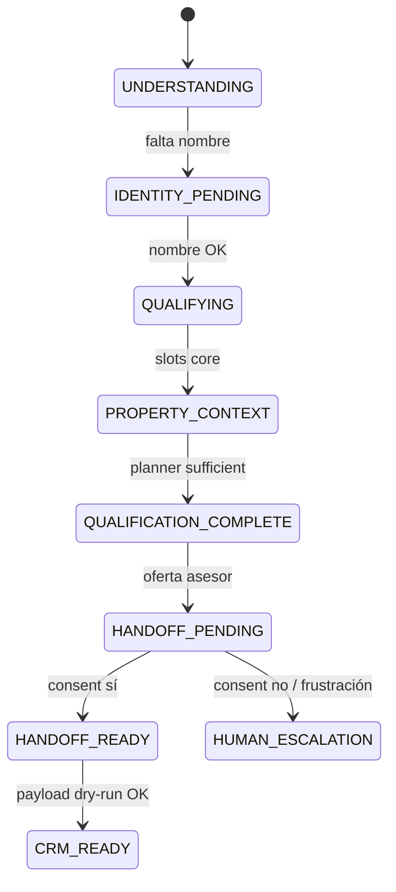

# PERSEO V3-F3 — Calificación, consentimiento asesor y CRM dry-run

**Estado:** plan aprobación (sin implementación hasta validación explícita).  
**Pre-requisito:** F2 cerrado como milestone arquitectónico (V3 primary allowlist, ownership, state bridge, composer humano).  
**Motor:** solo núcleo `conversation/v3/` — **no** regresar a legacy ni a prompts monolíticos.

---

## Definición oficial de PERSEO

> **PERSEO no es un formulario conversacional.**

PERSEO es un **asesor IA comercial** que usa **slots internos** para calificar y canalizar, **sin que el usuario sienta que está llenando campos**.

Implicaciones de arquitectura:

| Sí | No |
|----|-----|
| Una pregunta natural por turno | Checklist visible (“siguiente dato: precio”) |
| Micro-validaciones (“Perfecto, Jorge…”) | Interrogatorio legal/técnico temprano |
| Planner decide *qué conviene preguntar ahora* | Composer con árbol de `if` por campo |
| Consentimiento como **continuación consultiva** | “El bot terminó, ¿quieres un asesor?” |
| Slots en state / `ai_state` para CRM | Formulario paso a paso rígido |

El prompt histórico del Assistant es **referencia estratégica** (tono, filtros, cierre). **No** se copia literal al runtime.

---

## Objetivo comercial F3

```txt
Conversación natural
→ detección de intención
→ calificación mínima (slots invisibles)
→ consentimiento asesor (continuidad premium)
→ payload ATENA listo (dry-run)
→ (F6) ejecución CRM / asignación
```

**Fuera de F3.1:** validación legal avanzada, citas con calendario, inventario en vivo, OpenAI como cerebro obligatorio.

---

## 1. Stages finales (semántica oficial)

### Problema con `READY_FOR_CRM` hoy

En F2, `READY_FOR_CRM` se usa tras ocupación pero **antes** de consentimiento, payload validado o CRM. Genera ambigüedad operativa y de logs.

### Transición oficial (post-F3)

```txt
… → QUALIFYING / PROPERTY_CONTEXT
  → QUALIFICATION_COMPLETE
  → HANDOFF_PENDING
  → HANDOFF_READY
  → CRM_READY
```

| Stage | Significado | Usuario percibe |
|-------|-------------|-----------------|
| `NEW` … `PROPERTY_CONTEXT` | Descubrimiento, identidad, slots en curso | Plática normal |
| `QUALIFICATION_COMPLETE` | Información **suficiente** para proponer seguimiento con asesor (planner + policies) | “Ya me entendió” |
| `HANDOFF_PENDING` | Se ofreció contacto asesor; esperando sí/no/ambiguo | Continuación consultiva |
| `HANDOFF_READY` | Consentimiento explícito aceptado | “Me van a apoyar” |
| `CRM_READY` | Payload ATENA armado y validado (**dry-run** en F3) | (invisible) |
| `HUMAN_ESCALATION` | Rechazo, fuera de zona, frustración alta, pide humano | Cierre cordial |
| `CLOSED` | Conversación cerrada | — |

**Nota implementación:** `READY_FOR_CRM` en código F2 se **renombrará/migrará** a `QUALIFICATION_COMPLETE` al iniciar F3. `CRM_READY` es nuevo y **no** implica `insert` en Supabase.

### Diagrama venta (oferta)



---

## 2. Alcance F3 (qué sí / qué no)

### Sí entra

- **Qualification Planner** con filosofía conversión (ver §4)
- **Handoff Planner** + copy consultivo (ver §5)
- **Stage engine** alineado a stages §1
- **Rule guard:** ownership sticky, geo, price floors, no inventar inventario
- **Composer por slot/template** (advisor persona), no `if` por campo
- **State bridge** + `!state` ampliado
- **CRM payload builder** dry-run → `CRM_READY`
- Tests + QA WhatsApp allowlist

### No entra

| Tema | Fase |
|------|------|
| `owner_relation` (“¿es tuya?”) | F3.4+ o asesor humano |
| CRM create / leads reales | F6 |
| Asignación ATENA operativa | F6+ |
| OpenAI Decision Core obligatorio | Opcional shadow (F3.5) |
| Meta, multimedia, rollout global | F7–F9 |
| Schema Supabase nuevo | No; campos en `ai_state` |
| Agendamiento “¿entre semana o fin de semana?” | Post-consent (F4 comercial) |

---

## 3. Qualification minimums (por flujo)

### Gates (flags en state)

| Flag | `true` cuando |
|------|----------------|
| `qualificationComplete` | Planner: `sufficientForHandoff` (no solo “todos los slots”) |
| `handoffConsent` | `accepted` \| `declined` \| `pending` |
| `crmPayloadReady` | `handoffConsent === accepted` + payload schema válido |

### F3.1 — Venta oferta (`SELL_PROPERTY` / `offer`) — mínimo operativo

| Slot interno | Campo | Regla dura |
|--------------|-------|------------|
| identity | `fullName` | Requerido antes de handoff |
| location | `locationText` | + geoPolicy (F3.2 si zona fuera) |
| price | `expectedPrice` | Venta ≥ 3M MXN (F3.2) |
| property_type | `propertyType` | Inferible (“vender mi casa”) |
| occupancy | `occupancyStatus` | Requerido salvo **skip por planner** (urgencia) |

**Excluido F3.1:** `owner_relation`, motivación, urgencia clasificada, exclusividad, documentos.

### F3.2 — Otros flujos

| Flujo | Slots mínimos |
|-------|----------------|
| Compra (`buyDemand`) | nombre, zona, `budget` ≥ 3M, recámaras o tipo |
| Renta oferta (`rentOffer`) | nombre, zona, renta esperada ≥ 10k, tipo |
| Búsqueda renta (`rentDemand`) | nombre, zona, presupuesto ≥ 10k, recámaras |

### Descalificación (cordial)

- Geo fuera de cobertura → `disqualified: geo`, sin handoff
- Precio bajo piso → `disqualified: price_floor`, orientación breve (estilo Assistant), cierre

---

## 4. Filosofía del planner (no solo “campos faltantes”)

### Principio rector

El planner optimiza **conversión a contacto con asesor**, no completitud de formulario.

```txt
maximizar conversión  ≠  llenar todos los slots
```

### Entradas del planner (evolución)

| Señal | Uso |
|-------|-----|
| Slots faltantes / llenos | Base F3.1 |
| `frustrationState` | Acortar calificación; ir a handoff antes |
| Urgencia en texto (“me urge”, “rápido”) | `sufficientForHandoff` con slots core only |
| Momentum (mucho contexto en un mensaje) | Extraer varios slots; no repreguntar |
| Calidad lead (precio + zona premium) | Priorizar handoff |
| `awaiting_field` + última pregunta | Anti-loop |
| Intención comercial bloqueada | ruleGuard |

### Salida del planner (contrato)

```typescript
{
  nextSlot: string | null,           // null → no preguntar calificación; ir handoff
  sufficientForHandoff: boolean,
  skipSlots: string[],               // ej. occupancy por urgencia
  disqualified: boolean,
  disqualifyReason: string | null,
  plannerReason: string,             // log: conversion | missing_slot | urgency | frustration
}
```

### Ejemplo oficial (urgencia)

Usuario: *“Quiero vender en San Pedro y me urge.”*

| Planner malo | Planner bueno |
|--------------|---------------|
| Pregunta tipo → ocupación → … | Extrae zona + urgencia; si precio/tipo inferibles o preguntables en 1 turno → `sufficientForHandoff` |
| Sensación formulario | Sensación asesor que prioriza ayuda |

### Implementación por fases

| Fase | Comportamiento |
|------|----------------|
| **F3.1** | Reglas explícitas: core slots + `urgencyBypass` + `frustrationBypass` (básico pero **contrato** arriba) |
| **F3.2** | Geo/price + multi-flujo |
| **F3.4+** | Señales motivación, objeciones, scoring fino |

**Regla:** interpreter **extrae**; planner **decide**; composer **redacta** un slot.

---

## 5. Handoff / consentimiento (flujo y copy)

### Cuándo

`stage === QUALIFICATION_COMPLETE` y `handoffConsent == null`.

### Flujo

1. **Ack + contexto** (zona, tipo, rango) — demuestra que escuchó  
2. **Valor consultivo** (valuación / referencia mercado) — autoridad Luxetty  
3. **Una oferta de continuidad** (no “transferencia de bot”)

### Copy referencia (venta)

> Perfecto, Jorge.  
> Por la zona y el rango que me comentas, sí vale la pena revisarla bien.  
> Si te parece, puedo pedirle a uno de nuestros asesores de Luxetty que te contacte para ayudarte con la valuación y darte una referencia más precisa del mercado.

**Evitar:**

- “¿Quieres que un asesor te contacte?” (suena a cierre de bot)
- “Ya terminé, ¿te paso con alguien?”

### Respuestas usuario

| Clase | Ejemplos | Stage / state |
|-------|----------|----------------|
| `accepted` | sí, va, está bien, claro | `HANDOFF_READY` |
| `declined` | no, después, luego | cordial + `HUMAN_ESCALATION` o plan B |
| `ambiguous` | tal vez, no sé | una clarificación corta, `awaiting_field: handoff_consent` |

### Post-accept (F3)

- Ack: “Perfecto, con gusto te apoyamos por este medio.”
- **F3.3:** armar payload → `CRM_READY` (log / `!state`, sin create)
- **F3.4+:** “¿Este número te funciona?” (confirmación canal)

---

## 6. Arquitectura de módulos (sin cambios de filosofía)

```
v3Runtime.processV3Turn
  1. minimalInterpreter      → entidades, intents, patches
  2. stateManager            → merge, goalLock, identity
  3. qualificationPlanner    → nextSlot | sufficientForHandoff | disqualify
  4. handoffPlanner          → si sufficient → offer | parse consent
  5. stageEngine             → stages §1
  6. ruleGuard               → geo, price, ownership, CRM guards
  7. humanComposer           → slotTemplates (advisor persona)
  8. v3ToLegacyAiState       → persistencia + !state
```

| Módulo nuevo F3 | Ruta propuesta |
|-----------------|----------------|
| Qualification planner | `conversation/v3/planner/qualificationPlanner.js` |
| Slot definitions | `conversation/v3/planner/slots/*.js` |
| Handoff planner | `conversation/v3/planner/handoffPlanner.js` |
| Slot templates | `conversation/v3/composer/slotTemplates.js` |
| Geo / price policies | `conversation/v3/rules/geoPolicy.js`, `pricePolicy.js` |
| CRM payload | `conversation/v3/crm/payloadBuilder.js` |

**Prohibido:** crecer `humanComposer.js` con ramas por cada campo nuevo.

---

## 7. Sub-fases F3.1 / F3.2 / F3.3

### F3.1 — Conversión mínima venta + handoff (MVP)

**Objetivo:** allowlist QA vende casa → consent natural → state coherente.

- Stages: `QUALIFICATION_COMPLETE`, `HANDOFF_*`, `CRM_READY` (enum + engine)
- Migrar semántica desde `READY_FOR_CRM`
- Planner v1: core slots + `urgencyBypass` + `frustrationBypass`
- Handoff templates consultivos (§5)
- Sin `owner_relation`
- Refactor composer venta: solo `render(slot)` vía planner
- Tests + guion QA A (abajo)

### F3.2 — Políticas + multi-flujo

- `geoPolicy`, `pricePolicy`, descalificación cordial
- Compra, renta oferta, búsqueda renta (slots + planner paths)
- QA matrices B–E

### F3.3 — CRM dry-run

- `payloadBuilder` → shape ATENA documentado
- Evento `v3_crm_payload_preview`
- `!state`: `crm_payload_ready`, preview acotado (sin PII sensible en logs)
- Stage `CRM_READY` al validar schema
- **Cero** writes CRM

### F3.4 — Enriquecimiento comercial (post-MVP)

- `owner_relation`, motivación, urgencia clasificada, objeciones
- Micro-compromiso, variantes cita (post-consent)
- OpenAI shadow opcional (comparar extracción)

---

## 8. QA Matrix (WhatsApp real, allowlist)

Variables Railway sin cambio obligatorio (ver §10).

### A — Venta + consent (obligatorio F3.1)

```txt
!reset
Hola
Quiero vender mi casa
Jorge
No, en San Pedro
15 millones
Libre
Sí, está bien
!state
```

| # | PASS |
|---|------|
| A1 | `lead_flow=offer`, `goal_locked=true`, sin flip demand |
| A2 | `location_text=San Pedro`, `expected_price=15000000`, `property_type=house` |
| A3 | `occupancy_status=libre` (o skip documentado por urgencia en script B) |
| A4 | No repite zona / precio / ocupación |
| A5 | Handoff suena consultivo (no “bot terminó”) |
| A6 | `handoff_consent=accepted`, `conversation_stage=HANDOFF_READY` |
| A7 | Tras F3.3: `crm_payload_ready=true` o stage `CRM_READY` |
| A8 | No CRM create / no lead |

### B — Urgencia (planner bypass)

```txt
Quiero vender mi casa en San Pedro, me urge, como 15 millones
```

| # | PASS |
|---|------|
| B1 | No interrogatorio largo (tipo + ocupación) si planner marca `sufficientForHandoff` |
| B2 | Handoff en ≤ N turnos tras identidad (definir N=3 en implementación) |

### C — Consent rechazado

“No por ahora” → cierre cordial, sin loop, sin CRM.

### D — Frustración / “ya te dije”

Captura dato, no reset genérico ni nombre corrupto.

### E — Geo / precio (F3.2)

CDMX → descalificación; 2M venta → piso 3M.

### F — Compra (F3.2)

Script Cumbres + presupuesto + recámaras + consent.

---

## 9. Rollback

| Nivel | Acción |
|-------|--------|
| Railway | `PERSEO_V3_ENABLED=false` o allowlist vacía |
| F3 flags | `PERSEO_V3_HANDOFF_ENABLED=false` → comportamiento F2 (qual sin handoff) |
| Git | Revert rama `feat/perseo-v3-f3-*`; tag F2 estable |

Disparadores: flip buyer/seller, loops de slot, consent sin persistir, copy “transferencia bot”.

---

## 10. Railway / variables

### Actuales (mantener)

```env
PERSEO_ENGINE=legacy
PERSEO_V3_ENABLED=true
PERSEO_V3_SHADOW_MODE=false
PERSEO_V3_QA_ALLOWLIST=<QA>
PERSEO_V3_LOG=true
```

### Nuevas (propuesta)

| Variable | Default | Uso |
|----------|---------|-----|
| `PERSEO_V3_HANDOFF_ENABLED` | `false` | Master handoff F3.1 en QA |
| `PERSEO_V3_QUALIFICATION_STRICT` | `false` | Geo/price hard (F3.2) |
| `PERSEO_V3_CRM_DRY_RUN` | `true` | Log payload, no write |
| `PERSEO_V3_CRM_EXECUTE` | `false` | Reservado F6 |

---

## 11. Relación con roadmap histórico

| Doc original | Decisión F3 |
|--------------|-------------|
| F3 = OpenAI shadow | **Reemplazado** por calificación + handoff + CRM dry-run |
| F4 = Composer | Cubierto en F2; F3 = templates + handoff |
| F5 = Allowlist | Hecho en F2 |
| F6 = CRM execute | Después de `CRM_READY` dry-run PASS |

---

## 12. Criterios de aprobación del plan

- [ ] Stages §1 acordados (`QUALIFICATION_COMPLETE` … `CRM_READY`)
- [ ] `owner_relation` fuera de F3.1
- [ ] Filosofía PERSEO § definición oficial
- [ ] Planner §4 (conversión, no solo slots)
- [ ] Handoff §5 (copy consultivo)
- [ ] Sub-fases F3.1 → F3.3 orden
- [ ] QA matrix §8

Tras checkboxes: implementar **solo F3.1** en rama dedicada.

---

*Documento vivo. Actualizar al cerrar F3.1 / F3.2 / F3.3 con SHA y owner.*
